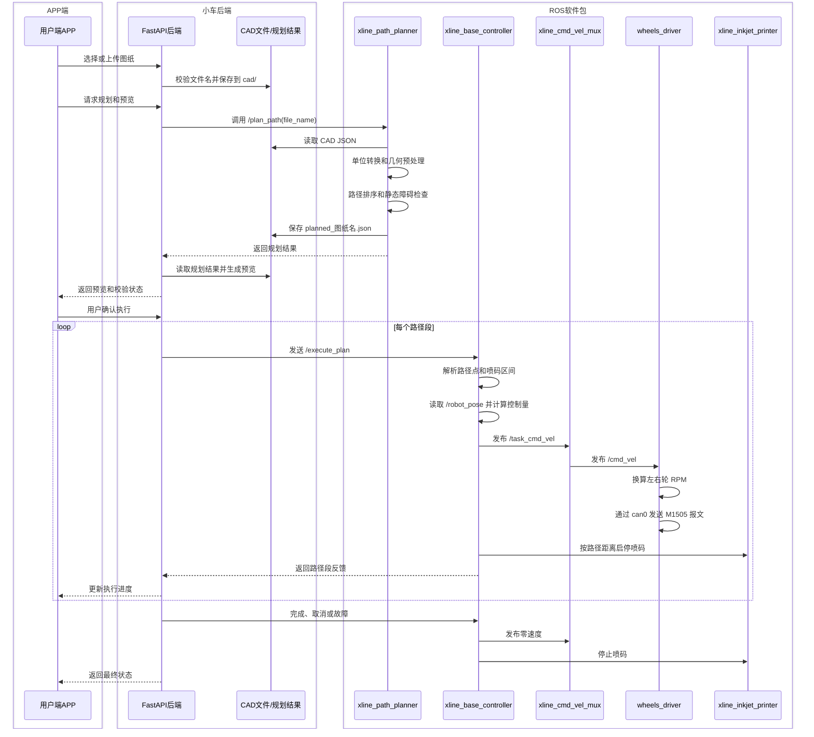

### APP端 CAD 图纸到小车划线执行流程

本文说明用户端 APP 如何把 CAD 图纸转换为小车能够执行的划线任务。当前项目的正式 CAD 链路是：APP 后端调用 ROS 2 规划服务，再由运动控制软件包将规划路径转换为速度指令，最后通过 CAN 控制 M1505 电机。

### 一、三层软件结构

| 层级 | 主要模块 | 主要职责 |
|---|---|---|
| APP 端 | 用户界面 | 选择图纸、发起规划、查看预览、确认执行、查看进度 |
| 小车后端 | FastAPI 后端 | 校验文件、调用 ROS 2 服务、读取规划结果、分段发送任务、返回状态 |
| ROS 2 软件包 | 路径规划器、运动控制器、速度仲裁器、轮驱和喷码器 | 解析路径、跟踪轨迹、控制速度、发送 CAN、同步喷码 |

### 二、完整执行时序



### 三、各阶段执行顺序

| 顺序 | 所属层 | 执行动作 | 结果 |
|---:|---|---|---|
| 1 | APP 端 | 用户选择图纸并点击规划 | 后端收到图纸任务 |
| 2 | 小车后端 | 检查任务状态、文件名和扩展名 | 确认图纸可以提交 |
| 3 | ROS 软件包 | `/plan_path` 读取并解析 CAD JSON | 生成可执行路径 |
| 4 | ROS 软件包 | 进行单位转换、路径预处理和碰撞检查 | 生成规划结果 |
| 5 | 小车后端 | 读取 `planned_*.json` | 生成 APP 预览 |
| 6 | APP 端 | 用户确认执行 | 允许开始运动 |
| 7 | 小车后端 | 逐段调用 `/execute_plan` | 路径段进入运动控制器 |
| 8 | ROS 软件包 | 根据 `/robot_pose` 闭环跟踪 | 计算线速度和角速度 |
| 9 | ROS 软件包 | 速度仲裁并发布 `/cmd_vel` | 形成最终底盘速度 |
| 10 | ROS 软件包 | 轮驱通过 `can0` 控制 M1505 | 小车开始运动 |
| 11 | ROS 软件包 | 根据路径累计距离控制喷码 | 实现划线同步 |
| 12 | 小车后端 | 汇总反馈并通知 APP | 显示进度或结果 |

### 四、CAD 文件和规划结果

当前规划器实际接收的是 `cad/` 目录中的 JSON 文件，不是直接接收原始 DWG 或 DXF 文件。

典型输入：

```text
/home/qingz/xline_ws3/cad/example.json
```

典型内容：

```json
{
  "coordinate_unit": "mm",
  "lines": [
    {
      "id": 1,
      "type": "line",
      "layer": "PATH",
      "work": true,
      "ink_enabled": true,
      "start": {"x": 0, "y": 0},
      "end": {"x": 1000, "y": 0}
    }
  ]
}
```

规划结果保存为：

```text
/home/qingz/xline_ws3/other/planned_results/planned_example.json
```

原始 CAD JSON 主要描述图形；规划结果 JSON 还会包含执行顺序、`motion_points`、喷码起止距离和路径类型，因此它才是运动控制器使用的任务数据。

### 五、ROS 2 软件包之间的速度链路

```mermaid
flowchart LR
    A[/execute_plan] --> B[运动控制中心]
    B --> C[/task_cmd_vel]
    C --> D[xline_cmd_vel_mux]
    D --> E[/cmd_vel]
    E --> F[wheels_driver]
    F --> G[SocketCAN can0]
    G --> H[M1505左右轮]
    B --> I[喷码器服务]
```

运动控制中心根据实时位姿计算速度，不是把 CAD 坐标直接发送给电机。底盘驱动再根据差速模型把整车线速度和角速度换算成左右轮 RPM。

### 六、当前能力边界

| 功能 | 状态 |
|---|---|
| CAD JSON 解析 | 已由路径规划器处理 |
| `/plan_path` 规划服务 | 已接入 |
| 规划结果 JSON | 已生成并保存 |
| `/execute_plan` 分段执行 | 后端按路径段调用 |
| 速度和 CAN 控制 | 由 ROS 2 底盘链路完成 |
| 喷码距离同步 | 由运动控制中心处理 |
| 原始 DXF/DWG 直接解析 | 当前代码链路未确认，需要先转换为 JSON |
| 突发动态障碍物检测 | 不能仅靠全站仪或速度超时实现，需要真实传感器数据 |

### 七、对应代码位置

| 功能 | 代码位置 |
|---|---|
| APP 后端 ROS 适配 | `/home/qingz/xline_app_backend1/app/ros_adapter.py` |
| APP 后端说明 | `/home/qingz/xline_app_backend1/README.md` |
| CAD 规划入口 | `src/xline_path_planner/xline_path_planner/src/main.cpp` |
| CAD 解析 | `src/xline_path_planner/xline_path_planner/src/cad_parser.cpp` |
| 几何预处理 | `src/xline_path_planner/xline_path_planner/src/geometry_preprocessor.cpp` |
| 路径规划 | `src/xline_path_planner/xline_path_planner/src/path_planner.cpp` |
| 运动控制 | `src/xline_base_controller/xline_base_controller/src/motion_control_center.cpp` |
| CAD 任务测试 | `src/xline_bringup/test/run_cad_task_no_station.py` |
