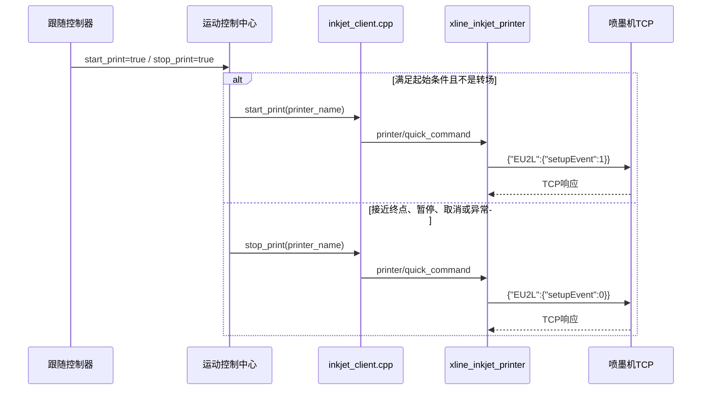
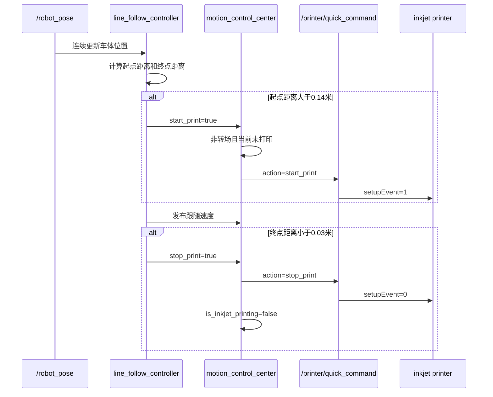
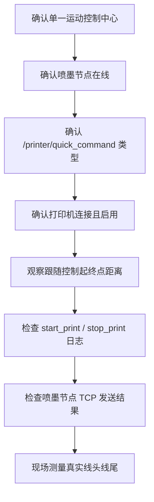

### 文档目的

本文说明 CAD 划线过程中 `start_print` 和 `stop_print` 的完整链路。这里有两个层次：跟随控制器中的 C++ 状态标志，以及喷墨节点接收到的 `QuickCommand` 动作字符串。二者不是 ROS 话题，也不是独立 Action。

### 一、完整控制链路



| 层级 | 代码对象 | 作用 |
| --- | --- | --- |
| 跟随控制器 | `BaseFollowController::start_print`、`stop_print` | 根据位姿和路径误差置位标志 |
| 运动控制中心 | `base_follow_controller_->start_print`、`stop_print` | 读取标志，避免转场喷墨并防止重复请求 |
| C++ 客户端 | `InkjetClient::start_print()`、`stop_print()` | 将动作封装成 `QuickCommand` 请求 |
| ROS 喷墨节点 | `printer/quick_command` | 校验打印机、连接状态并编码设备命令 |
| 喷墨设备 | TCP 协议 | 执行真正的开始或停止喷墨 |

### 二、`start_print` 和 `stop_print` 到底是什么

#### 2.1 跟随控制器中的布尔标志

定义位置：

```text
ros_pack/xline_follow_controller/include/xline_follow_controller/common/base_follow_controller.hpp
```

```cpp
bool start_print = false;
bool stop_print = false;
```

它们只是同一进程内的状态信号，不能用 `ros2 topic echo` 直接查看，也不会自动驱动喷墨机。运动控制中心在每次路径控制循环中读取它们。

#### 2.2 喷墨客户端的方法

定义位置：

```text
ros_pack/xline_base_controller/src/inkjet_client.cpp
```

实际封装关系是：

```cpp
start_print(printer_name)
    -> quick_command(printer_name, "start_print", 0)

stop_print(printer_name)
    -> quick_command(printer_name, "stop_print", 0)
```

第二个参数是动作字符串，`param=0` 对开始和停止动作没有额外作用。

### 三、直线跟随时的启动与停止条件

直线控制器文件：

```text
ros_pack/xline_follow_controller/src/line_follow/line_follow_controller.cpp
```

在 `handlePathFollowing()` 中，代码使用当前位姿到原始起点、原始终点的距离判断喷墨窗口：

| 条件 | 标志变化 | 含义 |
| --- | --- | --- |
| `distance_to_original_start > 0.14` | `start_print=true`，`stop_print=false` | 车体已经离开起始缓冲距离，允许开始喷墨 |
| `distance_to_original_target < 0.03` | `start_print=false`，`stop_print=true` | 接近终点，要求停止喷墨 |
| 设置新路径 | `start_print=false`，`stop_print=true` | 新路径开始时先确保上一段停止 |
| 进入末端对齐 | `start_print=false`，`stop_print=true` | 末端调整不应继续喷墨 |

这两个距离是“软件触发距离”，不是喷头在地面上的真实线头、线尾距离。喷头相对车体的安装偏移、车速、服务通信延迟和设备内部响应时间都会造成实际偏差。

### 四、运动控制中心如何读取标志

主要文件：

```text
ros_pack/xline_base_controller/src/motion_control_center.cpp
```

#### 4.1 开始打印

控制中心循环大致执行：

1. 读取 `base_follow_controller_->start_print`。
2. 检查当前是否已经打印，避免重复发送。
3. 检查当前路径是否为转场层；转场层不允许喷墨。
4. 设置 `is_inkjet_printing=true`，先更新内部状态。
5. 获取当前路径指定的 `current_ink_printer_` 和 `current_ink_mode_`。
6. 在线程中异步调用 `inkjet_client_->start_print(printer_name)`。
7. 继续执行速度控制；文本模式另有启动后短暂停车逻辑。

普通线段和文本模式的实现细节不同，但都通过同一个 `InkjetClient` 发出开始动作。异步线程意味着跟随控制置位和设备真正开始喷墨之间存在时间差。

#### 4.2 停止打印

当 `stop_print=true` 且 `is_inkjet_printing=true` 且当前不是转场层时：

1. 在线程中调用 `inkjet_client_->stop_print(current_ink_printer_)`。
2. 输出停止打印日志。
3. 设置 `is_inkjet_printing=false`，避免下一次循环重复停止。

即使跟随控制器没有及时置位停止标志，任务取消、暂停、控制计算失败、路径结束和节点关闭等分支也会主动调用停止打印，作为安全兜底。

### 五、ROS 服务和消息接口

喷墨节点创建的服务是：

```text
/printer/quick_command
类型：xline_msgs/srv/QuickCommand
```

服务定义：

```text
string printer_name
string action
int32 param
---
bool success
string message
```

支持的打印机名称包括 `left`、`center`、`right` 和 `all`；节点会把短名称规范化成内部名称。支持动作包括：

| `action` | 作用 | `param` |
| --- | --- | --- |
| `start_print` | 开始喷墨 | 无效，通常填 `0` |
| `stop_print` | 停止喷墨 | 无效，通常填 `0` |
| `beep` | 蜂鸣 | 蜂鸣次数 |
| `clean_nozzle` | 清洗喷头 | 清洗强度 |
| `test_print` | 执行测试流程 | 无效 |
| `ink_level` | 查询墨量 | 无效 |

手动检查服务类型：

```bash
ros2 service type /printer/quick_command
```

手动发送开始或停止命令示例：

```bash
ros2 service call /printer/quick_command xline_msgs/srv/QuickCommand "{printer_name: center, action: start_print, param: 0}"
```

```bash
ros2 service call /printer/quick_command xline_msgs/srv/QuickCommand "{printer_name: center, action: stop_print, param: 0}"
```

这两个命令会直接作用于喷墨设备，不能在喷头附近无人看守、墨路未准备或不希望出墨时执行。只检查链路时，应先查看服务是否存在，不要直接调用 `start_print`。

### 六、喷墨节点如何编码设备命令

文件：

```text
ros_pack/xline_inkjet_printer/xline_inkjet_printer/msg_encoder.py
```

编码结果为：

```text
start_print -> {"EU2L": {"setupEvent": 1}}
stop_print  -> {"EU2L": {"setupEvent": 0}}
```

异步喷墨节点收到 `QuickCommand` 后，会依次检查：

1. 打印机名称是否有效；
2. 打印机 TCP 客户端是否存在；
3. 打印机是否已经连接；
4. 打印机是否启用；
5. 根据动作选择 JSON 编码器；
6. 通过 TCP 发送设备命令；
7. 将设备发送结果写入 `success` 和 `message`。

因此，ROS 服务返回 `success=true` 表示命令已经被喷墨节点接受并完成发送流程，不等价于已经在地面形成了可测量的线条；线宽、出墨延迟和真实线头仍需现场检查。

### 七、一次线段的时序



### 八、为什么图纸可能出现线头或线尾偏差

| 原因 | 影响 |
| --- | --- |
| `start_print` 触发后服务异步发送 | 车辆已经前进，喷头稍晚才出墨，线头向前偏移 |
| `stop_print` 接近终点才触发 | 喷墨机停止有响应延迟，线尾可能超过目标点 |
| 喷头相对车体安装偏移未补偿 | 车体到达目标并不等于喷头到达目标 |
| `/robot_pose` 延迟或失效 | 起终点距离判断使用旧位姿，起停时刻不准确 |
| 转场路径识别错误 | 可能在不应喷墨的移动阶段发送开始命令 |
| 多个任务或控制器重复运行 | 起停状态和打印机请求可能互相覆盖 |

因此，`0.14 m` 和 `0.03 m` 应视为当前代码的初始触发值，而不是最终的物理补偿值。要做精准划线，应记录车速、服务响应时间和喷头到车体基准点的纵向距离，再重新标定起停阈值。

### 九、排查顺序



建议先做只读检查：

```bash
ros2 service list | grep printer
ros2 service type /printer/quick_command
ros2 node list | grep -E 'base_controller|inkjet'
```

执行 CAD 任务时重点查看控制中心日志中的“开始打印”和“停止打印”，以及喷墨节点是否报告“快速命令成功”。若只看到跟随控制器的标志变化，却没有服务请求和 TCP 成功日志，说明问题在运动控制中心读取标志或喷墨客户端链路；若服务成功但地面没有墨线，则继续检查打印机连接、喷头状态和起停延迟。
