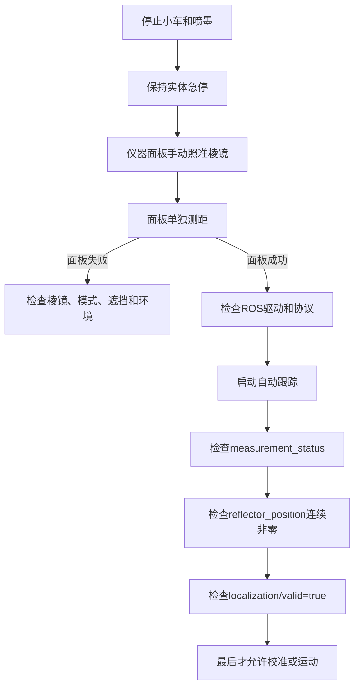

### 问题概述

当前 ROS 反复出现 `tracking_status=2`、`tilt_correction=1`、`measurement_error=E200`，同时 `/reflector_position` 输出零坐标。这表示全站仪接受了自动跟踪并锁定目标，但 EDM 没有得到有效距离测量。`E200` 不是 ROS 位姿超时，也不是单纯的自动跟踪命令失败。

### 手册结论

| 状态 | 含义 |
| --- | --- |
| `tracking_status=2` | 自动跟踪已锁定目标，只说明目标方向被锁定 |
| `tilt_correction=1` | 倾斜补偿正常 |
| `measurement_error=E200` | EDM 测距错误，需要重新测量 |
| `E210` | 超出测距范围 |
| `E575` | 无法锁定目标或目标丢失 |
| `E579` | 目标搜索超时 |
| `E297` | 设备忙，需要等待设备空闲 |

通信手册明确说明：测量字段出现错误时，不能把跟踪状态当成测距成功；没有有效距离时，坐标不能用于机器人定位。

### 最可能原因

| 优先级 | 原因 | 检查方法 |
| --- | --- | --- |
| 1 | 棱镜类型或棱镜常数设置错误 | 核对仪器目标类型与实际棱镜 |
| 2 | 棱镜没有正对仪器或被遮挡 | 手动照准并在仪器面板单独测距 |
| 3 | 小车转向后棱镜离开有效反射方向 | 低速转向时观察测距是否立即报错 |
| 4 | 棱镜松动、污染或高度变化 | 检查固定、清洁和中心高度 |
| 5 | 雨、雾、强光、热浪或玻璃反射 | 改变位置并重复静态测距 |
| 6 | 测距模式或目标模式不正确 | 在仪器面板选择正确的棱镜模式 |

### 棱镜参数核对

通信手册 `@ITRGT` 规定：圆棱镜为 `0`，360° 棱镜为 `1`；棱镜直径范围为 `1～300 mm`，默认 `34 mm`；棱镜常数范围为 `-99.9～99.9 mm`，默认 `-7 mm`。实际使用 360° 棱镜时，不能错误配置为普通圆棱镜，棱镜常数必须与厂家参数一致。

### 正确排查顺序



### ROS 检查命令

以下命令只读，不会让小车运动：

```bash
source /opt/ros/humble/setup.bash
source /home/qingz/a_xline_hhj/xline_hhj_ros2_ws/install/setup.bash
export ROS_LOCALHOST_ONLY=1 ROS_DOMAIN_ID=0
ros2 service call /ln_driver/command_srv xline_msgs/srv/LnCommand "{command_type: 2}"
timeout 10s ros2 topic echo /ln_driver/measurement_status
timeout 10s ros2 topic echo /reflector_position
timeout 5s ros2 topic echo /localization/valid --once
timeout 5s ros2 topic echo /robot_pose --once
```

![[Pasted image 20261011053516.png]]
### 恢复标准

| 项目 | 合格标准 |
| --- | --- |
| 跟踪状态 | `tracking_status=2` |
| 倾斜补偿 | `tilt_correction=1` |
| 自动调平 | `auto_leveling=0` |
| 测距错误 | `measurement_error=""` |
| 棱镜坐标 | 持续为非零、有限值 |
| 定位状态 | `/localization/valid=true` |
| 位姿 | `/robot_pose` 时间戳新鲜且连续更新 |

自动跟踪服务返回 `success=True` 只代表命令被设备接受，不能代替连续测量验证。

### 不应采用的修复方式

| 错误做法 | 原因 |
| --- | --- |
| 大幅放宽 `0.5 s` 位姿超时 | 无法修复 EDM 的 `E200`，只会让旧坐标存活更久 |
| 忽略 `measurement_error` | 会把无效坐标当成真实位置 |
| 用上一帧坐标继续跟线 | 失测期间机器人可能已经转向或移动 |
| 只看 `tracking_status=2` | 跟踪锁定不等于距离测量成功 |
| 失测后直接复位继续划线 | 可能在错误位置重复喷墨或产生偏轨 |

### 当前代码侧安全策略

程序应在 `measurement_error` 非空、棱镜坐标为零或非有限值、`/localization/valid=false`、`/robot_pose` 超时中的任一条件出现时停车、停喷并暂停或取消 Action。恢复时要求测量连续稳定后再继续，不能只凭一次正常消息恢复。

### 结论

当前首要修复对象是全站仪实际 EDM 测距链路，而不是 ROS 的 `0.5 s` 位姿超时参数。先在小车静止时用仪器面板确认连续测距，再核对棱镜类型、棱镜常数、遮挡和反射条件。面板能够稳定测距而 ROS 仍为 `E200` 时，才进入 LN-150 驱动协议和串口/网络接收代码排查。
