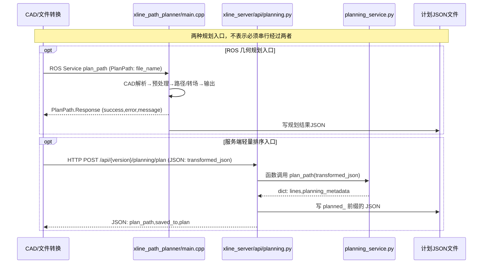
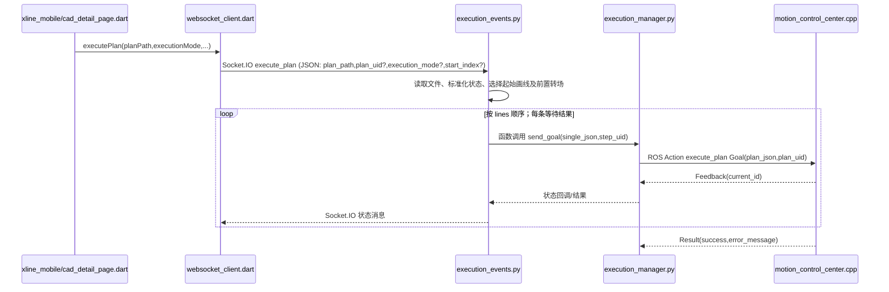
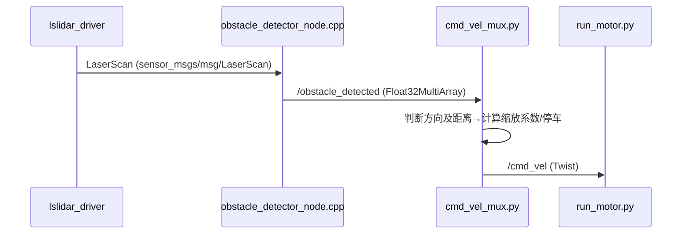
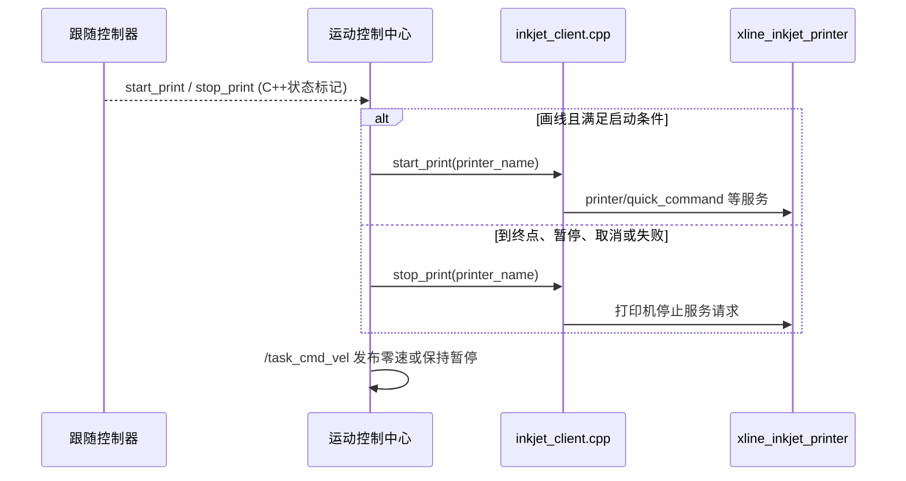

---
aliases:
  - 划线任务完整调用链
tags:
  - xline
  - 时序图
  - 接口
---

### 划线任务逐文件时序与接口

返回 [[划线源码阅读导航]]；算法公式见 [[划线算法与关键函数精读]]。

> [!important] 箭头的读法
> 每条跨进程箭头下方的表格给出真实接口、数据类型和源码。图中的函数内调用用 `函数调用` 标记，不把函数调用误写为 ROS topic。`xline_path_planner` 与 Python 轻量规划是两条可选的**规划入口**；执行阶段只消费已生成的计划文件。

### 阶段一：图纸到计划文件



| 箭头 | 接口与类型 | 发送/实现位置 | 接收/处理位置 | 关键含义 |
| --- | --- | --- | --- | --- |
| CAD → ROS 规划器 | `plan_path`，`xline_path_planner/srv/PlanPath`；请求 `string file_name` | 调用方需按实际 CAD/移动端配置确认 | [服务定义](../../ros_pack/xline_path_planner/srv/PlanPath.srv)、[入口](../../ros_pack/xline_path_planner/src/main.cpp) `start_service_server/handle_service` | 服务返回成功与错误文本，不直接返回完整轨迹；文件名指向转换后的 CAD 数据 |
| 客户端 → 服务端轻量规划 | `POST /api/{version}/planning/plan`，JSON | 上游调用方需按当前界面版本确认 | [蓝图注册](../../ros_pack/xline_server/__init__.py)、[路由](../../ros_pack/xline_server/api/planning.py) `create_plan` | 需要 `transformed_json.lines`；不是 ROS 服务 |
| 路由 → Python 规划 | `plan_path(dict) -> dict`，进程内函数 | [路由](../../ros_pack/xline_server/api/planning.py) | [实现](../../ros_pack/xline_server/services/planning_service.py) | 只选 `selected=true` 的线；贪心选下一线端点并可反向 |
| 两种规划 → 磁盘 | 计划 JSON | [ROS 输出格式](../../ros_pack/xline_path_planner/src/output_formatter.cpp) / [HTTP 保存](../../ros_pack/xline_server/api/planning.py) | `PLANNED_RESULTS_PREFIX` 指向的文件 | 执行事件收到的是文件名，不是直接接收 CAD 几何 |

> [!warning] 不能从文件名推断调用关系
> 已核对的 `xline_server/api/planning.py` 只调用 Python `planning_service.plan_path()`，没有建立 `PlanPath` ROS 客户端。ROS 几何规划器由其自己的 `plan_path` 服务提供。若现场界面只走其一，另一条不应算在该次任务的实测链内。

### 阶段二：计划文件到单条 Action



| 箭头 | 接口与类型 | 发送位置 | 接收位置 | 核心语义 |
| --- | --- | --- | --- | --- |
| 页面 → Socket.IO 客户端 | Dart 方法调用；字符串计划文件名、执行模式 | [页面](../../xline_mobile/lib/modules/task/widgets/cad_detail_page.dart) 执行任务段 | [客户端](../../xline_mobile/lib/modules/task/core/clients/websocket/websocket_client.dart) | UI 只发计划路径与控制选项 |
| 客户端 → 服务端 | Socket.IO 事件 `execute_plan`；JSON | [WebSocket 客户端](../../xline_mobile/lib/modules/task/core/clients/websocket/websocket_client.dart) | [事件处理器](../../ros_pack/xline_server/communications/websocket/execution_events.py) `handle_execute_plan` | 读取计划文件；`continue/restart/from_index` 会改变起始索引 |
| 事件处理器 → 执行管理器 | `send_goal(plan_json, plan_uid)`，Python 函数 | [事件处理器](../../ros_pack/xline_server/communications/websocket/execution_events.py) | [执行管理器](../../ros_pack/xline_server/services/execution_manager.py) | 当前实现逐条构建 `single_json`，不必把整个文件一次发给 Action |
| 执行管理器 → 运动控制中心 | `execute_plan`，`xline_msgs/action/ExecutePlan` | [Action 客户端](../../ros_pack/xline_server/services/execution_manager.py) | [Action 服务端](../../ros_pack/xline_base_controller/src/motion_control_center.cpp) | Goal: `plan_json`, `plan_uid`; Feedback: `current_id`; Result: `success`, `error_message`。定义见 [ExecutePlan.action](../../ros_pack/xline_msgs/src/xline_msgs/action/ExecutePlan.action) |
| 控制中心 → 页面 | Action Feedback/Result → 服务端状态回调 → Socket.IO 状态 | [运动控制中心](../../ros_pack/xline_base_controller/src/motion_control_center.cpp) | [执行管理器](../../ros_pack/xline_server/services/execution_manager.py)、[事件处理器](../../ros_pack/xline_server/communications/websocket/execution_events.py) | `current_id` 是路径标识，不是坐标；消息格式以服务端实际广播函数为准 |

### ExecutePlan 是“一条路径一个 Goal”

“按 `lines` 顺序；每条等待结果”是当前实现的关键语义。后端每次取出一条 `line`，序列化为 `single_json` 后发送一个 Goal。

| 层 | 实际动作 | 是否重复发送 Goal |
| --- | --- | --- |
| `execution_events.py` | 遍历 `task_lines`，每轮生成一个 `single_json` | 是，但必须等待上一条结束 |
| `ExecutionManager` | 创建 `ExecutePlan.Goal`，填入当前单条 JSON 和 `step_uid` | 每条路径一次 |
| `motion_control_center.cpp` | 解析当前 Goal，选择控制器并执行到终点 | 一个 Goal 内不创建下一个 Goal |
| 控制循环 | 读取 `/robot_pose`，计算并发布 `/task_cmd_vel` | 持续发速度，不是持续发 Goal |

例如计划含 3 条普通线和 2 条转场线，实际会依次产生 5 个 Goal。只要某条 Goal 返回失败或取消，后端逐条序列就会停止。

### 阶段三：一条线如何变成轮子运动

```mermaid
sequenceDiagram
    participant Pose as xline_localization
    participant BC as motion_control_center.cpp
    participant FC as xline_follow_controller 算法对象
    participant Mux as cmd_vel_mux.py
    participant Wheel as run_motor.py
    participant Servo as iwmc_servo_control.py
    Pose-->>BC: /robot_pose (PoseStamped; map,米/四元数)
    BC->>FC: 函数调用 setPlan(...)，按线型选控制器
    loop 跟随控制循环
      BC->>FC: computeVelocityCommands(pose,current_velocity,cmd_vel)
      FC-->>BC: TwistStamped: linear.x 米/秒,angular.z 弧度/秒
      BC->>Mux: /task_cmd_vel (Twist)
      Mux->>Wheel: /cmd_vel (Twist；障碍限速后的最终速度)
      Wheel->>Wheel: v左=v-Bω/2, v右=v+Bω/2；m/s→RPM
      Wheel->>Servo: set_target_velocity_rpm(左右轮目标RPM)
    end
    BC->>Mux: /task_cmd_vel (零速；完成/取消/故障)
```

| 箭头 | 类型及单位 | 源码 | 注释 |
| --- | --- | --- | --- |
| 定位 → 控制中心 | `/robot_pose`，`geometry_msgs/msg/PoseStamped`；位置 m，姿态四元数 | [定位](../../ros_pack/xline_localization/src/localization_node.cpp)、[控制中心](../../ros_pack/xline_base_controller/src/motion_control_center.cpp) | 发布者设置 `frame_id=map`；控制必须使用同一现场坐标约定 |
| 控制中心 → 跟随算法 | C++ 方法，不是 topic | [控制中心](../../ros_pack/xline_base_controller/src/motion_control_center.cpp)、[直线控制器](../../ros_pack/xline_follow_controller/src/line_follow/line_follow_controller.cpp) | 直线用 `setPlan`；圆弧/曲线会选择不同控制器，不能全部解释为直线 PID |
| 控制中心 → 仲裁器 | `/task_cmd_vel`，`geometry_msgs/msg/Twist`；`linear.x` m/s、`angular.z` rad/s | [发布](../../ros_pack/xline_base_controller/src/motion_control_center.cpp)、[订阅](../../ros_pack/xline_cmd_vel_mux/xline_cmd_vel_mux/cmd_vel_mux.py) | 这是任务源速度，不是最终电机指令 |
| 仲裁器 → 轮驱 | `/cmd_vel`，`geometry_msgs/msg/Twist` | [仲裁](../../ros_pack/xline_cmd_vel_mux/xline_cmd_vel_mux/cmd_vel_mux.py)、[轮驱](../../ros_pack/wheels_driver/wheels_driver/run_motor.py) | 同时可接收 `/tablet_cmd_vel`；障碍分支可缩放速度 |
| 轮驱 → 伺服控制 | Python 方法 `set_target_velocity_rpm`；RPM | [轮驱](../../ros_pack/wheels_driver/wheels_driver/run_motor.py)、[伺服](../../ros_pack/wheels_driver/wheels_driver/iwmc_servo_control.py) | 左轮电机命令有反号处理；驱动通过 CAN/串口接口发送 |

### 分支一：棱镜与 IMU 定位反馈

```mermaid
sequenceDiagram
    participant LN as xline_ln150_driver
    participant IMU as beiwei_imu_driver
    participant Loc as xline_localization
    participant BC as motion_control_center
    LN->>Loc: /reflector_position (PointStamped;位置m)
    IMU->>Loc: /imu (Imu;四元数/角速度/加速度)
    Loc->>Loc: 有效性检查、棱镜到车体偏移、航向处理
    Loc->>BC: /robot_pose (PoseStamped; map)
    BC->>BC: 按当前位姿计算线偏差及下一速度
```

| 数据 | 生产位置 | 消费位置 | 排查重点 |
| --- | --- | --- | --- |
| `/reflector_position`，`geometry_msgs/msg/PointStamped` | [LN150](../../ros_pack/xline_ln150_driver/src/lndriver_node.cpp) | [定位节点](../../ros_pack/xline_localization/src/localization_node.cpp) | 棱镜被仪器跟踪不等于 ROS 已发布有效点；定位回调会过滤 `x==0` 或 `y==0` |
| `/imu`，`sensor_msgs/msg/Imu` | [IMU 驱动](../../ros_pack/beiwei_imu_driver/src/beiwei_imu_driver.cpp) | [定位节点](../../ros_pack/xline_localization/src/localization_node.cpp) | QoS 为 SensorDataQoS，注意发布方 QoS 兼容 |
| `/robot_pose`，`geometry_msgs/msg/PoseStamped` | [定位节点](../../ros_pack/xline_localization/src/localization_node.cpp) | [控制中心](../../ros_pack/xline_base_controller/src/motion_control_center.cpp) 与规划器可选订阅 | 看时间戳、`frame_id`、位置和姿态，不能只看 topic 是否存在 |

`/imu` 在驱动源码中以相对零点模式初始化、自动输出，并配置为 200 Hz；消息包含四元数 `orientation`、三轴 `angular_velocity` 和三轴 `linear_acceleration`。定位节点并不是简单把 IMU 的绝对航向直接当车体航向：校准完成时记录 `imu_initial_yaw` 与 `robot_initial_yaw`，运行时使用 `robot_yaw = remainder(imu_yaw - imu_initial_yaw + robot_initial_yaw, 2π)`，再把全站仪给出的棱镜点通过 `reflector_to_base_tf_` 变换为车体基座位置。因此“全站仪已跟踪”还不等于 `/robot_pose` 已正确更新，必须同时检查 IMU 消息、校准状态、偏移参数和定位节点发布。

### 分支二：障碍物与速度仲裁



当前仓库配置将激光输入设为 `/scan`；[障碍检测节点](../../ros_pack/xline_obstacle_detector/src/obstacle_detector_node.cpp) 发布 `/obstacle_detected`，消息类型为 `std_msgs/msg/Float32MultiArray`，数组顺序是 `[前方, 后方, 左侧, 右侧]`，单位 m，`0.0` 表示该方向没有有效障碍距离。仲裁器订阅该数组并按自身阈值计算缩放或停车。另有 `/obstacle_detected_bool` 和 `/status` 输出，但不能把它们误写为当前仲裁器的输入。算法与阈值见 [cmd_vel_mux.py](../../ros_pack/xline_cmd_vel_mux/xline_cmd_vel_mux/cmd_vel_mux.py) 和 [obstacle_detector_config.yaml](../../ros_pack/xline_obstacle_detector/config/obstacle_detector_config.yaml)。

### 分支三：喷码、暂停和取消



`start_print/stop_print` 是 [跟随控制器](../../ros_pack/xline_follow_controller/src/line_follow/line_follow_controller.cpp) 的内部状态，**不是 ROS topic**。运动控制中心在 [motion_control_center.cpp](../../ros_pack/xline_base_controller/src/motion_control_center.cpp) 中检查状态和是否为转场层，调用 [inkjet_client.cpp](../../ros_pack/xline_base_controller/src/inkjet_client.cpp) 的打印服务客户端。左/右喷头还可能通过 `/stepper_motor_driver` 服务控制步进电机。服务是否真正生效需看打印节点响应及物理喷头，不可由布尔标记推断。

### 接口名与数据契约速查

| 接口 | 分类 | 载荷 | 谁读/写 | 易错点 |
| --- | --- | --- | --- | --- |
| `plan_path` | ROS Service | `PlanPath.srv` 的 `file_name` / `success,error,message` | 规划器 | 返回值不含路径数组 |
| `/api/{version}/planning/plan` | HTTP POST | `transformed_json` → 计划文件名和计划 | 服务端轻量规划 | 与 ROS 服务同名但算法不同 |
| `execute_plan` | Socket.IO 事件 | `plan_path`、可选执行模式 | 移动端 → 服务端 | 文件名必须对应服务端可读文件 |
| `execute_plan` | ROS Action | `ExecutePlan.action` | 服务端 → 底盘控制中心 | 同名不同协议；实际逐条下发 |
| `/reflector_position` | ROS Topic | `PointStamped` | 全站仪 → 定位 | 零坐标被定位节点过滤 |
| `/imu` | ROS Topic | `Imu` | IMU → 定位 | 航向不等于原始磁罗盘读数 |
| `/robot_pose` | ROS Topic | `PoseStamped` | 定位 → 控制/规划 | 必须关注时间戳及坐标系 |
| `/task_cmd_vel` | ROS Topic | `Twist` | 控制中心 → 仲裁 | 不是轮驱直接订阅的话题 |
| `/tablet_cmd_vel` | ROS Topic | `Twist` | 平板 TCP 服务 → 仲裁 | 手动控制通道 |
| `/obstacle_detected` | ROS Topic | `Float32MultiArray` | 障碍检测 → 仲裁 | 数组元素意义看检测与仲裁两端约定 |
| `/cmd_vel` | ROS Topic | `Twist` | 仲裁 → 轮驱 | 最终速度仍会受轮驱超时保护 |
| `/execution/pause`、`/execution/resume` | ROS Service | `std_srvs/srv/Trigger` | 服务端 → 控制中心 | 暂停不等于取消 Action |

### 追一次任务时应记录什么

| 阶段 | 必须能对上的标识 | 若断开意味着什么 |
| --- | --- | --- |
| 规划结果 | `plan_path` 与磁盘文件、`lines[].id`、画线/转场标记 | 文件不匹配时执行事件无法打开计划 |
| Socket.IO | `plan_uid`、`execution_mode`、起始索引 | 重启/续画可能从不同位置开始 |
| Action | `step_uid`、`current_id`、Result | 界面“已下发”不等于 Action 完成 |
| 定位 | `/reflector_position`、`/imu`、`/robot_pose` 的时间戳 | ROS 无有效坐标时控制反馈链断开 |
| 速度 | `/task_cmd_vel` 与 `/cmd_vel` 同时观察 | 前者有值而后者为零，检查仲裁和障碍 |
| 硬件 | 左右轮 RPM 与打印服务响应 | ROS 指令有值不等于伺服/喷头已动作 |
