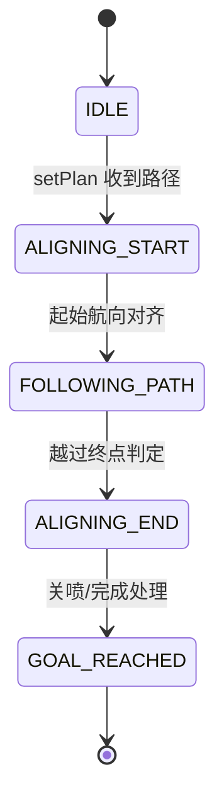

### 划线算法与关键函数精读

接口和时序见 [[划线任务逐文件时序与接口]]，总导航见 [[划线源码阅读导航]]。本页按“一条直线最终画出来”的执行顺序，先解释数据，再解释公式。圆、弧、曲线有各自控制器，不能把本页的直线公式套用到所有线型。

### 一、先认清四种数据

| 数据 | 典型字段 | 单位/坐标系 | 何时存在 | 对应源码 |
| --- | --- | --- | --- | --- |
| 原始 CAD 几何 | 线、圆、圆弧、样条的点和图层 | CAD 文件单位；不能直接假定是 m | 上传/转换前 | [cad_parser.cpp](../../ros_pack/xline_path_planner/src/cad_parser.cpp) |
| 转换后图纸 JSON | `lines[].start/end` 等 | 取决于转换阶段和文件契约；规划器配置按毫米→米换算 | 路径规划前 | [planner.yaml](../../ros_pack/xline_path_planner/config/planner.yaml)、[cad_parser.cpp](../../ros_pack/xline_path_planner/src/cad_parser.cpp) |
| 执行计划 JSON | `lines[]`、`id`、`type`、`ink`、`backward` 等 | 位置应与控制所用现场坐标一致，通常 m | 规划完成后 | [output_formatter.cpp](../../ros_pack/xline_path_planner/src/output_formatter.cpp)、[motion_control_center.cpp](../../ros_pack/xline_base_controller/src/motion_control_center.cpp) |
| 机器人实时位姿 | `/robot_pose`: `x,y`、四元数 | `map` 框架位置 m，航向从四元数取 rad | 控制循环中持续更新 | [localization_node.cpp](../../ros_pack/xline_localization/src/localization_node.cpp) |

> [!warning] 不要只看字段名
> 两个对象都叫 `x/y`，不表示它们已经处于同一坐标系。轨迹、定位和喷头偏移必须统一现场原点、轴向、角度正方向和单位。`planner.yaml` 写有 `unit_conversion_factor: 1000.0`，但还需按实际转换 JSON 和规划输出核对是否已经换算一次，避免重复除以 1000。

### 二、图纸如何变为画线顺序

| 步骤 | 为什么需要 | 主要算法/参数 | 读哪个函数或文件 |
| --- | --- | --- | --- |
| 解析 | 把 CAD 实体转成可计算的几何对象 | 单位换算、图层与线型识别 | [cad_parser.cpp](../../ros_pack/xline_path_planner/src/cad_parser.cpp)、[planner.yaml](../../ros_pack/xline_path_planner/config/planner.yaml) |
| 几何预处理 | 避免每个 CAD 小线段都变成独立任务 | Polyline 拆分、相邻共线线段合并；容差为配置值 | [geometry_preprocessor.cpp](../../ros_pack/xline_path_planner/src/geometry_preprocessor.cpp)、[collinear_merger.cpp](../../ros_pack/xline_path_planner/src/collinear_merger.cpp) |
| 画线与转场排序 | 尽量减少不喷墨的空驶，并连接不同画线段 | `processGeometryGroup` 处理几何组；转场长度与贝塞尔选项由配置控制 | [path_planner.cpp](../../ros_pack/xline_path_planner/src/path_planner.cpp)、[planner.yaml](../../ros_pack/xline_path_planner/config/planner.yaml) |
| 喷头路径补偿 | 车体参考点与左/中/右喷头不在同一点 | 配置 `left_offset=-0.25`、`right_offset=0.25`、`center_offset=0.005` m；正负方向还需对照路径法向实现 | [planner.yaml](../../ros_pack/xline_path_planner/config/planner.yaml)、[path_planner.cpp](../../ros_pack/xline_path_planner/src/path_planner.cpp) `applyPathOffset` |
| 离散与输出 | 控制器需要可跟踪的点/线数据 | 直线采样、曲线/圆/弧离散、进入/离开节点 | [trajectory_generator.cpp](../../ros_pack/xline_path_planner/src/trajectory_generator.cpp)、[output_formatter.cpp](../../ros_pack/xline_path_planner/src/output_formatter.cpp) |

#### 直线离散的实算例

[PathPlanner::generate_straight_path](../../ros_pack/xline_path_planner/src/path_planner.cpp) 对起点 `A=(0,0)`、终点 `B=(1,0)` 和分辨率 `0.2 m`，距离 `L=1 m`，源码用 `N=max(2, floor(L/resolution)+1)` 得到 6 个点。第 `i` 点按 `t=i/(N-1)·L` 沿单位方向向量插值，因此点为 `0,0.2,0.4,0.6,0.8,1.0 m`。首尾点都保留。若长度接近零，函数直接返回一个起点；这时不能把它当作有效可画线段。

> [!note] 另一种“规划”
> [planning_service.py](../../ros_pack/xline_server/services/planning_service.py) 的 `plan_path()` 不做以上几何链。它从第一条选中线的起点开始，每次比较当前位置到剩余线段两个端点的距离，取最近端点作为下一线起点；必要时交换起终点。它是局部贪心，不保证全局最短，也不负责喷头补偿。要看清某次任务的计划 JSON 究竟由哪个入口生成。

### 三、Action 如何决定使用哪种跟随算法

服务端 [execution_events.py](../../ros_pack/xline_server/communications/websocket/execution_events.py) 把计划按条下发；[ExecutionManager.send_goal](../../ros_pack/xline_server/services/execution_manager.py) 将一条计划 JSON 和 `step_uid` 装入 `ExecutePlan.Goal`。运动控制中心在 [motion_control_center.cpp](../../ros_pack/xline_base_controller/src/motion_control_center.cpp) 解析 `type`、起终点、`backward`、`ink`，再根据线型设置控制器。

| 类型 | 控制入口 | 说明 |
| --- | --- | --- |
| 直线 | `LineFollowController::setPlan(...)` | 进入本页下文的直线状态机 |
| 圆、圆弧 | 圆形控制器的 `setPlanForCircle(...)` | 当前控制中心有 LQR 圆形分支；不要假定走直线 PID |
| 曲线/其他 | 以控制中心当前 `type` 分支为准 | 对应 RPP/曲线策略及其参数，需沿实际分支阅读 |
| 转场 | 计划中的转场标记与 `setTransitionPath` | 车要移动，但通常不应喷墨；速度和停止距离也可能不同 |

### 四、直线跟随的状态机

[LineFollowController::computeVelocityCommands](../../ros_pack/xline_follow_controller/src/line_follow/line_follow_controller.cpp) 每轮接收位姿 `PoseStamped`、当前速度 `Twist`，输出 `TwistStamped`；若未收到计划返回失败，已到目标则输出零速。它对 `x/y` 做 Hampel 与平滑滤波，取四元数航向，按状态调用起始对齐或路径跟随。这里的 `velocity` 形参在当前实现中用 `(void)velocity` 忽略，不能在文档里说它参与了速度闭环。

### 五、直线控制的几何公式

设计划起点 `P1=(x1,y1)`、终点 `P2=(x2,y2)`、当前车体 `R=(xr,yr)`。控制器先选择最近路径段与前瞻路点，再计算下列量；实际源码会在倒车时反向处理段方向。

| 量 | 源码中的计算 | 单位 | 意义 |
| --- | --- | --- | --- |
| 线段方向 `u` | `(P2-P1)/‖P2-P1‖` | 无量纲 | 期望运动方向 |
| 左法向 `n` | `(-u_y,u_x)` | 无量纲 | 定义“在线左侧”为正 |
| 横向误差 `e` | `(R-P1)·n` | m | 车离期望线有多远、在左还是右 |
| 路径航向 `ψ_path` | `atan2(u_y,u_x)` | rad | 线本身的朝向 |
| 朝路点方向 `ψ_target` | `atan2(y_target-yr,x_target-xr)` | rad | 当前车到前瞻路点的朝向 |
| 航向误差 `e_ψ` | `shortest_angular_distance(ψ_robot,ψ_desired)` | rad | 最短转向角，跨越 ±π 时不会突然跳 2π |

例如路径从 `(0,0)` 到 `(1,0)`，车位于 `(0.4,0.1)`：`u=(1,0)`、`n=(0,1)`、横向误差 `e=+0.1 m`，即车在路径左侧。若使用 Stanley 分支，截获角应为负，才会朝右侧回线。对应源码是 `atan2(-k·e, |v|+v0)`，再按 `theta_max` 截断，并加在 `ψ_path` 上。若配置不是 `stanley`，则用“理想线方向与前瞻路点方向加权”的旧分支；`hybrid` 会依 `start_line_aligned_` 在对齐和跟随模式之间选择。实现见 [handlePathFollowing](../../ros_pack/xline_follow_controller/src/line_follow/line_follow_controller.cpp)，参数见 [line.yaml](../../ros_pack/xline_follow_controller/config/line.yaml)。

> [!important] 角度不是位置
> `ψ_desired` 决定车头往哪转；横向误差的符号决定向哪边修；`distance_to_original_target` 决定何时减速/停喷。三者不能互相代替。

### 六、速度如何算出来

#### 线速度 `v`

[computeLinearSpeed](../../ros_pack/xline_follow_controller/src/line_follow/line_follow_controller.cpp) 使用起点距离决定加速、终点距离决定减速。加速/减速曲线的核心形状均是 `S(z)=1/(1+exp(-k(z-c)))`。实际输出还经过最大速度、短路径限速、每帧最大减速度和一次平滑；不是简单的“距离越远速度越大”。

| 情况 | 源码行为 | 可观察现象 |
| --- | --- | --- |
| 尚未起始对齐且非转场 | 保持较低对齐速度，逐步增加 | 车先缓慢找线 |
| 已进入加速 | 用离起点的距离驱动 Sigmoid，短线再压低最大速度 | 短线不会达到长线最大速度 |
| 进入终点减速区 | 记录进入时速度，按剩余距离的 Sigmoid 降速 | 接近终点逐渐慢下来 |
| 接近精停距离 | 转场约 `0.05 m`，普通画线约 `0.1 m`，设为减速最小速度 | 这不是零速；最终完成条件由状态机处理 |
| 时间步变化 | 限制单步减速度，并在非减速区做平滑 | 减少速度突变 |

**当前实现细节：** `allow_linear_accel_by_distance` 虽根据 `0.2 m` 门槛算出，但相应 `if` 条件被注释，变量未参与实际分支；旁边还留有 `0.25 m` 的旧文字。阅读和调参应以执行语句为准，不能依据注释断言“必须过 0.2 m 才加速”。此外 `prev_speed` 和 `prev_time` 是函数静态变量，其跨实例/跨任务的状态共享值得单独评估，本轮不改变算法。

#### 角速度 `ω`

[computeAngularVelocity](../../ros_pack/xline_follow_controller/src/line_follow/line_follow_controller.cpp) 以 `e_ψ` 和 `dt` 输入航向 PID；对齐与跟随阶段用不同角速度、角加速度上限。之后经过 Hampel 离群值过滤、二阶平滑及一阶混合。最终 `cmd_vel.twist.angular.z` 单位为 rad/s。靠近原始终点 `0.07 m` 时，[handlePathFollowing](../../ros_pack/xline_follow_controller/src/line_follow/line_follow_controller.cpp) 将角速度设为零，避免末端小范围转向造成喷线抖动。参数详见 [line.yaml](../../ros_pack/xline_follow_controller/config/line.yaml)。

### 七、喷头何时开始与停止

当前直线跟随代码在 [handlePathFollowing](../../ros_pack/xline_follow_controller/src/line_follow/line_follow_controller.cpp) 中：离原始起点超过 `0.14 m` 时置 `start_print=true`；离原始终点小于 `0.03 m` 时置 `stop_print=true`。这两个布尔值由 [motion_control_center.cpp](../../ros_pack/xline_base_controller/src/motion_control_center.cpp) 的执行循环读取；只有不是转场层且当前打印状态符合条件时才触发 [inkjet_client.cpp](../../ros_pack/xline_base_controller/src/inkjet_client.cpp) 的服务请求。取消、控制计算失败、暂停和任务结束也有停止喷码分支。

| 阶段 | 控制器标记 | 运动控制中心动作 | 注意 |
| --- | --- | --- | --- |
| 转场 | 不应进行画线喷码 | `is_transition_layer` 限制启动 | 车移动 ≠ 在地上画线 |
| 进入画线段 | `start_print=true` | 异步发启动打印请求 | 布尔置位到喷头真正出墨之间有通信延迟 |
| 接近终点 | `stop_print=true` | 发停止打印请求 | 阈值 `0.03 m` 是软件触发点，不是物理落墨终点的保证 |
| 暂停/取消/计算失败 | 控制中心清理并发停止请求 | 同时发布零速 | 必须结合实际服务响应和喷头状态验证 |

> [!warning] 不要直接拿这些阈值当校准结论
> `0.14 m` 与 `0.03 m` 是此仓库代码中的触发条件。喷头与车体基准点偏移、车速、网络/服务响应、喷墨设备延迟都会影响真实线头与线尾；需要现场量测才能定出补偿。

### 八、速度到左右轮

[run_motor.py](../../ros_pack/wheels_driver/wheels_driver/run_motor.py) 订阅最终 `/cmd_vel`。差速底盘轮距为 `B` 时，左轮线速度 `v_L=v-Bω/2`，右轮 `v_R=v+Bω/2`，单位 m/s；轮半径 `r` 时，`RPM=v_wheel/r·60/(2π)`。例如 `v=0.2 m/s`、`ω=0.4 rad/s`、`B=0.5 m`，则 `v_L=0.1 m/s`、`v_R=0.3 m/s`，右轮更快，车辆左转。具体 `B` 和 `r` 必须以轮驱加载的运行配置为准。轮驱还有 `/cmd_vel` 超时置零机制；电机接口的左轮命令会反号以适配装配方向。

### 九、关键函数索引

| 函数 | 输入 → 输出 | 单位/坐标系 | 何时调用 | 读源码时抓住什么 |
| --- | --- | --- | --- | --- |
| `PlannerNode::handle_service` | `PlanPath.Request.file_name` → `success/error/message` | 文件名；内部路径 m | 调用 ROS `plan_path` 时 | 起点位姿可选、规划/写文件、失败分支；[源码](../../ros_pack/xline_path_planner/src/main.cpp) |
| `PathPlanner::processGeometryGroup` | 几何对象组 → `RouteSegment` 集合 | 几何位置 m | 几何解析和预处理后 | 画线顺序、转场连接及不同线型；[源码](../../ros_pack/xline_path_planner/src/path_planner.cpp) |
| `PathPlanner::applyPathOffset` | 点列、侧向偏移 → 新点列 | m，同规划坐标系 | 喷头路径补偿时 | 点的法向和封闭路径处理；[源码](../../ros_pack/xline_path_planner/src/path_planner.cpp) |
| `PathPlanner::generate_straight_path` | 起点、终点、采样间距 → 点列 | m | 需要直线采样时 | 首尾点与零长度分支；[源码](../../ros_pack/xline_path_planner/src/path_planner.cpp) |
| `TrajectoryGenerator::generate_from_path` | 路径点 → 执行节点 | m、航向 rad/四元数 | 输出可执行轨迹时 | 接近点、画线点、离开点；[源码](../../ros_pack/xline_path_planner/src/trajectory_generator.cpp) |
| `plan_path` (Python) | `transformed_json` → 排序后的字典 | 输入单位沿用 JSON | 调用 HTTP 轻量规划时 | `selected`、贪心反转、ID 去重；[源码](../../ros_pack/xline_server/services/planning_service.py) |
| `handle_execute_plan` | Socket.IO JSON → 状态事件 | 计划文件名、序号 | 界面发 `execute_plan` 时 | 续画/重画/从指定位置与转场回退；[源码](../../ros_pack/xline_server/communications/websocket/execution_events.py) |
| `ExecutionManager.send_goal` | 单条 JSON、UID → 是否发送 | JSON 字符串 | 每条开始前 | Action Server 探测、状态/反馈/结果；[源码](../../ros_pack/xline_server/services/execution_manager.py) |
| `MotionControlCenter` 执行循环 | Goal、`/robot_pose` → `/task_cmd_vel` 与打印服务 | 位姿 m/rad，速度 m/s/rad/s | Action 被接受后 | 线型分支、停喷、取消和零速；[源码](../../ros_pack/xline_base_controller/src/motion_control_center.cpp) |
| `LineFollowController::setPlan` | 起终点/路径 → 内部状态 | m、同定位坐标 | 每条直线开始 | 原始端点、延伸路径、状态复位；[源码](../../ros_pack/xline_follow_controller/src/line_follow/line_follow_controller.cpp) |
| `LineFollowController::handlePathFollowing` | 车体 `x/y` → `cmd_vel` | m → m/s、rad/s | 直线 FOLLOWING_PATH 每轮 | 前瞻点、Stanley/加权引导、喷码标记；[源码](../../ros_pack/xline_follow_controller/src/line_follow/line_follow_controller.cpp) |
| `LineFollowController::computeLinearSpeed` | 到起终点距离 → `v` | m → m/s | 跟随每轮 | Sigmoid、短线、减速、静态前值；[源码](../../ros_pack/xline_follow_controller/src/line_follow/line_follow_controller.cpp) |
| `LineFollowController::computeAngularVelocity` | 航向误差、时间步 → `ω` | rad、s → rad/s | 跟随每轮 | PID 限幅与滤波；[源码](../../ros_pack/xline_follow_controller/src/line_follow/line_follow_controller.cpp) |
| `CmdVelMux.process_and_forward` | 输入 `Twist` → 最终 `Twist` | m/s、rad/s | 收到任务/平板速度时 | 来源选择、障碍缩放；[源码](../../ros_pack/xline_cmd_vel_mux/xline_cmd_vel_mux/cmd_vel_mux.py) |
| `RunMotor.cmd_vel_callback` / 差速计算 | `Twist` → 左右轮目标 | m/s、rad/s → RPM | 收到最终速度时 | 轮距、半径、反号、超时；[源码](../../ros_pack/wheels_driver/wheels_driver/run_motor.py) |

### 十、源码与运行环境的边界

这份解释说明仓库中的**实现方式**，不证明当前香橙派确实运行了同一提交/同一 YAML。尤其 [planner.yaml](../../ros_pack/xline_path_planner/config/planner.yaml) 中 TCP 地址为 `192.168.0.123`，与当前小车常用 `192.168.0.100` 不同；规划器当前源码还暂时跳过了位姿超时判定。运行中的路径、话题重映射、参数和设备固件版本要另行核对后才能用于故障结论。
