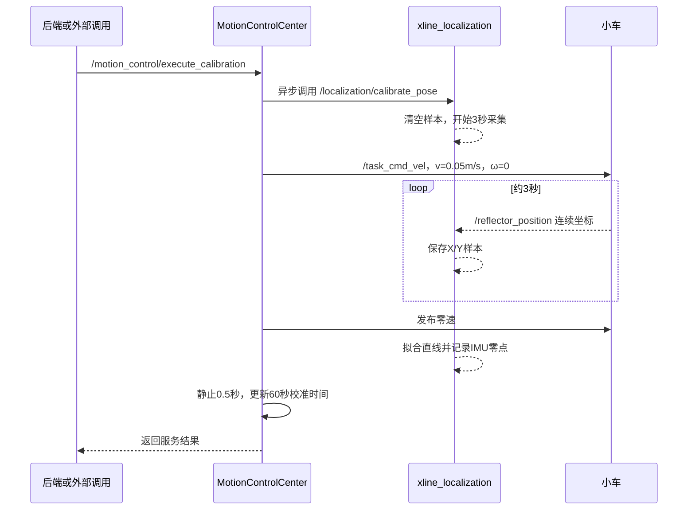

### 文档目的

本文依据当前源码说明 X/Y 坐标、IMU 航向、车体姿态、校准服务和 `ExecutePlan` Action 的关系。

| 模块 | 源码 | 作用 |
| --- | --- | --- |
| 定位融合 | [localization_node.cpp](../../ros_pack/xline_localization/src/localization_node.cpp) | 接收 `/imu`、`/reflector_position`，发布 `/robot_pose` |
| 定位参数 | [localization_params.yaml](../../ros_pack/xline_localization/config/localization_params.yaml) | 保存棱镜到车体基座的偏移 |
| 运动控制 | [motion_control_center.cpp](../../ros_pack/xline_base_controller/src/motion_control_center.cpp) | 调用校准服务、控制校准移动、执行 Action |
| Action 定义 | [ExecutePlan.action](../../ros_pack/xline_msgs/src/xline_msgs/action/ExecutePlan.action) | 定义划线任务的 Goal、Result、Feedback |
| 后端编排 | [execution_events.py](../../ros_pack/xline_server/communications/websocket/execution_events.py) | 开始划线前请求姿态校准 |

### 一、最终位姿接口

当前源码发布：

```text
/robot_pose : geometry_msgs/msg/PoseStamped
```

| 字段 | 实际来源 | 含义 | 单位 |
| --- | --- | --- | --- |
| `position.x` | 棱镜 X 加安装偏移变换 | 车体基座在 `map` 中的 X | 米 |
| `position.y` | 棱镜 Y 加安装偏移变换 | 车体基座在 `map` 中的 Y | 米 |
| `position.z` | 棱镜 Z 加安装偏移变换 | 车体基座高度 | 米 |
| `orientation` | IMU 航向变化 | 车体平面姿态 | 四元数 |
| `header.frame_id` | 定位节点设置 | 当前为 `map` | — |

当前系统不是直接把全站仪棱镜坐标复制成车体坐标，而是先做棱镜到车体基座的刚体变换。

### 二、X/Y 坐标的实现

全站仪驱动发布：

```text
/reflector_position : geometry_msgs/msg/PointStamped
```

定位节点收到消息后，如果 `x == 0` 或 `y == 0`，当前实现直接丢弃。有效坐标进入 `reflectorPositionCallback()`，再执行：

```text
global_to_base = global_to_reflector × reflector_to_base_tf_
```

配置文件中的参数为：

```yaml
reflector_to_base_x:  0.0885
reflector_to_base_y: -0.0045
reflector_to_base_z:  0.0
```

它们表示棱镜参考点到车体基座参考点的安装偏移。平面上可以理解为：

```text
车体基座位置 = 棱镜位置 + 当前航向旋转后的安装偏移
```

因此，偏移量的大小或正负号错误，会造成 X/Y 固定偏差；车辆转向后，偏差还可能随航向变化。

```mermaid
flowchart LR
    A[全站仪] -->|棱镜X/Y/Z| B[/reflector_position]
    C[IMU /imu] --> E[计算当前航向]
    D[reflector_to_base偏移] --> F[棱镜到车体变换]
    B --> F
    E --> F
    F --> G[/robot_pose]
```

### 三、IMU 航向和姿态校正

定位节点从 `/imu` 的四元数提取：

```text
imu_yaw = tf2::getYaw(latest_imu.orientation)
```

校准后保存：

| 变量 | 含义 |
| --- | --- |
| `imu_initial_yaw_` | 校准完成时 IMU 的原始航向 |
| `robot_initial_yaw_` | 根据全站仪移动轨迹计算出的车体初始航向 |

运行时计算：

```text
diff = remainder(imu_yaw - imu_initial_yaw_, 2π)
robot_yaw = remainder(diff + robot_initial_yaw_, 2π)
```

IMU 负责提供相对转角；全站仪移动轨迹负责建立车体在 `map` 中的初始方向。最终 `robot_yaw` 被转换成四元数，写入 `/robot_pose`。

### 四、定位节点校准服务

节点源码创建：

```text
/localization/calibrate_pose
类型：std_srvs/srv/Trigger
```

源码写成 `~/calibrate_pose`，因为节点名是 `localization`，最终解析为 `/localization/calibrate_pose`。

| 步骤 | 实现 |
| --- | --- |
| 1 | 清空 `position_samples_`，设置 `is_collecting_ = true` |
| 2 | 创建 3 秒定时器，并立即返回“已开始校准” |
| 3 | 3 秒内接收有效 `/reflector_position`，保存 X/Y 样本 |
| 4 | 定时器触发 `finishCalibration()`，停止采样 |
| 5 | `fitLine()` 对采样点做最小二乘直线拟合 |
| 6 | 将首个和最后一个采样点投影到拟合直线 |
| 7 | `initPose()` 用投影起终点计算车体初始航向 |
| 8 | 读取当前 IMU 航向，保存 `imu_initial_yaw_` |
| 9 | 设置 `initialized_ = true`，发布初始 `/robot_pose` |

注意：该服务响应是异步语义。返回成功只表示“开始校准”，不代表 3 秒后的拟合已经成功。

### 五、X/Y 轨迹如何校正航向

`fitLine()` 拟合：

```text
y = kx + b
k = Σ((xᵢ-x̄)(yᵢ-ȳ)) / Σ((xᵢ-x̄)²)
b = ȳ - kx̄
```

如果 X 方差接近零，源码按垂直线 `x = 常数` 处理。随后：

```text
dx = end.x - start.x
dy = end.y - start.y
yaw = atan2(dy, dx)
```

于是：

```text
robot_initial_yaw_ = atan2(end.y - start.y, end.x - start.x)
```

如果移动距离小于 `0.05 m`，校准失败。源码建议实际移动距离超过 `0.5 m`，以降低定位噪声对方向角的影响。

### 六、运动控制中心的校准接口

| 接口 | 类型 | 作用 |
| --- | --- | --- |
| `/localization/calibrate_pose` | `std_srvs/srv/Trigger` 客户端 | 请求定位节点开始采样和拟合 |
| `/motion_control/execute_calibration` | `std_srvs/srv/Trigger` 服务端 | 提供给后端或外部程序的校准入口 |

设计流程：



当前源码参数：

| 参数 | 当前值 |
| --- | --- |
| 校准速度 | `0.05 m/s` |
| 移动时间 | `3.0 s` |
| 控制发布频率 | `20 Hz` |
| 移动后静止时间 | `0.5 s` |
| 周期性校准窗口 | `60 s` |

### 七、后端和 Action 的关系

后端收到 Socket.IO `execute_plan` 后，会先调用 `/motion_control/execute_calibration`，成功后再逐条发送 `ExecutePlan` Action。

```text
Socket.IO execute_plan
    ↓
/motion_control/execute_calibration
    ↓
校准完成后发送 ExecutePlan Goal
    ↓
MotionControlCenter 执行路径
    ↓
/task_cmd_vel → 速度仲裁 → /cmd_vel
```

`ExecutePlan.action` 的字段：

| 部分 | 字段 | 含义 |
| --- | --- | --- |
| Goal | `plan_json` | 计划 JSON |
| Goal | `plan_uid` | 计划唯一标识 |
| Result | `success` | 是否执行成功 |
| Result | `error_message` | 错误信息 |
| Feedback | `current_id` | 当前路径 ID |

校准不是 Action 的字段，也不是 Action 自动携带的 X/Y 参数；它通过独立的 `Trigger` 服务完成。Action 只消费校准之后发布的 `/robot_pose`。

运动控制中心遇到 `TRANSITION` 路径时，会检查距离上次校准是否超过 60 秒；超过或从未校准时，会在 Action 执行线程中调用 `executeLocalizationCalibration(0.05, 3.0)`。

### 八、当前实现中的重要注意事项

| 现象 | 源码事实 |
| --- | --- |
| 服务很快返回成功 | `/localization/calibrate_pose` 立即返回“已开始校准”，实际拟合由 3 秒定时器完成 |
| 外部服务可能只返回成功 | `handleCalibrationService()` 当前源码中真正的 `executeLocalizationCalibration()` 调用被注释，需检查现场版本是否一致 |
| Action 转场可能触发实际移动校准 | `execute()` 内部的转场分支直接调用 `executeLocalizationCalibration()` |
| 棱镜跟踪但 X/Y 不变 | 检查 `/reflector_position` 是否有连续非零数据，以及定位节点是否订阅成功 |

### 九、推荐验证命令

```bash
ros2 service list | grep calibrate
ros2 topic echo /reflector_position
ros2 topic echo /imu
ros2 topic echo /robot_pose
ros2 topic echo /task_cmd_vel
ros2 action list
```

推荐顺序：先确认 `/reflector_position` 和 `/imu` 有效，再调用 `/localization/calibrate_pose`，等待 3 秒查看拟合日志，最后检查 `/robot_pose` 的 X/Y 和四元数。若调用 `/motion_control/execute_calibration` 时小车不动，应重点检查 `/task_cmd_vel` 和 `handleCalibrationService()` 的实际编译版本。

### 十、两个校准接口的动作对照

用户常说的“`/localization/calibrate_`”完整名称是：

```text
/localization/calibrate_pose
```

用户常说的“`/motion_control/execute_calibr`”完整名称是：

```text
/motion_control/execute_calibration
```

二者不是同一个服务，也不是两个 Action。当前二者的关系如下：

| 对比项 | `/localization/calibrate_pose` | `/motion_control/execute_calibration` |
| --- | --- | --- |
| 所属节点 | `xline_localization` | `xline_base_controller` |
| 服务类型 | `std_srvs/srv/Trigger` | `std_srvs/srv/Trigger` |
| 主要职责 | 采集棱镜 X/Y、拟合移动直线、更新 IMU 初始航向 | 对外提供一个运动控制层的校准入口，并负责并发占用检查 |
| 是否直接采集棱镜点 | 是 | 否，依赖定位节点采集 |
| 是否直接计算航向 | 是，`fitLine()` + `initPose()` | 否，调用定位服务才会间接完成 |
| 是否发布 `/robot_pose` | 校准完成后发布一次；平时由棱镜回调持续发布 | 当前回调本身不发布 |
| 是否控制小车移动 | 当前服务本身不发布速度 | 设计上应控制；当前回调中的实际调用被注释 |
| 返回时机 | 立即返回“开始校准”，3 秒后异步完成 | 当前立即返回“校准完成” |

### 十一、`/localization/calibrate_pose` 的完整动作

调用该服务后，定位节点实际执行以下动作：

1. 忽略 `Trigger` 请求内容，因为该服务没有参数。
2. 清空旧的 `position_samples_`，避免把上次校准点混入本次计算。
3. 设置 `is_collecting_ = true`，打开棱镜坐标采集开关。
4. 创建一个 3 秒定时器；服务回调不等待定时器，而是立即返回 `success=true`。
5. 在这 3 秒内，每次收到有效 `/reflector_position` 就保存其 X/Y。
6. 3 秒后执行 `finishCalibration()`，关闭采集开关。
7. 检查样本数量；少于 2 个点无法拟合直线。
8. 用最小二乘法得到移动轨迹直线，并把首尾点投影到该直线。
9. 用投影首尾点的方向计算 `robot_initial_yaw_`。
10. 读取最新 IMU 四元数，计算并保存 `imu_initial_yaw_`。
11. 设置 `initialized_ = true`，发布校准后的 `/robot_pose`。

这个服务本质上是“定位算法校准服务”，并不是“底盘运动服务”。如果调用前小车没有沿直线移动，采集到的点可能几乎重合，最终会因为移动距离小于 `0.05 m` 而失败。

### 十二、`/motion_control/execute_calibration` 的完整动作

该服务由 `MotionControlCenter::handleCalibrationService()` 提供，当前源码的真实执行顺序是：

1. 接收 `std_srvs/srv/Trigger` 请求。
2. 使用 `compare_exchange_strong` 检查 `is_executing_`。
3. 如果已有 Action 或校准占用控制权，返回 `success=false`，拒绝并发校准。
4. 如果没有任务占用，将 `is_executing_` 设置为 `true`。
5. 创建 RAII 清理对象，准备在回调退出时恢复 `is_executing_` 和 `is_paused_`。
6. 设置默认参数 `0.05 m/s` 和 `3.0 s`。
7. 当前版本没有真正调用 `executeLocalizationCalibration()`，因为该调用被注释。
8. 当前版本直接返回 `success=true` 和“姿态校正完成”。
9. 回调退出时清理执行占用标记。

因此，当前源码中直接调用 `/motion_control/execute_calibration` 的实际效果是：

```text
检查是否有任务占用
    ↓
设置/清理执行锁
    ↓
直接返回成功
```

它不会自动保证：

- 小车已经沿直线移动；
- `/task_cmd_vel` 已发布校准速度；
- `/localization/calibrate_pose` 已被调用；
- 3 秒采样已经完成；
- `/robot_pose` 已经更新。

### 十三、真正会移动小车的校准函数

真正包含“请求定位采样 + 控制底盘直行”的函数是：

```text
MotionControlCenter::executeLocalizationCalibration(double linear_velocity, double duration)
```

它的动作顺序是：

| 顺序 | 动作 | 当前实现 |
| --- | --- | --- |
| 1 | 检查 `/localization/calibrate_pose` 服务 | 只做快速 `service_is_ready()` 检查，不等待服务上线 |
| 2 | 异步发送 `Trigger` 请求 | 发送后不立即等待响应 |
| 3 | 生成直行速度 | `linear.x = 0.05 m/s`，`angular.z = 0` |
| 4 | 持续发布速度 | 20 Hz，约 3 秒，话题为 `/task_cmd_vel` |
| 5 | 停车 | 发布一次零速度 |
| 6 | 静止保持 | 继续以 20 Hz 发布零速度，约 0.5 秒 |
| 7 | 更新时间戳 | 设置最近一次校准时间，并开启 60 秒窗口 |
| 8 | 异步检查定位服务响应 | 最多等待约 2 秒，仅记录日志，不改变前面流程结果 |

该函数的设计意图是让“定位节点采样”和“底盘直行”同时发生：定位节点收集棱镜轨迹，运动控制中心负责产生直行运动。但是它不等同于 `ExecutePlan` Action；它只是 Action 执行过程中的一个普通 C++ 函数。

### 十四、后端调用链的真实含义

后端的 `call_calibration_service()` 调用的是：

```text
/motion_control/execute_calibration
```

后端会等待这个服务返回，最长约 6 秒；收到 `success=true` 后，就广播校准成功并继续下发 `ExecutePlan`。问题在于：当前 `handleCalibrationService()` 直接返回成功，而实际校准函数调用被注释，所以“后端收到成功”不能证明定位节点已经完成校准。

可以把当前代码分成两条路径：

| 路径 | 当前行为 |
| --- | --- |
| 后端 → `/motion_control/execute_calibration` | 当前只做占用检查并立即成功返回 |
| `ExecutePlan` 遇到 `TRANSITION` → `executeLocalizationCalibration()` | 会真正调用定位服务、发布直行速度、停车和更新 60 秒时间戳 |

### 十五、Action 中的校准不是消息字段

`ExecutePlan.action` 只有：

| 部分 | 字段 |
| --- | --- |
| Goal | `plan_json`、`plan_uid` |
| Result | `success`、`error_message` |
| Feedback | `current_id` |

因此 Action 不会携带“校准 X”“校准 Y”“IMU 零点”这些数据。校准结果保存在定位节点内存变量中：

- `robot_initial_yaw_`
- `imu_initial_yaw_`
- `initialized_`
- `robot_pose_`

之后 Action 的跟随控制每一帧只订阅已经发布的 `/robot_pose`，再用当前位姿计算路径误差和速度。

### 十六、现场判断校准是否真正完成

不能只看服务返回值，应按以下顺序观察：

| 检查 | 能证明什么 |
| --- | --- |
| `ros2 service list | grep calibrate` | 两个服务是否存在 |
| `ros2 topic echo /reflector_position` | 全站仪是否持续提供非零 X/Y |
| `ros2 topic echo /imu` | IMU 是否提供有效四元数 |
| `ros2 topic echo /task_cmd_vel` | 控制中心是否真的让小车直行 |
| `ros2 topic echo /robot_pose` | 校准后的车体 X/Y/姿态是否发布 |
| 查看定位节点日志 | 是否完成采样、拟合和 `initialized_ = true` |
| 查看控制中心日志 | 是否进入 `executeLocalizationCalibration()` |

最关键的判据是：调用 `/motion_control/execute_calibration` 后，是否能在 `/task_cmd_vel` 看到约 `0.05 m/s` 的直行速度，以及定位日志是否出现“收集完成、直线拟合成功、姿态校准完成”。如果只有服务成功响应而没有这两类证据，当前校准并没有真正执行。


