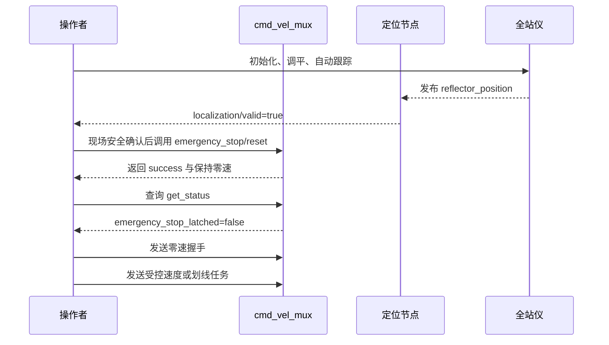

### 文档目的

本文解释急停复位命令及当前小车测试中常用的 ROS 2 服务、话题命令。

### 急停复位命令

```bash
ros2 service call /emergency_stop/reset std_srvs/srv/Trigger "{}"
```

| 部分 | 含义 |
|---|---|
| `ros2 service call` | 调用 ROS 2 服务 |
| `/emergency_stop/reset` | 速度仲裁器的急停复位服务 |
| `std_srvs/srv/Trigger` | 无参数触发型服务 |
| `{}` | 本次请求没有字段 |

正常返回示例：

```text
success=True
message='已复位并保持零速；等待0.60秒，再用来源零速握手开始新会话'
```

该命令只解除 `cmd_vel_mux` 的软件急停锁存，并保持最终速度为零。它不会恢复旧速度，也不会解除实体急停；实体急停、定位失效或其他节点再次触发急停时，锁存仍可能恢复。

### 复位后的状态确认

```bash
ros2 service call /cmd_vel_mux/get_status std_srvs/srv/Trigger "{}"
```

重点检查：

| 字段 | 期望值 | 含义 |
|---|---:|---|
| `emergency_stop_latched` | `false` | 软件急停锁存已解除 |
| `output.x` | `0.0` | 当前没有线速度输出 |
| `output.yaw` | `0.0` | 当前没有角速度输出 |
| `source` | `null` 或有效来源 | 当前速度来源 |

### 常用服务命令

定位校准：

```bash
ros2 service call /motion_control/execute_calibration std_srvs/srv/Trigger "{}"
```

这条命令可能使小车运动，必须先确认现场安全、全站仪坐标有效，并将实体急停放在手边。

暂停和继续任务（以下名称来自此前节点输出，实际运行时先用 `ros2 service list` 核实）：

```bash
ros2 service call /execution/pause std_srvs/srv/Trigger "{}"
ros2 service call /execution/resume std_srvs/srv/Trigger "{}"
```

### 全站仪命令

初始化：

```bash
ros2 service call /ln_driver/command_srv \
  xline_msgs/srv/LnCommand "{command_type: 1}"
```

自动调平：

```bash
ros2 service call /ln_driver/command_srv \
  xline_msgs/srv/LnCommand "{command_type: 3}"
```

自动跟踪：

```bash
ros2 service call /ln_driver/command_srv \
  xline_msgs/srv/LnCommand "{command_type: 2}"
```

通常顺序是初始化、物理确认调平、自动调平、棱镜对准、自动跟踪。跟踪命令返回“请使用棱镜或靶球……”只表示驱动等待或提示光学照准，最终应以 `/reflector_position` 持续收到非零坐标为准。

### 零速与速度话题

发送一次零速：

```bash
ros2 topic pub --once /task_cmd_vel geometry_msgs/msg/Twist \
"{linear: {x: 0.0}, angular: {z: 0.0}}"
```

零速消息可用于来源握手或停车，但不能代替急停复位服务。根据此前状态，复位后需至少等待 0.60 秒，再进行来源零速握手；来源超时为 0.6 秒。

注意：分两次启动 `ros2 topic pub`，零速握手与非零速度之间可能超过来源超时，导致来源再次被阻断。所以“先单独发一次零速，再慢慢手敲速度命令”不保证成功，不能把单次零速当成完整可执行运动流程。运动测试应使用已验证的持续发布与握手逻辑，本文件不执行运动测试。

### 服务和接口查询命令

查看所有服务：

```bash
ros2 service list
```

查看服务类型：

```bash
ros2 service type /emergency_stop/reset
ros2 service type /ln_driver/command_srv
```

查看请求字段：

```bash
ros2 interface show std_srvs/srv/Trigger
ros2 interface show xline_msgs/srv/LnCommand
```

查看定位状态：

```bash
ros2 topic echo /localization/valid --once
ros2 topic echo /robot_pose --once
ros2 topic echo /reflector_position --once
```

### 标准检查顺序



### 常见判断

| 现象 | 判断 |
|---|---|
| 复位服务一直等待 | 仲裁器未运行或 ROS 环境不一致 |
| 复位成功但状态又变为 `true` | 实体急停仍触发，或其他节点再次触发急停 |
| `/localization/valid=false` | 定位数据无效，不能可靠执行划线 |
| `/task_cmd_vel` 有速度而 `/cmd_vel` 为零 | 急停锁存、来源未零速握手、来源超时或仲裁条件未满足 |
| `/cmd_vel` 有速度但车轮不动 | 检查轮驱节点、CAN 通信、轮驱超时和急停硬件 |
