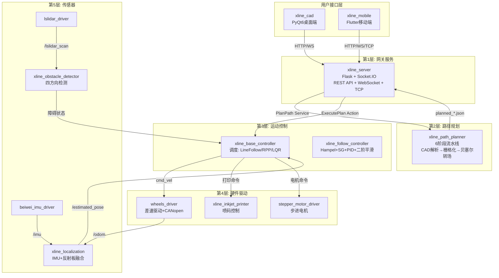

# X-LINE 智能喷码机器人系统

> **项目定位**: 基于 ROS 2 Humble 的智能地面喷码机器人全栈系统\
> **核心能力**: CAD图纸 → 路径规划 → 运动控制 → 同步喷码\
> **技术栈**: C++17 / ROS 2 Humble / Python 3.10 / Flutter / PyQt6

***

## 目录

1. [项目概述](<#1. 项目概述>)
2. [核心功能](<#2. 核心功能>)
3. [系统架构一览](<#3. 系统架构一览>)
4. [环境要求](<#4. 环境要求>)
5. [快速开始](<#5. 快速开始>)
6. [文档导航](<#6. 文档导航>)
7. [常见问题](<#7. 常见问题>)

***

## 1. 项目概述

X-LINE 是一套完整的智能地面喷码机器人系统，包含 **三个子系统**：

| 子系统      | 路径              | 技术                        | 用途                     |
| -------- | --------------- | ------------------------- | ---------------------- |
| **机器人端** | `ros_pack/`     | ROS 2 Humble (C++/Python) | 传感器驱动、路径规划、运动控制、执行编排   |
| **桌面端**  | `xline_cad/`    | PyQt6 (Python 3.10)       | CAD文件导入、图层编辑、路径预览、文件同步 |
| **移动端**  | `xline_mobile/` | Flutter (Dart)            | 远程监控、任务下发、实时控制、状态推送    |

### 1.1 典型工作流程

```
用户上传DXF图纸 → 桌面端解析/编辑 → 转换为JSON → 路径规划(6阶段流水线)
→ 贝塞尔转场优化 → 下发执行计划 → 机器人沿路径运动 → 同步喷码
```

### 1.2 适用场景

- **建筑工地**: 地面标线喷码（车位线、警示线、通道标识）
- **工厂车间**: 安全通道划线、设备定位标识
- **体育场馆**: 场地标线绘制
- **停车场**: 车位编号和边线喷码

***

## 2. 核心功能

### 2.1 功能矩阵

| 功能类别         | 功能项                      | 实现模块                       |
| ------------ | ------------------------ | -------------------------- |
| **CAD 数据处理** | DXF/DWG/PDF 多格式导入        | xline\_cad                 |
| <br />       | 图层管理、线型渲染、颜色配置           | xline\_cad                 |
| <br />       | 坐标变换（仿射变换/投影）            | xline\_cad + xline\_mobile |
| **路径规划**     | 6阶段规划流水线                 | xline\_path\_planner       |
| <br />       | 贝塞尔曲线转场（三次/五次）           | xline\_path\_planner       |
| <br />       | 贪心路径排序 + 共线合并            | xline\_path\_planner       |
| <br />       | 栅格地图生成（Bresenham）        | xline\_path\_planner       |
| **运动控制**     | 直线跟随（Sigmoid速度曲线）        | xline\_follow\_controller  |
| <br />       | RPP曲线跟随（Pure Pursuit）    | xline\_follow\_controller  |
| <br />       | LQR最优控制                  | xline\_follow\_controller  |
| <br />       | 多层滤波（Hampel/SG/PID/二阶平滑） | xline\_follow\_controller  |
| **传感器融合**    | IMU + 激光反射板定位            | xline\_localization        |
| <br />       | 四方向障碍物检测                 | xline\_obstacle\_detector  |
| **执行控制**     | ExecutePlan Action 调度    | xline\_base\_controller    |
| <br />       | 暂停/恢复/取消控制               | xline\_server              |
| <br />       | 喷码机同步（实线/虚线/文字）          | xline\_inkjet\_printer     |
| **远程管理**     | REST API（29个端点）          | xline\_server              |
| <br />       | WebSocket 实时推送（17个事件）    | xline\_server              |
| <br />       | TCP 控制协议（4个端口）           | xline\_server              |
| **安全保护**     | cmd\_vel 超时自动停车          | wheels\_driver             |
| <br />       | 障碍物检测自动降速                | xline\_obstacle\_detector  |
| <br />       | 姿态自动校准（最小二乘）             | xline\_localization        |

***

> **📌 多层滤波说明**：机器人运动控制中最怕两件事——传感器数据"跳"（异常值）和速度指令"抖"（噪声）。四层滤波各司其职：
>
> - **Hampel 滤波器**：基于中位数绝对偏差（MAD）检测并替换异常跳变值（如 IMU 毛刺）
> - **Savitzky-Golay 滤波器**：用多项式拟合窗口数据，保留转弯趋势的同时磨平随机噪声
> - **PID 控制器**：闭环控制核心，用比例/积分/微分三项计算消除跟踪误差
> - **二阶平滑器**：模拟"弹簧-阻尼"物理系统，把速度指令变得像弹性运动一样自然，避免机器人猛冲急停
> 
> 详情参见 [06\_技术架构与实现原理.md §3.3 滤波器组详解](06_技术架构与实现原理.md)

## 3. 系统架构一览



> 完整6层架构详解请参见 [01\_系统架构总览.md](01_系统架构总览.md)

***

## 4. 环境要求

### 4.1 硬件要求

| 组件  | 最低配置           | 推荐配置                        |
| --- | -------------- | --------------------------- |
| CPU | x86\_64, ARM64 | Intel i5+ / ARM Cortex-A72+ |
| RAM | 4GB            | 8GB+                        |
| 磁盘  | 20GB           | 50GB SSD                    |
| 接口  | USB串口 + CAN总线  | 同上                          |
| 传感器 | 北微IMU + 镭神激光雷达 | 同左                          |

### 4.2 软件依赖

完整技术栈（含用途、版本、必需性说明）已汇总至 [附录: 技术栈速览](#附录-技术栈速览)。

核心必需依赖：`Ubuntu 22.04` + `ROS 2 Humble` + `C++17` + `Python 3.10+` + `Flask 2.0+` + `Eigen3` + `CANopen`

***

## 5. 项目运行命令 #待修改

### 5.1 克隆项目

```bash
mkdir -p ~/xline_ws/src
cp -r /path/to/X-LINE源码/ros_pack/* ~/xline_ws/src/
```

### 5.2 安装 ROS 2 依赖

```bash
cd ~/xline_ws
rosdep install --from-paths src --ignore-src -r -y
```

### 5.3 编译

```bash
colcon build --symlink-install --cmake-args -DCMAKE_BUILD_TYPE=Release
source install/setup.bash
```

### 5.4 启动系统

```bash
# 方式一: 一键启动完整系统
ros2 launch xline_base_controller base_controller.launch.py

# 方式二: 分步启动各组件
ros2 run wheels_driver run_motor &              # 轮组驱动
ros2 run beiwei_imu_driver beiwei_imu_driver_node &  # IMU
ros2 run xline_localization localization_node &      # 定位
ros2 run xline_base_controller base_controller_node & # 控制中心
python3 -m xline_server &                             # 服务端
```

### 5.5 验证运行

```bash
# 检查服务是否正常
curl http://192.168.0.123:5000/api/v1/monitoring/health \
  -H "X-API-Key: xline-production-api-key-12345"

# 期望响应
{"success":true,"data":{"overall_status":"healthy",...}}
```

### 5.6 关键端口

| 服务        | 端口   | 协议        |
| --------- | ---- | --------- |
| REST API  | 5000 | HTTP      |
| WebSocket | 5000 | Socket.IO |
| 执行状态推送    | 9998 | TCP       |
| 控制命令      | 9997 | TCP       |
| 底盘控制      | 8888 | TCP       |
| 位置服务      | 9999 | TCP       |

***

## 6. 文档导航 #待修改

本自述文件夹包含 **23 份文档**，按阅读顺序组织为三个层次：

### 📖 第一层：宏观认知（先读这些建立全局概念）

| 序号     | 文档                                  | 内容                            | 建议用时 |
| ------ | ----------------------------------- | ----------------------------- | ---- |
| **00** | `00_README.md`                      | 项目总览、快速开始                     | 10分钟 |
| **01** | [01\_系统架构总览.md](01_系统架构总览.md)       | 6层架构、15个包依赖关系图                | 30分钟 |
| **02** | [02\_工程目录结构.md](02_工程目录结构.md)       | 三子系统完整文件树、模块职责                | 20分钟 |
| **03** | [03\_完整运行流程.md](03_完整运行流程.md)       | 18步端到端流程、启动流程、控制流             | 30分钟 |
| **04** | [04\_API接口参考文档.md](04_API接口参考文档.md) | 29个REST端点 + 17个WS事件 + 4个TCP协议 | 45分钟 |
| **05** | [05\_通信拓扑.md](05_通信拓扑.md)           | Topic/Service/Action/TCP全貌    | 20分钟 |
| **06** | [06\_技术架构与实现原理.md](06_技术架构与实现原理.md) | 技术选型、核心算法总览                   | 30分钟 |

### 📖 第二层：模块精读（深入各模块细节）

| 序号        | 文档                                                                                                  |
| --------- | --------------------------------------------------------------------------------------------------- |
| **07-01** | [07\_核心模块精读/01\_xline\_msgs\_消息定义.md](01_xline_msgs_消息定义.md)                              |
| **07-02** | [07\_核心模块精读/02\_xline\_path\_planner\_路径规划器.md](02_xline_path_planner_路径规划器.md)           |
| **07-03** | [07\_核心模块精读/03\_xline\_base\_controller\_运动控制中心.md](03_xline_base_controller_运动控制中心.md)   |
| **07-04** | [07\_核心模块精读/04\_xline\_follow\_controller\_跟随控制器.md](04_xline_follow_controller_跟随控制器.md) |
| **07-05** | [07\_核心模块精读/05\_xline\_server\_服务端.md](05_xline_server_服务端.md)                            |
| **07-06** | [07\_核心模块精读/06\_wheels\_driver\_差速驱动.md](06_wheels_driver_差速驱动.md)                        |
| **07-07** | [07\_核心模块精读/07\_传感器与定位.md](07_传感器与定位.md)                                                  |
| **07-08** | [07\_核心模块精读/08\_辅助模块.md](08_辅助模块.md)                                                      |

### 📖 第三层：文件详解（单文件逐行分析）

| 序号        | 文档                                                                                                | 关键度 |
| --------- | ------------------------------------------------------------------------------------------------- | --- |
| **08-01** | [08\_关键文件详解/01\_path\_planner.cpp\_详解.md](01_path_planner.cpp_详解.md)                    | ★★★ |
| **08-02** | [08\_关键文件详解/02\_follow\_common.hpp\_详解.md](02_follow_common.hpp_详解.md)                  | ★★★ |
| **08-03** | [08\_关键文件详解/03\_rpp\_follow\_controller.cpp\_详解.md](03_rpp_follow_controller.cpp_详解.md) | ★★★ |
| **08-04** | [08\_关键文件详解/04\_motion\_control\_center.cpp\_详解.md](04_motion_control_center.cpp_详解.md) | ★★★ |
| **08-05** | [08\_关键文件详解/05\_execution\_events.py\_详解.md](05_execution_events.py_详解.md)              | ★★★ |
| **08-06** | [08\_关键文件详解/06\_run\_motor.py\_详解.md](06_run_motor.py_详解.md)                            | ★★  |
| **08-07** | [08\_关键文件详解/07\_common\_types.hpp\_详解.md](07_common_types.hpp_详解.md)                    | ★★  |
| **08-08** | [08\_关键文件详解/08\_\_\_main\_\_.py\_详解.md](08___main__.py_详解.md)                           | ★★  |

## 附录: 技术栈速览

| 层级              | 技术              | 版本        | 用途                           | 必需  |
| --------------- | --------------- | --------- | ---------------------------- | --- |
| **操作系统**        | Ubuntu          | 22.04 LTS | 系统运行环境                       | ✅   |
| **机器人框架**       | ROS 2           | Humble    | 机器人中间件：节点管理、话题/服务/Action 通信  | ✅   |
| **编程语言**        | C++             | 17        | 核心控制算法、路径规划、硬件驱动             | ✅   |
| <br />          | Python          | 3.10+     | Web 服务、脚本、桌面端 CAD 工具         | ✅   |
| <br />          | Dart            | 3.x       | 移动端 Flutter APP              | 可选  |
| **Web 服务**      | Flask           | 2.0+      | REST API 后端框架                | ✅   |
| <br />          | Socket.IO       | —         | WebSocket 实时推送               | ✅   |
| **桌面端**         | PyQt6           | 6.5+      | CAD 可视化工具（xline\_cad）        | 可选  |
| **移动端**         | Flutter         | 3.x       | 移动端控制 APP（xline\_mobile）     | 可选  |
| **数学库**         | Eigen3          | 3.4+      | 矩阵运算、多项式拟合、滤波器卷积系数预计算        | ✅   |
| **可视化**         | OpenCV          | 4.5+      | 路径规划结果可视化（生成 PNG/JPG 图片查看路线） | 编译时 |
| **数据交换**        | YAML            | —         | 运行时参数配置（控制参数、路径参数、传感器参数）     | ✅   |
| <br />          | JSON            | —         | 数据交换格式（CAD 解析、执行计划、API 通信）   | ✅   |
| **C++ 配置解析**    | yaml-cpp        | 0.7+      | C++ 端 YAML 文件读取              | ✅   |
| <br />          | nlohmann-json   | 3.11+     | C++ 端 JSON 序列化/反序列化          | ✅   |
| **Python 配置解析** | PyYAML          | 6.0+      | Python 端 YAML 文件读取           | ✅   |
| **串口通信**        | pyserial        | 3.5+      | Python 端串口（CAN 总线 SLCAN 适配器） | ✅   |
| **工业总线**        | CANopen (SLCAN) | —         | 伺服轮电机控制协议（iWMC 智能轮组）         | ✅   |

> 💡 **"编译时"** 的含义：该库仅在编译特定功能包时需要（如 OpenCV 仅在编译 `xline_path_planner` 时需要），机器人端（工控机）运行时不需要安装，可以减小部署体积。
> 💡 **"可选"** 的含义：不安装不影响核心控制功能，仅桌面端/移动端工具不可用。

***

## 附录: 核心硬件与技术术语

> 💡 **详细原理讲解**已迁移至 [06\_技术架构与实现原理.md §4 硬件系统与技术原理](06_技术架构与技术原理讲解.md)，涵盖伺服轮闭环控制、CANopen/SLCAN 协议、差速运动学公式、LN150 定位融合策略等。

| 硬件/技术 | 型号/说明 | 在 X-LINE 中的角色 | 通信方式 |
|-----------|----------|-------------------|----------|
| **伺服轮** | iWMC 智能轮组（伺服电机 + 编码器 + 驱动器） | 差速驱动，逆/正运动学，发布 /odom + /tf | CANopen (SDO, 通过 SLCAN) |
| **LN150 全站仪** | 中海达高精度工程全站仪 | 厘米级绝对定位，为 xline_localization 提供反射板坐标 | 串口/TCP, 10Hz |
| **北微 IMU** | MINS-500 惯性测量单元 | 提供高频航向角 (yaw)，弥补全站仪无姿态的短板 | 串口, 100Hz |
| **镭神激光雷达** | LS X10 | 360° 点云 → 四方向障碍物检测（非 SLAM 建图） | UDP 以太网, 10Hz |
| **CANopen** | 基于 CAN 总线的应用层协议 | 伺服轮数字控制协议（OD/SDO/PDO/NMT） | SLCAN 串口适配器 |
| **步进电机** | TB6600 驱动器 × 2 | 喷码机喷头升降（调整喷头距地面高度） | 串口 |
| **喷码机** | 工业喷码机 | 执行实线/虚线/文字喷印 | TCP |
