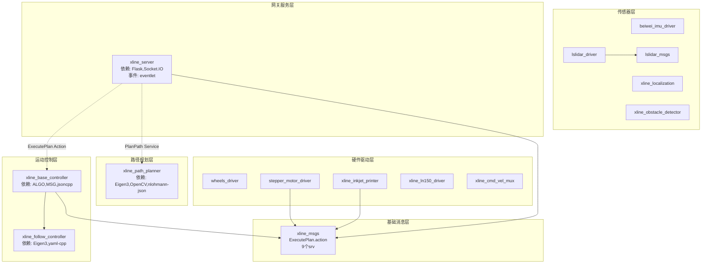

# 01 - 系统架构总览

> **阅读目标**: 建立对 X-LINE 项目6层分层架构和15个ROS包的全局认知\
> **前置阅读**: [00\_README.md](00_README.md)

***

## 1. 6层架构全景

X-LINE 采用严格的**六层分层架构**，层间通过明确的接口（Topic/Service/Action/TCP/文件）解耦：

```
┌──────────────────────────────────────────────────────────────────────┐
│  第0层: 用户接口层 (User Interface)                                  │
│  xline_cad (PyQt6)  ←──→  xline_mobile (Flutter)                    │
│  桌面CAD编辑+文件同步     移动端远程监控+任务下发                      │
├──────────────────────────────────────────────────────────────────────┤
│  第1层: 网关服务层 (Gateway)                                         │
│  xline_server (Flask + Socket.IO + TCP)                             │
│  REST API(29端点) / WebSocket(17事件) / TCP(4端口)                    │
├──────────────────────────────────────────────────────────────────────┤
│  第2层: 路径规划层 (Planning)                                        │
│  xline_path_planner (C++)                                            │
│  6阶段流水线: CAD解析→预处理→栅格化→规划→轨迹→输出                    │
├──────────────────────────────────────────────────────────────────────┤
│  第3层: 运动控制层 (Control)                                         │
│  xline_base_controller (调度) + xline_follow_controller (算法)       │
│  4种控制器: LineFollow / RPP / LQRCircle / LQRCurve                  │
├──────────────────────────────────────────────────────────────────────┤
│  第4层: 硬件驱动层 (Hardware)                                        │
│  wheels_driver + xline_inkjet_printer + stepper_motor_driver         │
│  + xline_ln150_driver + xline_cmd_vel_mux                            │
│  CANopen伺服轮 / TCP喷码机 / 步进电机 / LN150全站仪 / 速度复用         │
├──────────────────────────────────────────────────────────────────────┤
│  第5层: 传感器与感知层 (Sensors)                                      │
│  beiwei_imu_driver + lslidar_driver + lslidar_msgs                  │
│  + xline_localization + xline_obstacle_detector                      │
│  IMU航向 + 激光雷达点云 + 定位融合 + 四方向障碍检测                     │
└──────────────────────────────────────────────────────────────────────┘
      ▲                              ▲
      │ 消息定义                     │ 自定义消息
      ▼                              ▼
┌──────────────────────────────────────────────────────────────────────┐
│  基础层: xline_msgs                                                  │
│  ExecutePlan.action + 9个 srv + 消息类型定义                          │
└──────────────────────────────────────────────────────────────────────┘
```

***

## 1.1 各层功能简述

| 层级               | 核心职责                                                                                                                                                                    |
| ---------------- | ----------------------------------------------------------------------------------------------------------------------------------------------------------------------- |
| **第0层 - 用户接口**   | 桌面CAD编辑与移动端远程控制                                                                                                                                                         |
| **第1层 - 网关服务**   | 承上启下的通信枢纽，提供REST API、WebSocket、TCP接口                                                                                                                                    |
| **第2层 - 路径规划**   | 6阶段流水线，生成最优喷码路径                                                                                                                                                         |
| **第3层 - 运动控制**   | **核心执行层**：`xline_base_controller` 是调度中心，解析执行计划、协同步进电机和喷码机同步、管理执行状态（暂停/恢复/取消）；`xline_follow_controller` 是算法库，提供4种路径跟随控制器（LineFollow/RPP/LQRCircle/LQRCurve）和5种滤波器，计算速度指令 |
| **第4层 - 硬件驱动**   | 控制伺服轮、喷码机、步进电机、全站仪等硬件                                                                                                                                                   |
| **第5层 - 传感器与感知** | IMU、激光雷达、定位融合、障碍物检测                                                                                                                                                     |

***

## 2. 三个子系统定位

### 2.1 ros\_pack - 机器人端

| 维度       | 说明                                   |
| -------- | ------------------------------------ |
| **定位**   | 系统核心，运行在机器人上的 ROS 2 节点集合             |
| **语言**   | C++17（核心算法）+ Python 3.10（Web服务和部分驱动） |
| **包含包数** | 15 个 ROS 2 功能包                       |
| **核心职责** | 传感器驱动、路径规划、运动控制、执行编排、远程API           |

### 2.2 xline\_cad - 桌面端

| 维度       | 说明                                       |
| -------- | ---------------------------------------- |
| **定位**   | 桌面CAD处理工具，运行在PC上                         |
| **语言**   | Python 3.10 + PyQt6                      |
| **核心职责** | DXF/DWG文件导入、图层编辑、线型渲染、路径预览、WebSocket文件同步 |

### 2.3 xline\_mobile - 移动端

| 维度       | 说明                               |
| -------- | -------------------------------- |
| **定位**   | 移动端远程控制APP                       |
| **语言**   | Dart (Flutter 3.x)               |
| **核心职责** | 远程任务下发、实时执行监控、暂停/恢复/取消控制、机器人位置追踪 |

***

## 3. 15个ROS包的分类与职责

### 3.1 按层次分类

| 层次       | 包名                        | 语言     | 核心职责                            |
| -------- | ------------------------- | ------ | ------------------------------- |
| **消息定义** | xline\_msgs               | C++    | 自定义 Action/Service/Message 定义   |
| **传感器**  | beiwei\_imu\_driver       | C++    | 北微IMU驱动 → `/imu`                |
| **传感器**  | lslidar\_driver           | C++    | 镭神激光雷达驱动 → `/lslidar_scan`      |
| **传感器**  | lslidar\_msgs             | C++    | 雷达自定义消息定义                       |
| **感知**   | xline\_localization       | C++    | IMU+反射板融合定位 → `/estimated_pose` |
| **感知**   | xline\_obstacle\_detector | C++    | 四方向障碍物检测                        |
| **规划**   | xline\_path\_planner      | C++    | 6阶段路径规划流水线                      |
| **控制**   | xline\_base\_controller   | C++    | 运动控制中枢调度器                       |
| **控制**   | xline\_follow\_controller | C++    | 4种路径跟随控制器+滤波器组                  |
| **驱动**   | wheels\_driver            | Python | 两轮差速驱动+CANopen伺服轮               |
| **驱动**   | stepper\_motor\_driver    | Python | 步进电机控制(喷码机升降)                   |
| **驱动**   | xline\_inkjet\_printer    | Python | 喷码打印机(异步TCP)                    |
| **驱动**   | xline\_ln150\_driver      | C++    | LN150全站仪驱动                      |
| **辅助**   | xline\_cmd\_vel\_mux      | Python | cmd\_vel多路复用                    |
| **网关**   | xline\_server             | Python | Flask+Socket.IO网关服务             |

### 3.2 按语言分类

| 语言              | 包数  | 包名                                                                                                                                                                                                               |
| --------------- | --- | ---------------------------------------------------------------------------------------------------------------------------------------------------------------------------------------------------------------- |
| **C++17**       | 10个 | xline\_msgs, beiwei\_imu\_driver, lslidar\_driver, lslidar\_msgs, xline\_localization, xline\_obstacle\_detector, xline\_path\_planner, xline\_base\_controller, xline\_follow\_controller, xline\_ln150\_driver |
| **Python 3.10** | 5个  | wheels\_driver, stepper\_motor\_driver, xline\_inkjet\_printer, xline\_cmd\_vel\_mux, xline\_server                                                                                                              |

***

## 4. 包依赖关系图



> 实线箭头 = 编译时依赖 (`package.xml` 中的 `<depend>`)\
> 虚线箭头 = 运行时通信 (ROS Service/Action)

***

## 5. 技术栈详解

### 5.1 技术选型依据

| 技术                    | 选型原因                                             |
| --------------------- | ------------------------------------------------ |
| **ROS 2 Humble**      | LTS长期支持版(至2027年)，成熟稳定的机器人中间件                     |
| **C++17**             | 核心控制算法的性能要求；`std::optional`/`std::variant`/结构化绑定 |
| **Python 3.10**       | Web服务和硬件驱动的快速开发；丰富的生态库                           |
| **Eigen3**            | 头文件式线性代数库，零运行时依赖，SIMD加速                          |
| **OpenCV**            | 路径可视化+栅格地图生成                                     |
| **Flask + Socket.IO** | 轻量级Web框架，事件驱动实时推送                                |
| **Flutter**           | 跨平台移动端，单一代码库支持Android/iOS                        |
| **PyQt6**             | 成熟的桌面GUI框架，丰富的CAD渲染能力                            |
| **nlohmann-json**     | 头文件式JSON库，与C++ STL无缝集成                           |

### 5.2 关键版本约束

```
ROS 2 Humble (Ubuntu 22.04)
├── Python 3.10 (系统自带)
├── GCC 11+ (C++17支持)
├── CMake 3.16+
├── Eigen 3.4.0 (apt install libeigen3-dev)
├── OpenCV 4.5.4 (apt install libopencv-dev)
├── yaml-cpp 0.7.0 (apt install libyaml-cpp-dev)
└── nlohmann-json 3.11+ (头文件, 通过CMake FetchContent或apt)

Python 依赖:
├── Flask >= 2.0
├── Flask-SocketIO >= 5.3
├── eventlet >= 0.33 (异步WebSocket)
├── PyYAML >= 6.0
├── pyserial >= 3.5
└── numpy (可选)
```

***

## 6. 构建系统说明

### 6.1 ament\_cmake (C++包)

所有 C++ 包使用 `ament_cmake` 构建：

```cmake
# 典型 CMakeLists.txt 结构（以 xline_path_planner 为例）
cmake_minimum_required(VERSION 3.16)
project(xline_path_planner)

find_package(ament_cmake REQUIRED)
find_package(rclcpp REQUIRED)
find_package(Eigen3 REQUIRED)
find_package(OpenCV REQUIRED)
find_package(nlohmann_json REQUIRED)

add_library(xline_path_planner_lib SHARED
  src/cad_parser.cpp
  src/geometry_preprocessor.cpp
  src/grid_map_generator.cpp
  src/path_planner.cpp
  src/trajectory_generator.cpp
  src/output_formatter.cpp
)

target_include_directories(xline_path_planner_lib PUBLIC
  $<BUILD_INTERFACE:${CMAKE_CURRENT_SOURCE_DIR}/include>
  $<INSTALL_INTERFACE:include>
)

ament_target_dependencies(xline_path_planner_lib
  rclcpp Eigen3 OpenCV nlohmann_json
)

add_executable(drawing_planner_node src/main.cpp)
target_link_libraries(drawing_planner_node xline_path_planner_lib)

install(DIRECTORY config/ DESTINATION share/${PROJECT_NAME}/config)
ament_export_include_directories(include)
ament_export_libraries(xline_path_planner_lib)

ament_package()
```

### 6.2 ament\_python (Python包)

所有 Python 包使用 `ament_python`：

```python
# setup.py
from setuptools import setup
package_name = 'wheels_driver'
setup(
    name=package_name,
    version='0.0.1',
    packages=[package_name],
    data_files=[
        ('share/ament_index/resource_index/packages',
            ['resource/' + package_name]),
        ('share/' + package_name, ['package.xml']),
        ('share/' + package_name + '/config',
            ['config/differential_wheels_params.yaml']),
    ],
    install_requires=['setuptools'],
    zip_safe=True,
    entry_points={
        'console_scripts': [
            'run_motor = wheels_driver.run_motor:main',
        ],
    },
)
```

***

## 7. 配置体系说明

### 7.1 YAML配置文件总览

| 配置文件                                     | 所属包                       | 核心参数                         |
| ---------------------------------------- | ------------------------- | ---------------------------- |
| `config/planner.yaml`                    | xline\_path\_planner      | 规划器配置：可视化、CAD解析、栅格地图、贝塞尔转场参数 |
| `config/line.yaml`                       | xline\_follow\_controller | 直线跟随：Sigmoid参数、PID增益、滤波器窗口   |
| `config/rpp_circle.yaml`                 | xline\_follow\_controller | RPP圆跟随：前瞻距离、曲率约束、航向预对准       |
| `config/rpp_curve.yaml`                  | xline\_follow\_controller | RPP曲线跟随：前瞻距离、曲率约束            |
| `config/differential_wheels_params.yaml` | wheels\_driver            | 轮半径、轮距、编码器分辨率、减速比、速度限制       |
| `config/localization_params.yaml`        | xline\_localization       | 反射板偏移、数据超时、校准速度参数            |
| `config/obstacle_detector_config.yaml`   | xline\_obstacle\_detector | 检测距离、机器人尺寸、屏蔽区域              |
| `config/printers.yaml`                   | xline\_inkjet\_printer    | 打印机TCP地址、端口、墨水配置             |
| `config/mins500.yaml`                    | beiwei\_imu\_driver       | IMU串口参数、坐标系                  |
| `params/lsx10.yaml`                      | lslidar\_driver           | 雷达网络参数、扫描频率                  |
| `config/ln.yaml`                         | xline\_ln150\_driver      | LN150全站仪通信参数                 |

### 7.2 xline\_server配置 (Python)

配置集中在 `config/config.py`：

```python
class Config:
    SECRET_KEY = os.environ.get('SECRET_KEY', 'xline-secret-key')
    API_KEY = os.environ.get('API_KEY', 'xline-production-api-key-12345')
    HOST = os.environ.get('HOST', '192.168.0.123')
    PORT = int(os.environ.get('PORT', 5000))
    UPLOAD_FOLDER = os.path.join(WS_ROOT, 'uploads')
    EXECUTION_HISTORY_DIR = os.path.join(WS_ROOT, 'execution_history')
    PLANNED_RESULTS_PREFIX = os.path.join(WS_ROOT, 'xline_path_planner/planned_results/planned_')
    MAX_CONTENT_LENGTH = 500 * 1024 * 1024  # 500MB
    ALLOWED_EXTENSIONS = {'dxf', 'dwg', 'dgn', 'pdf', 'plt', 'hpgl'}
    SOCKETIO_PING_TIMEOUT = 60
    SOCKETIO_PING_INTERVAL = 25
    SYNC_INTERVAL = 5  # 文件同步间隔 (秒)
    HEARTBEAT_INTERVAL = 30  # 心跳间隔 (秒)
```

***

## 8. 系统资源消耗估算

| 组件                        | CPU占用   | 内存占用        | 说明                      |
| ------------------------- | ------- | ----------- | ----------------------- |
| xline\_path\_planner      | 偶发高负载   | \~500MB     | 仅在规划时运行，栅格化+可视化消耗大      |
| xline\_base\_controller   | 中等      | \~200MB     | 持续运行，Action Server      |
| xline\_follow\_controller | 中等      | \~100MB     | 作为库链接到 base\_controller |
| xline\_server             | 低-中     | \~150MB     | 持续运行，WebSocket连接增多时内存增长 |
| wheels\_driver            | 低       | \~50MB      | 持续运行，50Hz控制循环           |
| 传感器驱动 (4个)                | 低       | \~50MB/个    | 持续运行                    |
| **总计**                    | \~4核低负载 | **\~1.2GB** | 所有组件同时运行                |

***

## 9. 不同规模场景的部署建议

### 9.1 最小部署（仅开发调试用）

```
仅需运行:
  - wheels_driver
  - xline_base_controller + xline_follow_controller
  - xline_server

不需要: CAD桌面端、移动端、传感器（用仿真数据替代）
```

### 9.2 标准部署（正常作业）

```
全部15个ROS包 + xline_server
可选择性启动:
  - xline_cad (桌面端，PC运行)
  - xline_mobile (移动端，Android平板运行)
```

### 9.3 资源受限部署（树莓派/ARM嵌入式）

```
精简启动:
  - wheels_driver (必需)
  - xline_base_controller + xline_follow_controller (必需)
  - xline_server (必需)
  - beiwei_imu_driver + xline_localization (定位必需)

可省略:
  - xline_path_planner (在PC上离线规划后传JSON)
  - lslidar_driver + xline_obstacle_detector (非必需场景)
```

***

## 10. 全部功能包详细描述（按层次）

### 基础层：消息定义

| 包名              | 语言  | 功能简述                                                                                                                                                                                                  |
| --------------- | --- | ----------------------------------------------------------------------------------------------------------------------------------------------------------------------------------------------------- |
| **xline\_msgs** | C++ | 定义系统全部自定义通信协议：1 个 Action（`ExecutePlan`）+ 9 个 Service（MotorCommand / PrinterCommand / LnCommand / QuickCommand / ConfigurePrint / SetLine / SetText / SetPrinterActive / SetPrinterEnabled），是整个系统的通信基础 |

### 第1层：网关服务

| 包名                | 语言     | 功能简述                                                                                                                                                                                                                                                     |
| ----------------- | ------ | -------------------------------------------------------------------------------------------------------------------------------------------------------------------------------------------------------------------------------------------------------- |
| **xline\_server** | Python | Flask + Socket.IO 网关服务。提供 29 个 REST API 端点 + 17 个 WebSocket 事件 + 7 个 TCP 服务器端口（9998/9997/9996/9999/9993/9992/8888），负责文件管理、执行编排、路径规划触发、系统监控、文件同步。作为 `/execute_plan` Action Client 和 `/execution/pause`、`/execution/resume`、`/plan_path` Service Client 运行 |

### 第2层：路径规划

| 包名                       | 语言  | 功能简述                                                                                                                                                                                                                      |
| ------------------------ | --- | ------------------------------------------------------------------------------------------------------------------------------------------------------------------------------------------------------------------------- |
| **xline\_path\_planner** | C++ | 6 阶段路径规划流水线：CAD JSON 解析 → 几何预处理（Polyline 拆分/共线合并） → Bresenham 栅格化 → 贪心排序 + 三次/五次贝塞尔转场 → 轨迹生成 → planned\_\*.json 输出。作为 `/plan_path` Service Server 运行。核心算法文件：`path_planner.cpp`（\~800行）、`common_types.hpp`（定义全部几何数据结构继承体系） |

### 第3层：运动控制

| 包名                            | 语言  | 功能简述                                                                                                                                                                                                                                                                                                                                                                                                      |
| ----------------------------- | --- | --------------------------------------------------------------------------------------------------------------------------------------------------------------------------------------------------------------------------------------------------------------------------------------------------------------------------------------------------------------------------------------------------------- |
| **xline\_base\_controller**   | C++ | 运动控制中枢调度器。作为 `/execute_plan` Action Server 运行，接收执行计划 JSON，解析 5 种路径类型（直线/圆/圆弧/样条/椭圆），调度 4 种跟随控制器（多态），协同步进电机升降和喷码机同步（调用 `/printer_command`、`/motor_command` Service），提供 `/execution/pause`、`/execution/resume` Service，支持暂停/恢复/取消控制流                                                                                                                                                                        |
| **xline\_follow\_controller** | C++ | 路径跟随算法库（编译时链接到 base\_controller，不独立运行节点）。提供 4 种控制器：LineFollow（直线：Sigmoid 速度曲线）、RPP（Regulated Pure Pursuit：前瞻点 + 曲率约束 + 接近减速）、LQR Circle、LQR Curve。包含 5 种滤波器（`follow_common.hpp`）：HampelFilter（异常值检测，4 种处理策略）、SavitzkyGolayFilter（数据平滑）、PIDController（积分限幅 + 输出限幅）、SecondOrderSmoother（质量-弹簧-阻尼物理模型）、FourthOrderLowpassFilter（四阶低通）。采用策略模式：`CirclePathStrategy`（圆：航向预对准）/ `CurvePathStrategy`（曲线：NURBS 插值） |

### 第4层：硬件驱动

| 包名                         | 语言     | 功能简述                                                                                                                                                                                                                          |
| -------------------------- | ------ | ----------------------------------------------------------------------------------------------------------------------------------------------------------------------------------------------------------------------------- |
| **wheels\_driver**         | Python | 两轮差速驱动核心节点。订阅 `/cmd_vel`，逆运动学（cmd\_vel → 左右轮 RPM → DEC 值），通过 SLCAN 串口 + CANopen 协议控制 iWMC 伺服轮（SDO 写入 0x60FF 目标速度），读取编码器反馈，正运动学（精确弧线积分）计算并发布 `/odom`（50Hz）和 `/tf`。包含超时自动停车保护、速度限幅、CANopen 状态机（NOT\_READY → OPERATION\_ENABLED） |
| **xline\_inkjet\_printer** | Python | 喷码打印机控制。作为 `/printer_command` Service Server 接收命令，通过 `msg_encoder` 编码为二进制消息，经异步 TCP 发送到打印机。支持 solid（实线连续喷墨）/ dashed（虚线间隔喷墨）/ text（文字喷印）三种模式，含墨量查询和配置校验功能                                                                      |
| **stepper\_motor\_driver** | Python | 双 TB6600 步进电机控制。作为 `/motor_command` Service Server，通过串口控制左右喷码机升降（forward / reverse），确保喷头与地面保持合适距离                                                                                                                             |
| **xline\_ln150\_driver**   | C++    | LN150 全站仪驱动。作为 `/ln_driver/command_srv` Service Server，支持初始化全站仪（command\_type=1）、自动跟踪锁定反射板（command\_type=2）、自动调平（command\_type=3）                                                                                             |
| **xline\_cmd\_vel\_mux**   | Python | cmd\_vel 多路复用节点。订阅多个来源的速度指令（自动路径跟随 + 手动摇杆），根据 `/obstacle_detected` 障碍物距离动态减速，按优先级转发到 `/cmd_vel`。支持四方向独立停止距离配置、线速度和角速度的加速度限制，防止速度突变                                                                                            |

### 第5层：传感器与感知

| 包名                            | 语言  | 功能简述                                                                                                                                                                                                    |
| ----------------------------- | --- | ------------------------------------------------------------------------------------------------------------------------------------------------------------------------------------------------------- |
| **beiwei\_imu\_driver**       | C++ | 北微 IMU 传感器驱动。20Hz 主循环，串口读取原始数据，通过 `imu_parser` 解码字节流协议，发布 `/imu`（sensor\_msgs/Imu，100Hz）。配置含串口号/波特率/坐标系参数（`mins500.yaml`）                                                                               |
| **lslidar\_driver**           | C++ | 镭神激光雷达驱动。包含两个子包：`lslidar_driver`（驱动核心：UDP 收包 → 点云解析，10Hz 发布 `/lslidar_scan`）和 `lslidar_msgs`（自定义雷达消息：LslidarPacket / LslidarPoint / LslidarScan / LslidarSweep / LslidarDifop）。支持单雷达和双雷达模式，含 RViz 可视化配置 |
| **xline\_localization**       | C++ | 定位融合节点。订阅 `/imu`（100Hz 航向）+ `/odom` + `/tf`（反射板位置变换），融合后发布 `/estimated_pose`（20Hz）。提供 `~/calibrate_pose` 姿态校准服务：驱动机器人前进一段距离，收集位置点序列，最小二乘拟合直线，计算初始航向和位姿。含 watchdog 数据超时安全机制                              |
| **xline\_obstacle\_detector** | C++ | 四方向障碍物检测。订阅 `/lslidar_scan`，将雷达点云变换到机器人坐标系，在前后左右四个矩形区域内检测障碍物最近距离，过滤屏蔽区域（避免误检自身），发布 `/obstacle_detected`（Float32MultiArray：四方向距离数组）和 `/obstacle_bool`（Bool），10Hz                                         |

***

## 附录：xline\_base\_controller 与 xline\_follow\_controller 详细协作机制

### 一、两个控制器的角色分工

```
┌──────────────────────────────────────────────────────────────────┐
│  xline_base_controller ←── 静态链接库 ──→ xline_follow_controller │
│      (调度中枢 / 主节点)                      (算法库 / 被调用)      │
└──────────────────────────────────────────────────────────────────┘
```

| 维度       | xline\_base\_controller             | xline\_follow\_controller                                             |
| -------- | ----------------------------------- | --------------------------------------------------------------------- |
| **角色**   | **调度中枢** — 决策"做什么、什么时候做"            | **算法库** — 计算"怎么做"                                                     |
| **运行方式** | 独立 ROS 节点 (`motion_control_center`) | 被编译为静态库，不独立运行                                                         |
| **核心类**  | `MotionControlCenter`               | `BaseFollowController`(基类) + `LineFollowController` / `RPPController` |
| **输入**   | ExecutePlan Action (JSON 执行计划)      | 当前位姿 + 速度 + 已设置的路径                                                    |
| **输出**   | `/cmd_vel` + Action 反馈/结果           | 速度指令 `TwistStamped`                                                   |
| **职责边界** | JSON 解析、打印机/步进电机协同、状态管理、Action 生命周期 | 路径跟随算法、滤波平滑、到达判定                                                      |

### 二、完整协作流程（18Hz 控制循环）

```
                              ① xline_server 下发 ExecutePlan Action
                                                  ↓
┌─────────────────────────────────────────────────────────────────────┐
│                    xline_base_controller (MotionControlCenter)       │
│                                                                      │
│  ② execute() 解析 JSON，识别路径类型 (line/circle/arc/spline/ellipse)  │
│                                                  ↓                   │
│  ③ 根据类型选择并配置跟随控制器（多态基类指针切换）                    │
│     line → line_follow_controller_->setPlan(起点, 终点)              │
│     circle/arc → rpp_follow_controller_->setPlanForCircle(...)       │
│     spline → rpp_follow_controller_->setPlanForSpline(...)           │
│     ellipse → rpp_follow_controller_->setPlanForEllipse(...)         │
│     base_follow_controller_ = 选中的控制器 (多态赋值)                 │
│                                                  ↓                   │
│  ④ 进入 compute_velocity() — 18Hz 控制循环                           │
│     ┌──────────────────────────────────────────────────┐            │
│     │  每次循环 (18次/秒):                               │            │
│     │                                                    │            │
│     │  4a. 获取最新位姿 getLatestPose()                   │            │
│     │  4b. 检查暂停/取消状态 checkPauseState()            │            │
│     │  4c. 到达判定 base_follow_controller_->isGoalReached()  │        │
│     │  4d. ★★★ 核心调用 ★★★                              │            │
│     │      base_follow_controller_->computeVelocityCommands() │──────┐ │
│     │      (多态调用，实际执行子类算法)                     │      │ │
│     │  4e. 发布 cmd_vel_publisher_->publish(cmd_vel)       │      │ │
│     │  4f. 喷码同步：检测 start_print/stop_print 标志      │      │ │
│     └──────────────────────────────────────────────────┘      │ │
│                                                                │ │
│  ⑤ isGoalReached() == true 时退出循环                          │ │
│     步进电机 reverse → 打印机停止 → Action succeed             │ │
└──────────────────────────────────────────────────────────────┘ │ │
                                                                  │ │
┌─────────────────────────────────────────────────────────────────┘ │
│                    xline_follow_controller (算法库)                 │
│                                                                     │
│  ⑥ computeVelocityCommands(pose, velocity, cmd_vel) 被调用         │
│     ├─ 状态机运转 (IDLE → ALIGNING_START → FOLLOWING →              │
│     │              ALIGNING_END → GOAL_REACHED)                      │
│     ├─ 误差计算 (航向误差 / 横向误差 / 前瞻点误差)                   │
│     ├─ 线速度: Sigmoid 速度曲线 (平滑加速/减速)                      │
│     ├─ 角速度: PID 控制 + 滤波器组                                   │
│     │   PIDController → HampelFilter(MAD异常值检测)                  │
│     │   → SavitzkyGolayFilter(数据平滑) → SecondOrderSmoother(物理模型) │
│     │   → FourthOrderLowpassFilter(四阶低通)                         │
│     └─ 返回 cmd_vel.twist (v, ω)                                    │
│                                                                     │
└─────────────────────────────────────────────────────────────────────┘
```

### 三、关键源码调用链

**3.1 base\_controller 设置控制器 —** **`execute()`** **函数**

```cpp
// motion_control_center.cpp — 根据路径类型选择控制器
if (current_layer_type == "line") {
    line_follow_controller_->setPlan(start_x, start_y, end_x, end_y);
    line_follow_controller_->setTransitionPath(is_transition);
    line_follow_controller_->setBackFollow(is_backward);
    base_follow_controller_ = line_follow_controller_;  // 多态切换
}
else if (current_layer_type == "circle") {
    rpp_follow_controller_->setAngleRange(2*M_PI, 0.0);
    rpp_follow_controller_->setPlanForCircle(cx, cy, radius, start_pose);
    base_follow_controller_ = rpp_follow_controller_;   // 多态切换
}
// ... arc/spline/ellipse 同理
```

**3.2 base\_controller 控制循环 —** **`compute_velocity()`** **函数**

```cpp
// motion_control_center.cpp — 18Hz 控制循环
rclcpp::Rate rate(18.0);
while (rclcpp::ok() && !shutdown_.load()) {
    rate.sleep();
    checkPauseState(goal_handle);          // 暂停/恢复检查
    if (goal_handle->is_canceling()) ...   // 取消检查
    
    getLatestPose(robot_pose);             // 获取位姿
    
    if (base_follow_controller_->isGoalReached()) {  // 到达判定
        cmd_vel_publisher_->publish(stop);
        return true;  // 退出循环
    }
    
    // ★★★ 多态调用：实际执行 LineFollowController 或 RPPController 的算法 ★★★
    bool ok = base_follow_controller_->computeVelocityCommands(
        robot_pose, current_velocity, cmd_vel);
    
    cmd_vel_publisher_->publish(cmd_vel.twist);  // 发布速度
    
    // 喷码同步逻辑...
}
```

**3.3 follow\_controller 算法执行 —** **`computeVelocityCommands()`**

```cpp
// line_follow_controller.cpp — 直线跟随算法
bool LineFollowController::computeVelocityCommands(pose, velocity, cmd_vel) {
    switch (current_state_) {
        case ALIGNING_START:  // 对齐起始航向
            cmd_vel.twist.angular.z = PID(目标航向 - 当前航向);
            break;
        case FOLLOWING_PATH:  // 跟随路径
            yaw_error = atan2(终点_y - 当前_y, 终点_x - 当前_x) - 当前航向;
            cross_track_error = 计算横向偏差();        // 十字叉乘
            raw_angular = PID(yaw_error + cross_track_gain * cross_track_error);
            cmd_vel.twist.angular.z = Hampel(SG(Smooth(raw_angular)));  // 滤波器级联
            cmd_vel.twist.linear.x = Sigmoid加速曲线(当前里程, 目标速度, k);
            break;
        case ALIGNING_END:    // 对齐终点航向 → GOAL_REACHED
            break;
    }
}
```

### 四、状态管理：暂停/恢复/取消

| 操作     | 触发方式                        | 实现机制                                                  |
| ------ | --------------------------- | ----------------------------------------------------- |
| **暂停** | `/execution/pause` Service  | `is_paused_.store(true)`，`checkPauseState()` 阻塞等待     |
| **恢复** | `/execution/resume` Service | `is_paused_.store(false)`，`pause_cv_.notify_all()` 唤醒 |
| **取消** | Action Cancel               | `handleCancel()` 发出取消信号 + `notify_all()` 唤醒暂停中的线程     |

```
暂停流程:
  外部 Service 调用 → is_paused_ = true
  compute_velocity() 循环中 → checkPauseState() → cv.wait() 阻塞
  等待恢复或取消 → cv.notify_all() 唤醒

取消流程:
  Action 取消请求 → handleCancel() → cancel 标志 + notify_all()
  checkPauseState() 返回 → is_canceling() 检查 → 停止运动 → cancel(result)
```

### 五、喷码同步机制

base\_controller 通过检测 follow\_controller 的信号标志实现喷码同步：

| 标志                   | 触发时机                     | base\_controller 响应  |
| -------------------- | ------------------------ | -------------------- |
| `start_print = true` | 控制器进入 FOLLOWING\_PATH 状态 | 异步启动打印机              |
| `stop_print = true`  | 控制器进入 GOAL\_REACHED 状态   | 停止打印机 + 步进电机 reverse |

### 六、四种控制器对比

| 控制器             | 实现类                                    | 适用路径类型      | 速度策略         | 关键算法           |
| --------------- | -------------------------------------- | ----------- | ------------ | -------------- |
| **LineFollow**  | `LineFollowController`                 | line, text  | Sigmoid 速度曲线 | PID + 5滤波器级联   |
| **RPP Circle**  | `RPPController` + `CirclePathStrategy` | circle, arc | 前瞻点曲率调节      | 纯追踪几何 + 航向预对准  |
| **RPP Spline**  | `RPPController` + `CurvePathStrategy`  | spline      | 前瞻点曲率调节      | 纯追踪 + NURBS 插值 |
| **RPP Ellipse** | `RPPController`                        | ellipse     | 前瞻点曲率调节      | 椭圆参数方程         |

***

*下一篇:* *[02\_工程目录结构.md](02_工程目录结构.md)* *— 三子系统的完整文件树和模块职责划分*
