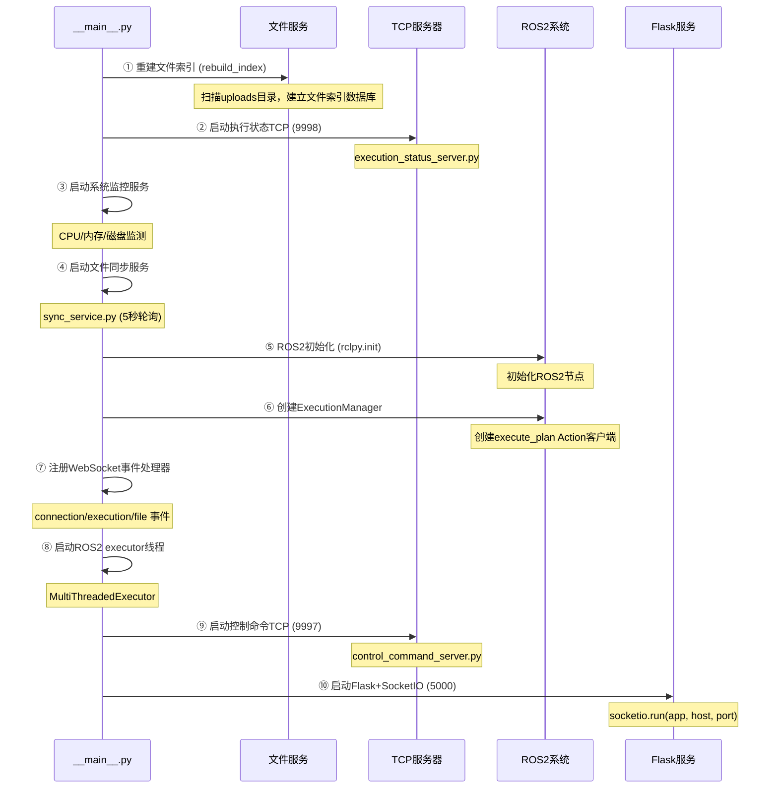
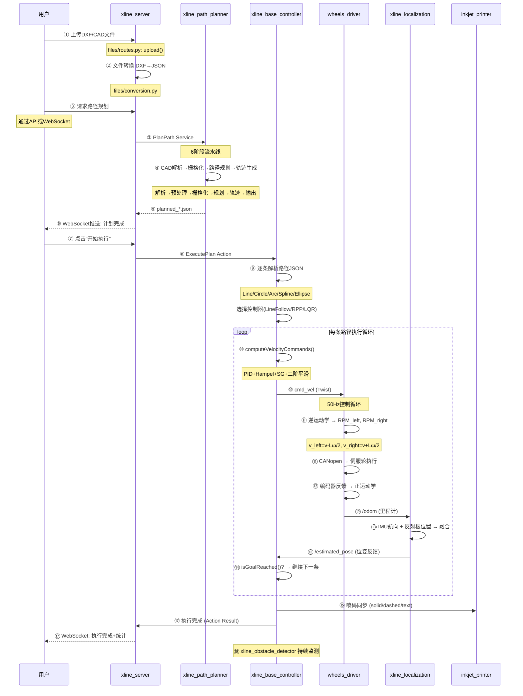
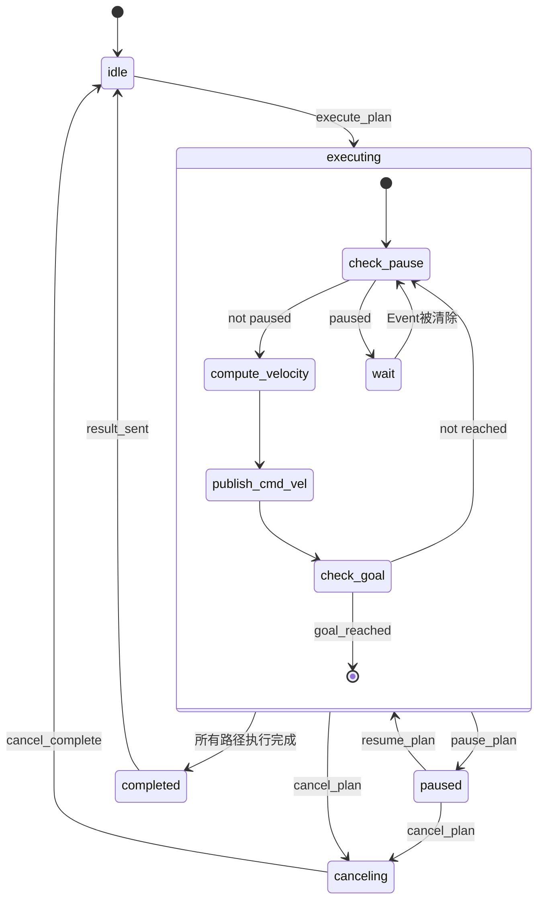

# 03 - 完整运行流程

> **阅读目标**: 掌握系统启动流程和18步端到端业务流程  
> **建议用时**: 30分钟  
> **前置阅读**: [00_README.md](00_README.md) + [01_系统架构总览.md](01_系统架构总览.md)

---

## 1. 系统启动流程

### 1.1 xline_server 启动流程（10步）

`xline_server/__main__.py` 按严格顺序启动全部服务：



**关键代码位置**: `xline_server/__main__.py` [L100-L180]

### 1.2 ROS2 Launch 启动

```bash
ros2 launch xline_base_controller base_controller.launch.py
```

该 launch 文件会并行启动以下节点：

| 启动顺序 | 节点 | 功能 | 启动方式 |
|----------|------|------|----------|
| 1 | beiwei_imu_driver | IMU传感器 | `ros2 run` |
| 2 | lslidar_driver | 激光雷达 | `ros2 run` |
| 3 | xline_localization | 定位融合 | `ros2 run` |
| 4 | xline_obstacle_detector | 障碍检测 | `ros2 run` |
| 5 | wheels_driver | 差速驱动 | `ros2 run` |
| 6 | xline_base_controller | 运动控制中心 | `ros2 run` |
| 7 | xline_inkjet_printer | 喷码机 | `ros2 run` |
| 8 | stepper_motor_driver | 步进电机 | `ros2 run` |

---

## 2. 18步端到端业务流程



### 2.1 各步骤详解

#### 步骤①-②: 文件上传与转换

```
触发: 用户通过桌面端/移动端/API上传DXF/DWG文件
处理: xline_server files/routes.py → upload()
结果: 
  - 文件保存到 uploads/ 目录
  - 异步转换: files/conversion.py 调用命令行工具 (convert_to_dxf.sh)
  - WebSocket广播: file_uploaded → conversion_complete
```

#### 步骤③-⑤: 路径规划

```
触发: 
  方式A: xline_server 自动触发 → PlanPath Service
  方式B: 桌面端离线规划 → 上传 planned_*.json
  
6阶段流水线:
  [1] CADParser.parse(cad_transformed.json) → CADData
  [2] GeometryPreprocessor.preprocess() → 拆分Polyline/扩展路径
  [3] GridMapGenerator.generate_from_cad() → 栅格地图
  [4] PathPlanner.plan_paths() → 绘图路径+贝塞尔转场
  [5] TrajectoryGenerator.generate_from_path() → ExecutionNode[]
  [6] OutputFormatter.format() → planned_*.json + 可视化图片
```

#### 步骤⑦-⑨: 执行启动

```
触发: 用户通过WebSocket发送 execute_plan 事件
处理: execution_events.py → execute_plan 事件处理器

execute_plan 编排逻辑:
  1. 校验计划文件存在性 → 解析JSON
  2. 补齐字段 (id/planned_order/execution_status)
  3. 检查队列占用 (一次仅支持一个序列)
  4. 调用姿态校正服务 /motion_control/execute_calibration
  5. 成功 → 逐条下发路径
     失败 → 返回 plan_rejected

逐条下发机制:
  for line in plan.lines:
    1. 构造 ExecutePlan Goal (单条JSON)
    2. 通过 ExecutionManager 发送到 base_controller
    3. 等待 Action Result (阻塞)
    4. 收到 SUCCEEDED → 下一条
       收到 CANCELED/ABORTED → 终止
```

#### 步骤⑩: 运动控制循环

```
xline_base_controller execute() 主循环:

while (!isGoalReached()):
  ├─ checkPauseState()      // 检查是否需要暂停
  │   └─ 如果暂停 → 阻塞等待恢复
  ├─ compute_velocity()     // 调用控制器
  │   ├─ 选择控制器 (多态)
  │   ├─ base_follow_controller_->computeVelocityCommands()
  │   │   ├─ 直线: Sigmoid速度 + PID+Hampel+SG+二阶平滑
  │   │   └─ 曲线: RPP前瞻点 + 曲率约束 + 减速
  │   └─ 返回 cmd_vel (geometry_msgs/Twist)
  ├─ publish cmd_vel        // 发布到 /cmd_vel
  ├─ publish feedback       // Action Feedback (current_id)
  └─ 等待传感器数据更新
```

#### 步骤⑪-⑫: 电机执行与里程计

```
wheels_driver control_loop() (50Hz):

1. 检查 cmd_vel 超时
   if (now - last_cmd_vel_time > timeout):
       v = 0, ω = 0   // 安全停车

2. 逆运动学
   v_left  = v - (wheel_base / 2) × ω
   v_right = v + (wheel_base / 2) × ω

3. 速度→RPM→DEC
   RPM = v / (2π × wheel_radius) × 60
   DEC = RPM × 512 × encoder_resolution / 1875

4. CANopen SDO写入
   slcan_comm.sdo_write(node_id=1, index=0x60FF, sub=0, data=DEC_left)
   slcan_comm.sdo_write(node_id=2, index=0x60FF, sub=0, data=DEC_right)

5. 读取编码器反馈速度
   actual_rpm = read_actual_velocity(node_id)

6. 正运动学 + 里程计更新
   v_actual  = (v_left + v_right) / 2
   ω_actual = (v_right - v_left) / wheel_base
   odom.x += v × cos(θ) × dt
   odom.y += v × sin(θ) × dt
   odom.θ += ω × dt

7. 发布 /odom + /tf
```

#### 步骤⑬: 定位融合

```
xline_localization 融合流程:

1. IMU回调 (高频, 100Hz)
   yaw = imu.orientation → euler_yaw

2. 反射板位置回调 (低频, 20Hz)
   robot_x, robot_y = reflector_position + TF(offset)

3. 融合发布 (20Hz)
   estimated_pose.x = robot_x
   estimated_pose.y = robot_y
   estimated_pose.θ = yaw
   publish /estimated_pose
```

#### 步骤⑱: 障碍物检测

```
xline_obstacle_detector (10Hz):

1. 接收 /lslidar_scan
2. 雷达点→机器人坐标系变换
3. 四方向矩形碰撞检测
   front_zone  = [x: +0.5~+2.0m, y: -0.4~+0.4m]
   back_zone   = [x: -0.5~-2.0m, ...]
   left_zone   = [y: +0.3~+1.0m, ...]
   right_zone  = [y: -0.3~-1.0m, ...]
4. 屏蔽区域过滤 (避免误检测自身)
5. 发布 /obstacle_detected: [front_dist, back_dist, left_dist, right_dist]
```

---

## 3. 暂停/恢复/取消控制流



### 3.1 暂停机制

1. 用户发送 `pause_plan` WebSocket事件
2. `ExecutionController.pause()`:
   - 设置 `_sequence_pause_event` (threading.Event)
   - 调用 `/execution/pause` ROS Service → base_controller暂停当前路径
   - WebSocket广播: `status_change` → `paused`
3. 后续路径等待 `_sequence_pause_event` 被清除

### 3.2 恢复机制

1. 用户发送 `resume_plan` WebSocket事件
2. `ExecutionController.resume()`:
   - 调用 `/execution/resume` ROS Service
   - 清除 `_sequence_pause_event`
   - WebSocket广播: `status_change` → `executing`
3. 继续下发后续路径

### 3.3 取消机制

1. 用户发送 `cancel_plan` WebSocket事件
2. `ExecutionController.cancel()`:
   - 设置 `_sequence_cancel_event` (阻止后续下发)
   - 清除 `_sequence_pause_event`
   - 调用 ROS2 Action `cancel_goal()`
   - WebSocket广播: `status_change` → `canceling`
3. base_controller 收到取消 → 结束当前执行 → 返回 CANCELED Result
4. WebSocket广播: `plan_cancelled`

---

## 4. 姿态校准流程

```
触发: execute_plan 事件处理器在步骤3中自动触发

executeLocalizationCalibration():
  1. 发布 cmd_vel (线速度=0.2 m/s, 角速度=0)
  2. 机器人前进一段距离 (2米)
  3. 同时调用 /motion_control/execute_calibration Service
     ↓
  xline_localization.calibratePoseCallback():
    ├─ 收集前进方向的位置点序列
    ├─ 最小二乘拟合直线: y = ax + b
    ├─ 计算航向: θ = atan(a)
    ├─ 初始化位姿: initPose(x, y, θ)
    └─ 发布 /estimated_pose
  4. 停止前进
  5. 返回校准结果 (success/fail)
```

---

## 5. 60秒内完整时间线

```
T+0s    用户上传DXF文件
T+2s    xline_server 完成文件接收
T+5s    触发异步DXF转换
T+15s   DXF转换完成 → cad_transformed.json
T+16s   用户选择文件 + 触发路径规划
T+30s   路径规划完成 → planned_*.json (6阶段流水线)
T+31s   WebSocket推送: 计划完成
T+32s   用户点击"开始执行"
T+33s   姿态校准开始
T+38s   姿态校准完成 (~5秒前进+拟合)
T+39s   第一条路径开始执行
T+39s   cmd_vel → wheels_driver → 电机转动
T+40s   第一条路径完成 → 下一条
  ...
T+55s   所有路径执行完成
T+56s   Action Result → get_result_callback
T+56s   WebSocket: execution_complete
T+57s   用户看到完成通知
```

---

*下一篇: [04_API接口参考文档.md](04_API接口参考文档.md) — REST API + WebSocket + TCP 协议详解*
