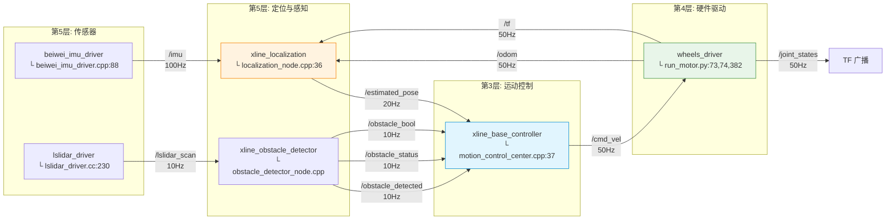
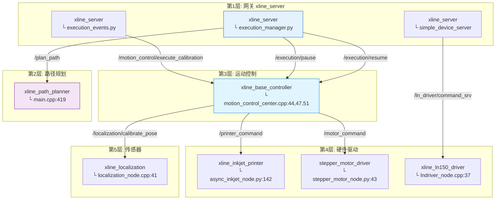
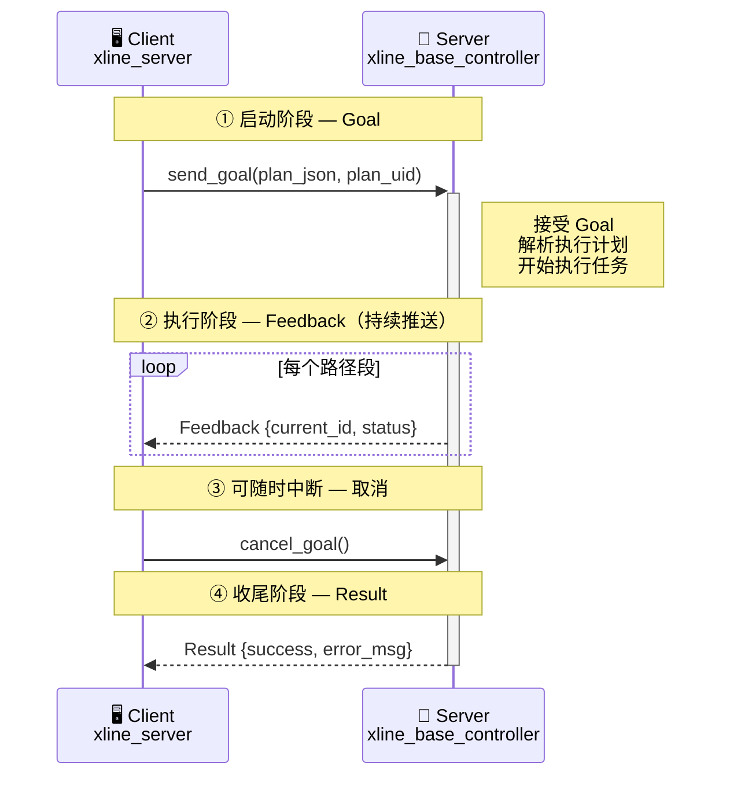
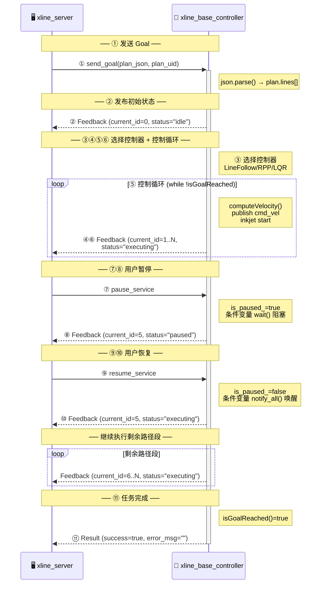
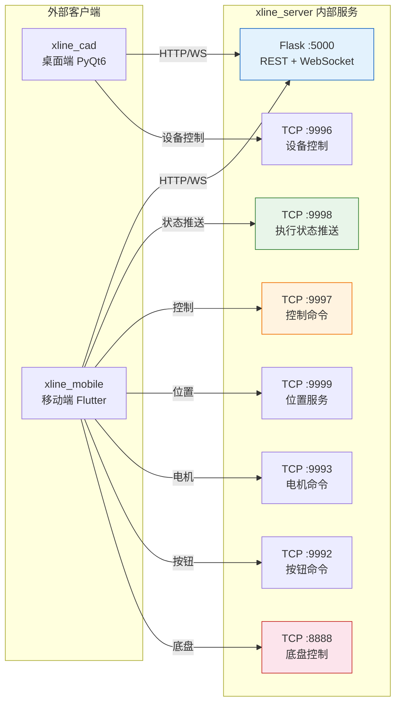
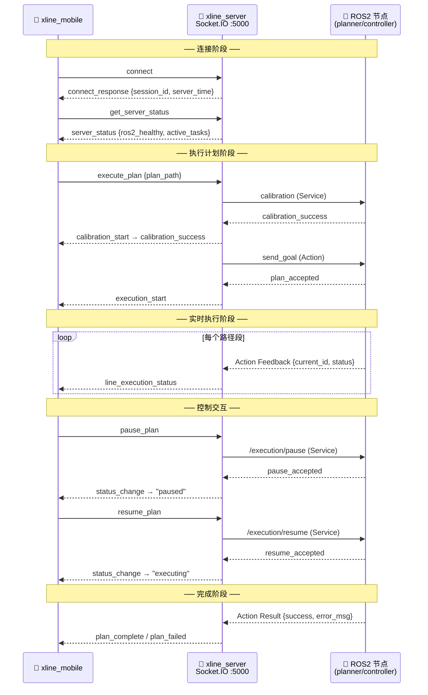
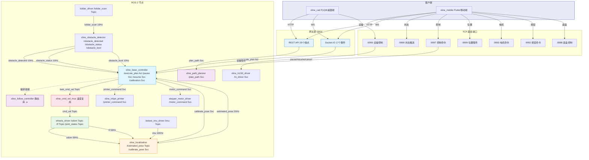

# 05 - 通信拓扑

> **阅读目标**: 全面掌握 X-LINE 的所有通信通道（Topic/Service/Action/TCP/WebSocket）  
> **建议用时**: 20分钟  
> **前置阅读**: [01_系统架构总览.md](01_系统架构总览.md)

---

## 目录索引

| 章节 | 内容 | 行数 |
|------|------|------|
| [1. ROS Topic 通信表](#1-ros-topic-通信表) | 10个话题的发布者/订阅者/源文件完整表格 | L9 |
| ↳ [1.1 Topic 消息含义速览](#11-topic-消息含义速览) | 每个话题携带的信息及通俗理解 | L28 |
| [2. ROS Service 通信表](#2-ros-service-通信表) | 8个服务的服务端/客户端/源文件完整表格 | L45 |
| ↳ [2.1 Service 含义速览](#21-service-含义速览) | 请求/响应内容及通俗理解 | L58 |
| [3. ROS Action 通信表](#3-ros-action-通信表) | `/execute_plan` 的三段式详细定义 + 数据流 | L73 |
| ↳ [3.1 ExecutePlan 深入解析](#31-executeplan-action-深入解析) | Action 生命周期、字段详解、执行时序、与Topic/Service对比、为什么必须用Action、源码路径、通俗理解 | L107 |
| ↳ [3.2 Action 含义速览](#32-action-含义速览) | 三阶段信息的快速回顾表 | L270 |
| [4. TCP 端口总表](#4-tcp-端口总表) | 8个TCP端口的服务文件/功能/协议/客户端完整表格 | L284 |
| ↳ [4.1 TCP 9998 - 执行状态推送](#41-tcp-9998---执行状态推送协议) | JSON格式协议、广播消息示例 | L297 |
| ↳ [4.2 TCP 9997 - 控制命令](#42-tcp-9997---控制命令协议) | pause/resume/cancel 命令格式 | L320 |
| ↳ [4.3 TCP 9996 - 设备控制](#43-tcp-9996---设备控制协议) | 全站仪/雷达控制命令格式 | L337 |
| [5. WebSocket 事件总表](#5-websocket-事件总表) | 17个WebSocket事件的命名空间/方向/说明 | L350 |
| ↳ [5.1 连接管理事件](#51-连接管理事件) | connect/disconnect/auth | L352 |
| ↳ [5.2 执行控制事件](#52-执行控制事件) | execute_plan/pause/resume/line_execution_status 等 | L363 |
| ↳ [5.3 文件事件](#53-文件事件) | file_uploaded/file_deleted/file_modified 等 | L379 |
| [6. 通信拓扑全景图](#6-通信拓扑全景图) | 全部通信通道汇聚的ASCII架构图 | L394 |
| [7. 跨层通信映射总结](#7-跨层通信映射总结) | 按层次汇总所有通信通道：Layer0→Layer5 | L441 |

### 速查指引

| 我想知道... | 去这里 |
|------------|--------|
| 某个话题是谁发的、在哪个源文件里 | [§1 Topic 表](#1-ros-topic-通信表) |
| 某个话题是什么意思 | [§1.1 Topic 速览](#11-topic-消息含义速览) |
| 某个服务是谁提供的、在哪个源文件里 | [§2 Service 表](#2-ros-service-通信表) |
| 某个服务是干什么用的 | [§2.1 Service 速览](#21-service-含义速览) |
| `/execute_plan` Action 的完整原理 | [§3.1 Action 深入解析](#31-executeplan-action-深入解析) |
| Topic/Service/Action 有什么区别 | [§3.1.4 对比表](#314-与-topic-和-service-的对比) |
| 各个TCP端口是干什么的 | [§4 TCP 端口总表](#4-tcp-端口总表) |
| WebSocket 有哪些事件 | [§5 WebSocket 事件总表](#5-websocket-事件总表) |
| 系统整体的通信连接关系 | [§6 通信拓扑全景图](#6-通信拓扑全景图) |

---

## 1. ROS Topic 通信表

| 话题名称 | 消息类型 | 发布者 | 发布源文件 | 订阅者 | 频率 | QoS |
|----------|----------|--------|-----------|--------|------|-----|
| `/cmd_vel` | `geometry_msgs/Twist` | xline_base_controller | `src/motion_control_center.cpp:37` | wheels_driver | 50Hz | BestEffort |
| `/odom` | `nav_msgs/Odometry` | wheels_driver | `wheels_driver/run_motor.py:73` | xline_localization | 50Hz | Reliable |
| `/imu` | `sensor_msgs/Imu` | beiwei_imu_driver | `src/beiwei_imu_driver.cpp:88` | xline_localization | 100Hz | BestEffort |
| `/estimated_pose` | `geometry_msgs/PoseStamped` | xline_localization | `src/localization_node.cpp:36` | xline_base_controller | 20Hz | Reliable |
| `/lslidar_scan` | `lslidar_msgs/LslidarScan` | lslidar_driver | `src/lslidar_driver.cc:230` | xline_obstacle_detector | 10Hz | BestEffort |
| `/obstacle_detected` | `std_msgs/Float32MultiArray` | xline_obstacle_detector | `src/obstacle_detector_node.cpp:51` | xline_base_controller | 10Hz | Reliable |
| `/obstacle_status` | `std_msgs/String` | xline_obstacle_detector | `src/obstacle_detector_node.cpp:54` (话题名 `/status`) | xline_base_controller | 10Hz | Reliable |
| `/obstacle_bool` | `std_msgs/Bool` | xline_obstacle_detector | `src/obstacle_detector_node.cpp:57` (话题名 `/obstacle_detected_bool`) | xline_base_controller | 10Hz | Reliable |
| `/joint_states` | `sensor_msgs/JointState` | wheels_driver | `wheels_driver/run_motor.py:74` | (TF广播) | 50Hz | BestEffort |
| `/tf` | `tf2_msgs/TFMessage` | wheels_driver | `wheels_driver/run_motor.py:382` (sendTransform) | xline_localization | 50Hz | Reliable |

> **注意**：
> - `/cmd_vel`：源码中发布的话题名是 `/task_cmd_vel`（`motion_control_center.cpp:37`），经 `xline_cmd_vel_mux` 节点合并各路速度源后，重映射为最终 `/cmd_vel` 输出给 `wheels_driver`。
> - `/obstacle_status` / `/obstacle_bool`：源码中实际话题名为 `/status`（`:54`）和 `/obstacle_detected_bool`（`:57`），可能通过 launch 文件 remap。

#### Topic 数据流拓扑图



> **数据流向解读**：IMU(100Hz) + 里程计(50Hz) → 定位融合(20Hz) → 控制中心(50Hz指令) → 轮组驱动。激光雷达(10Hz) → 障碍检测(10Hz) → 控制中心(降速保护)。形成**传感器→融合→控制→执行**的闭环。

### 1.1 Topic 消息含义速览

| 话题 | 携带的信息 | 通俗理解 |
|------|-----------|---------|
| `/cmd_vel` | `Twist`: 线速度 v(m/s) + 角速度 ω(rad/s) | **"怎么走"** — 控制中心告诉轮子：以多快速度前进、转多大弯 |
| `/odom` | `Odometry`: 位置(x,y) + 姿态(四元数) + 速度 | **"走了多远"** — 轮子反馈累计位移，推算机器人当前位置 |
| `/imu` | `Imu`: 角速度 + 线加速度 + 姿态四元数 | **"身体姿态"** — IMU 传感器报告：机器人现在朝向哪里、有没有晃动 |
| `/estimated_pose` | `PoseStamped`: 融合后的位置(x,y) + 航向 | **"我在哪"** — 定位节点综合 IMU+里程计+全站仪，给出最可信的位姿 |
| `/lslidar_scan` | `LslidarScan`: 360° 距离点云 | **"周围有什么"** — 激光雷达扫一圈，返回每个角度的障碍物距离 |
| `/obstacle_detected` | `Float32MultiArray`: [前,后,左,右] 四方向最近距离(m) | **"哪边有东西"** — 障碍物检测处理后，告诉你前后左右最近的障碍物有多远 |
| `/obstacle_status` | `String`: 如 "front:1.5m, left:0.3m, ..." | **"障碍物报告"** — 人类可读的障碍物状态文字描述 |
| `/obstacle_bool` | `Bool`: true/false | **"有障碍吗"** — 最简单的开关信号：前方有没有挡住路 |
| `/joint_states` | `JointState`: 左右轮位置+速度 | **"轮子状态"** — 每个轮子的角度和转速（机械层面） |
| `/tf` | `TFMessage`: odom → base_link 坐标变换 | **"坐标对齐"** — 告诉系统：里程计坐标系和机器人坐标系之间的偏移 |

---

## 2. ROS Service 通信表

| 服务名称 | 类型 | 服务端 | 服务端源文件 | 客户端 | 说明 |
|----------|------|--------|-------------|--------|------|
| `/plan_path` | `xline_path_planner/PlanPath` | xline_path_planner | `src/main.cpp:419` | xline_server | 路径规划请求 |
| `/execution/pause` | `std_srvs/Trigger` | xline_base_controller | `src/motion_control_center.cpp:44` | xline_server (ExecutionController) | 暂停执行 |
| `/execution/resume` | `std_srvs/Trigger` | xline_base_controller | `src/motion_control_center.cpp:47` | xline_server (ExecutionController) | 恢复执行 |
| `/motion_control/execute_calibration` | `std_srvs/Trigger` | xline_base_controller | `src/motion_control_center.cpp:51` | xline_server (execution_events.py) | 姿态校准 |
| `/printer_command` | `xline_msgs/PrinterCommand` | xline_inkjet_printer | `xline_inkjet_printer/async_inkjet_node.py:142` | xline_base_controller (InkjetClient) | 喷码控制 |
| `/motor_command` | `xline_msgs/MotorCommand` | stepper_motor_driver | `stepper_motor_driver/stepper_motor_node.py:43` | xline_base_controller | 步进电机控制 |
| `/ln_driver/command_srv` | `xline_msgs/LnCommand` | xline_ln150_driver | `src/lndriver_node.cpp:37-38` | xline_server (simple_device_server) | LN150控制 |
| `/localization/calibrate_pose` | `std_srvs/Trigger` | xline_localization | `src/localization_node.cpp:41-42` | xline_base_controller | 定位校准 |

#### Service 调用关系拓扑图



> **调用方向解读**：箭头从 Client 指向 Server。上层(xline_server)调用下层 ROS 节点的 Service，实现 **HTTP/WebSocket → ROS2 Service** 的桥接。base_controller 同时作为 Service Server（pause/resume/calibration）和 Service Client（printer/motor/localization）。

### 2.1 Service 含义速览

| 服务 | 请求内容 | 响应内容 | 通俗理解 |
|------|---------|---------|---------|
| `/plan_path` | CAD文件路径 + 规划参数 | 规划后的路径 JSON (planned_xxx.json) | **"帮我算路线"** — Server 收到 DXF 文件后，规划出机器人可走的路径 |
| `/execution/pause` | (空) | success: true/false | **"暂停"** — 正在执行中，用户按下暂停，机器人停在当前位置等待 |
| `/execution/resume` | (空) | success: true/false | **"继续"** — 从暂停位置恢复继续执行剩下的路径 |
| `/motion_control/execute_calibration` | (空) | success: true/false | **"校准航向"** — 执行前让机器人走一段直线，自动校准初始朝向 |
| `/printer_command` | 喷码模式(solid/dashed/text) + 开关 | success: true/false | **"喷墨控制"** — 告诉喷码机：现在开始喷实线/虚线/文字，或停止 |
| `/motor_command` | 电机ID + 命令(正转/反转/停止) | success: true/false | **"升降喷头"** — 步进电机控制喷码机的高度，喷码时降下，转场时抬起 |
| `/ln_driver/command_srv` | LN150全站仪指令 | 执行结果 | **"全站仪控制"** — 向全站仪发送搜索反射板、开始追踪等命令 |
| `/localization/calibrate_pose` | (空) | success: true/false | **"定位校准"** — 让机器人前进一段距离，用最小二乘拟合计算精确初始航向 |

---

## 3. ROS Action 通信表

| Action名称 | 类型 | Server | Server源文件 | Client | 通信模式 |
|------------|------|--------|-------------|--------|----------|
| `/execute_plan` | `xline_msgs/ExecutePlan` | xline_base_controller | `src/motion_control_center.cpp:24` | xline_server (ExecutionManager) | Action (Goal→Feedback→Result) |

### ExecutePlan Action 详细定义

```
# Goal (请求)
string plan_json       # JSON格式的执行计划
string plan_uid        # 计划唯一标识
---
# Feedback (执行中实时反馈)
int32 current_id       # 当前执行到的路径索引
string status          # 执行状态: idle/executing/paused
---
# Result (最终结果)
bool success           # 是否成功
string error_msg       # 错误信息（失败时）
```

**数据流**:
```
xline_server (ExecutionManager)
  │  send_goal(plan_json, plan_uid)
  ▼
xline_base_controller (MotionControlCenter)
  │  while(!isGoalReached()):
  │    publish feedback(current_id, status)
  │
  └── 执行完成 → publish result(success, error_msg)
```

### 3.1 ExecutePlan Action 深入解析

#### 3.1.1 什么是 ROS2 Action

Action 是 ROS2 中为**长时间运行的任务**设计的通信机制。它基于 Topic 实现，但封装了完整的四段式生命周期：

```
┌──────────────────────────────────────────────────────────────────┐
│                     ROS2 Action 生命周期                          │
│                                                                   │
│   Client (xline_server)              Server (xline_base_controller)│
│   ───────────────────                ────────────────────────── │
│          │                                      │                 │
│    ① 发送 Goal                               收到 Goal            │
│    send_goal(plan_json)         →        开始执行任务             │
│          │                                      │                 │
│          │        ② 持续接收 Feedback           │                 │
│          │  ←────  current_id=3,              │                 │
│          │  ←────  status="executing"          │                 │
│          │  ←────  current_id=7,              │                 │
│          │  ←────  status="executing"          │                 │
│          │  ←────  current_id=12,             │                 │
│          │  ←────  status="paused"             │                 │
│          │                                      │                 │
│    ③ 随时可以 取消                           检查取消请求           │
│    cancel_goal()          →          if(canceled): 终止           │
│          │                                      │                 │
│          │        ④ 最终 Result                │                 │
│          │  ←────  success=true/false          │                 │
│          │  ←────  error_msg="..."             │                 │
│                                                                   │
└──────────────────────────────────────────────────────────────────┘
```

<blockquote>
<details>
<summary>📊 点击展开 Mermaid 可视化版本</summary>


</details>
</blockquote>

> 底层实际上是通过5个 Topic 实现：`/execute_plan/_action/goal`（发目标）、`/execute_plan/_action/status`（状态变更）、`/execute_plan/_action/feedback`（持续反馈）、`/execute_plan/_action/result`（最终结果）、`/execute_plan/_action/cancel`（取消请求）。ROS2 的 `rclcpp_action` 库封装了这些细节。

#### 3.1.2 ExecutePlan 各字段详细解释

**Goal（目标 —— 启动任务）**：

| 字段 | 类型 | 含义 | 示例 |
|------|------|------|------|
| `plan_json` | `string` | 路径规划器（xline_path_planner）生成的完整执行计划。包含所有路径段的几何信息（起点/终点/圆心/半径/样条控制点等）、喷码模式（实线/虚线/文字）、转场路径标记 | `{"lines":[{"type":"line","start_xy":[0,0],"end_xy":[1,0],"ink_mode":"solid"},{"type":"arc","center_xy":[2,0],"radius":1.0,"ink_mode":"dashed"}]}` |
| `plan_uid` | `string` | 计划的唯一标识符，用于后续跟踪和日志关联 | `"plan_20260523_001"` |

**Feedback（反馈 —— 实时进度）**：

| 字段 | 类型 | 含义 | 示例值 |
|------|------|------|--------|
| `current_id` | `int32` | 当前正在执行的路径段编号（从1开始），对应 plan_json 中 lines 数组的索引 | `3`（表示正在执行第3条路径） |
| `status` | `string` | 当前执行状态 | `"idle"`（空闲）/ `"executing"`（执行中）/ `"paused"`（已暂停） |

**Result（结果 —— 任务终点）**：

| 字段 | 类型 | 含义 | 示例 |
|------|------|------|------|
| `success` | `bool` | 全部路径段是否成功执行完成 | `true` / `false` |
| `error_msg` | `string` | 失败时的错误信息，成功时为空字符串 | `"Obstacle detected, execution aborted"` |

#### 3.1.3 完整执行时序

```
时间轴 ──────────────────────────────────────────────────────────→

xline_server                          xline_base_controller
    │                                         │
    │  ① send_goal(plan_json, plan_uid)       │
    │────────────────────────────────────────→│  收到 Goal
    │                                         │  解析 plan_json
    │                                         │  json.parse() → plan.lines[]
    │                                         │
    │  ② Feedback (current_id=0, status="idle")│
    │←────────────────────────────────────────│  发布初始状态
    │                                         │
    │                                         │  for line in plan.lines:
    │                                         │    ③ 选择控制器
    │  ④ Feedback (current_id=1,              │    LineFollow/RPP/LQR
    │              status="executing")         │
    │←────────────────────────────────────────│    ⑤ 控制循环
    │                                         │    while(!isGoalReached()):
    │  ⑥ Feedback (current_id=1,              │      computeVelocity()
    │              status="executing")         │      publish cmd_vel
    │←────────────────────────────────────────│      inkjet start
    │                                         │
    │        ... 持续反馈，current_id 递增 ...  │
    │                                         │
    │  ⑦ 用户按下暂停                          │
    │     cancel → pause_service              │
    │────────────────────────────────────────→│  is_paused_=true
    │                                         │  条件变量阻塞
    │  ⑧ Feedback (current_id=5,              │
    │              status="paused")            │
    │←────────────────────────────────────────│
    │                                         │
    │  ⑨ 用户按下恢复                          │
    │     resume_service                      │
    │────────────────────────────────────────→│  is_paused_=false
    │                                         │  条件变量唤醒
    │  ⑩ Feedback (current_id=5,              │
    │              status="executing")         │
    │←────────────────────────────────────────│
    │                                         │
    │        ... 继续执行剩余路径段 ...           │
    │                                         │
    │                                         │  isGoalReached()=true
    │  ⑪ Result (success=true, error_msg="")  │
    │←────────────────────────────────────────│  任务完成
    │                                         │
```

<blockquote>
<details open>
<summary>📊 Mermaid 可视化版本（与上方 ASCII —— 对应）</summary>



</details>
</blockquote>

> **时序解读**：上图把11个步骤分成6个阶段。其中最核心的是 **⑤ 控制循环**——在 `while(!isGoalReached())` 中持续调用 `follow_controller` 计算速度、发布 `/cmd_vel`、同步喷码机，同时把进度通过 Feedback 实时推送给上层。暂停/恢复通过**条件变量**（`std::condition_variable`）实现——暂停时 `wait()` 阻塞，恢复时 `notify_all()` 唤醒，做到"停在哪、就从哪继续"。

#### 3.1.4 与 Topic 和 Service 的对比

| 特性 | Topic | Service | Action |
|------|-------|---------|--------|
| **通信模式** | 发布-订阅（单向广播） | 请求-响应（一问一答） | 目标-反馈-结果（三段式） |
| **持续时间** | 持续不断 | 瞬间完成 | 长时间运行 |
| **进度反馈** | ❌ 无 | ❌ 无 | ✅ 有（Feedback 持续推送） |
| **可取消性** | ❌ 不可取消 | ❌ 不可取消（收到结果前只能等） | ✅ 可随时取消 |
| **X-LINE 例子** | `/cmd_vel` 速度指令 | `/plan_path` 路径规划 | `/execute_plan` 执行计划 |
| **典型耗时** | 毫秒 | 秒级 | 分钟级 |

#### 3.1.5 为什么 ExecutePlan 必须用 Action 而不是 Service

假设用 Service 来实现执行计划，会发生什么：

```
用 Service 的困境：
  xline_server 调用 /execute_plan Service
    → xline_base_controller 开始执行（可能持续几分钟）
    → xline_server 一直阻塞等待结果
    → 期间无法知道执行到哪了（没有 Feedback）
    → 用户想暂停也做不到（Service 无法取消）
    → 如果网络断开，整个调用就丢失了
    
用 Action 的优势：
  xline_server 发送 Goal
    → 立即返回（非阻塞）
    → 持续接收 Feedback，实时更新移动端进度条
    → 用户可以随时暂停/恢复/取消
    → 即使客户端断开，Server 继续执行，重连后可获取状态
```

#### 3.1.6 源码中的关键代码路径

| 阶段 | 源码位置 | 关键代码 |
|------|---------|---------|
| **Server 创建** | `motion_control_center.cpp:24` | `action_server_ = rclcpp_action::create_server<ExecutePlan>(this, ...)` |
| **接收 Goal** | `motion_control_center.cpp` — `handle_goal()` | 校验 plan_json 格式，接受或拒绝 |
| **执行循环** | `motion_control_center.cpp` — `execute()` | while(!isGoalReached()) 循环 |
| **发布 Feedback** | `motion_control_center.cpp` | `goal_handle->publish_feedback(feedback)` |
| **发布 Result** | `motion_control_center.cpp` | `goal_handle->succeed(result)` |
| **Client 发送** | `execution_manager.py:133` | `self._action_client.send_goal(goal, feedback_callback=...)` |
| **Client 取消** | `execution_manager.py` | `self._goal_handle.cancel_goal()` |

#### 3.1.7 简单理解

**`/execute_plan` Action 就像是"给机器人派了一个长期任务"**：

- 🗺️ **Goal（派任务）**：把画好的图纸（执行计划）交给机器人："按这个来，所有线条都画完"
- 📊 **Feedback（报进度）**：机器人边做边报告："第3条线画好了，正在画第4条，还是第12条，我停一下"
- ⏸️ **可控制**：你可以随时喊"暂停"或"继续"，机器人会听
- ✅ **Result（交作业）**：全部画完说"好了！"；出问题了说"这有个障碍物，我没法画了"

---

### 3.2 Action 含义速览

**Action 与 Service 的区别**：ROS Service 是"一问一答"（请求→等→响应），一旦发出请求就只能干等；Action 是"持续性任务"——可以中间接收进度反馈（Feedback），也可以随时取消。

| 阶段 | 携带的信息 | 通俗理解 |
|------|-----------|---------|
| **Goal（目标）** | `plan_json`: 整个执行计划（所有路径段）；`plan_uid`: 计划ID | **"开始执行"** — Server 把规划好的全部路径打包发给控制中心 |
| **Feedback（反馈）** | `current_id`: 当前做到第几条路径；`status`: executing/paused | **"进度汇报"** — 控制中心边做边报告：做到第3条了、还在做、我暂停了 |
| **Result（结果）** | `success`: 是否全部完成；`error_msg`: 失败原因 | **"做完了"** — 全部路径执行完毕（成功），或中途出错（失败+原因） |

> **一言以蔽之**：Action 让上层（xline_server）不只是"发命令"，还能"看进度"和"喊停"。Service 做不到这一点。

---

## 4. TCP 端口总表

| 端口 | 服务器文件 | 启动文件位置 | 功能 | 协议模式 | 客户端 |
|------|-----------|-------------|------|----------|--------|
| **5000** | Flask (__main__.py) | __main__.py | REST API + WebSocket | HTTP长连接 | 桌面端/移动端 |
| **9998** | execution_status_server.py | __main__.py L112 | 执行状态推送 | TCP长连接+广播 | 移动端 (ExecutionTcpClient) |
| **9997** | control_command_server.py | __main__.py L158 | 控制命令接收 | TCP短连接/长连接 | 移动端 (ControlTcpClient) |
| **9996** | simple_device_server.py | __main__.py L168 | 设备控制(全站仪/雷达) | TCP短连接 | 桌面端 |
| **9999** | robot_position_server.py | — | 位置数据上报 | TCP长连接+5Hz | 移动端 (TcpPositionClient) |
| **9993** | motor_command_server.py | — | 电机命令 | TCP短连接 | 移动端 |
| **9992** | button_command_server.py | — | 按钮命令 | TCP短连接 | 移动端 |
| **8888** | chassis_control_server.py | — | 底盘控制 | TCP长连接 | 移动端 |

#### TCP 端口拓扑图



> **连接关系解读**：5000 端口是唯一对两类客户端都开放的通道（HTTP/WebSocket）。其余 TCP 端口主要服务移动端。底盘控制(8888)独立通道，保证低延迟。

### 4.1 TCP 9998 - 执行状态推送协议

```
协议: 基于TCP长连接，每行一个JSON (以\n分隔)

欢迎消息（连接建立时）:
{"type":"welcome","message":"已连接到执行状态推送服务器","timestamp":"..."}

心跳:
Client → {"action":"ping"}
Server → {"type":"pong","timestamp":"..."}

推送事件（广播格式）:
{
  "event": "execution_start"|"line_execution_status"|"execution_complete"|
           "task_start"|"task_complete"|"task_failed"|"status_change"|
           "plan_complete"|"plan_failed"|"plan_cancelled"|"plan_rejected",
  "timestamp": "...",
  "plan_uid": "...",
  "data": { /* 具体事件数据 */ }
}
```

### 4.2 TCP 9997 - 控制命令协议

```
协议: TCP短连接，每行一个JSON请求，对应一行JSON响应

请求格式:
{"cmd": "pause"|"resume"|"cancel"|"watch_status", "plan_uid": "..."}

响应格式:
成功: {"cmd":"pause_response","status":"success","message":"...","plan_uid":"...","timestamp":"..."}
失败: {"cmd":"pause_response","status":"error","message":"...","timestamp":"..."}

watch_status模式 (长连接, 5Hz推送):
每0.2秒推送: {"cmd":"status_update","status":"success","current_status":"executing","plan_uid":"...","timestamp":"..."}
任务结束后发送: {"cmd":"status_update","status":"success","message":"no_active_task"}
```

### 4.3 TCP 9996 - 设备控制协议

```
协议: 简单字符串命令，JSON响应

命令:
"init_station"   → 初始化全站仪 → {"success":true,"message":"全站仪初始化成功"}
"auto_track"     → 自动跟踪     → {"success":true,"message":"...'"}
"auto_level"     → 自动调平     → {"success":true,"message":"..."}
```

---

## 5. WebSocket 事件总表

### 5.1 连接管理事件

| 事件名 (客户端→) | 事件名 (←服务端) | 说明 |
|-----------------|-----------------|------|
| `connect` (系统) | `connect_response` | 连接确认 (session_id, server_time) |
| `disconnect` (系统) | — | 断开处理 |
| `heartbeat` | `heartbeat_response` | 心跳 |
| `get_server_status` | `server_status` | 获取服务器状态 |
| `join_room` | `room_joined` | 加入房间 |
| `leave_room` | `room_left` | 离开房间 |

### 5.2 执行控制事件

| 事件名 (客户端→) | 事件名 (←服务端) | 说明 |
|-----------------|-----------------|------|
| `execute_plan` | `plan_accepted` / `plan_rejected` | 启动执行 |
| | `calibration_start` → `calibration_success` | 姿态校正序列 |
| | `execution_start` | 开始执行 |
| | `task_start` → `task_complete` / `task_failed` | 单条路径生命周期 |
| | `execution_complete` / `plan_complete` / `plan_failed` | 完成/失败 |
| `cancel_plan` | `cancel_accepted` / `cancel_rejected` | 取消 |
| `pause_plan` | `pause_accepted` / `pause_rejected` | 暂停 |
| `resume_plan` | `resume_accepted` / `resume_rejected` | 恢复 |
| `get_execution_state` | `execution_state` | 状态快照 |
| `subscribe_execution` | `subscription_confirmed` + `execution_state` | 订阅 |
| `unsubscribe_execution` | `subscription_cancelled` | 取消订阅 |

### 5.3 文件事件

| 事件名 (客户端→) | 事件名 (←服务端) | 说明 |
|-----------------|-----------------|------|
| `subscribe_files` | `subscription_confirmed` + `current_files` | 订阅文件变更 |
| `unsubscribe_files` | `subscription_cancelled` | 取消订阅 |

**服务端主动推送**:
- `file_uploaded` / `file_updated` / `file_deleted`
- `json_uploaded` / `json_deleted`
- `conversion_complete`
- `force_sync` (全量同步)

#### WebSocket 执行编排事件流



> **时序解读**：WebSocket 是执行编排的主通道。连接→校验→校准→执行→(暂停/恢复)→完成，六个阶段通过 Socket.IO 事件串联。每个移动端操作都对应一个 WebSocket 事件 → ROS2 Service/Action 调用的桥接。

---

## 6. 通信拓扑全景图


---

## 7. 跨层通信映射总结

```
┌──────────────┬──────────────────────┬──────────────────────┬────────────────┐
│   通信方式    │     机器人端内部       │     机器人↔客户端      │     协议层次    │
├──────────────┼──────────────────────┼──────────────────────┼────────────────┤
│ Topic        │ cmd_vel, odom, imu,  │ —                    │ DDS (ROS 2)    │
│              │ estimated_pose,      │                      │                │
│              │ lslidar_scan,        │                      │                │
│              │ obstacle_detected    │                      │                │
├──────────────┼──────────────────────┼──────────────────────┼────────────────┤
│ Service      │ plan_path,           │ —                    │ DDS (ROS 2)    │
│              │ execution/pause,     │                      │                │
│              │ execution/resume,    │                      │                │
│              │ printer_command,     │                      │                │
│              │ motor_command        │                      │                │
├──────────────┼──────────────────────┼──────────────────────┼────────────────┤
│ Action       │ execute_plan         │ —                    │ DDS (ROS 2)    │
│              │ (Goal→Feedback→Result)│                      │                │
├──────────────┼──────────────────────┼──────────────────────┼────────────────┤
│ REST API     │ —                    │ 文件管理              │ HTTP/1.1       │
│              │                      │ 执行历史/规划/监控     │                │
├──────────────┼──────────────────────┼──────────────────────┼────────────────┤
│ WebSocket    │ —                    │ 执行编排+文件事件      │ Socket.IO      │
│              │                      │ 实时状态推送           │ (WebSocket)    │
├──────────────┼──────────────────────┼──────────────────────┼────────────────┤
│ TCP          │ —                    │ 执行状态推送(:9998)    │ 原始TCP        │
│              │                      │ 控制命令(:9997)       │ (JSON/行)      │
│              │                      │ 底盘控制(:8888)       │                │
│              │                      │ 位置服务(:9999)       │                │
└──────────────┴──────────────────────┴──────────────────────┴────────────────┘
```

<blockquote>
<details>
<summary>📊 点击展开 Markdown 表格版本</summary>

| 通信方式 | 机器人端内部 | 机器人↔客户端 | 协议层次 |
|---------|-------------|--------------|---------|
| **Topic** | `/cmd_vel`, `/odom`, `/imu`, `/estimated_pose`, `/lslidar_scan`, `/obstacle_detected`, `/obstacle_status`, `/obstacle_bool`, `/joint_states`, `/tf` | — | DDS (ROS 2) |
| **Service** | `/plan_path`, `/execution/pause`, `/execution/resume`, `/motion_control/execute_calibration`, `/printer_command`, `/motor_command`, `/ln_driver/command_srv`, `/localization/calibrate_pose` | — | DDS (ROS 2) |
| **Action** | `/execute_plan` (Goal→Feedback→Result) | — | DDS (ROS 2) |
| **REST API** | — | 文件管理、执行历史/规划/监控、同步 (29个端点) | HTTP/1.1 |
| **WebSocket** | — | 执行编排、文件事件、实时状态推送 (17个事件) | Socket.IO (WebSocket) |
| **TCP** | — | 状态推送(:9998)、控制命令(:9997)、设备控制(:9996)、位置服务(:9999)、电机命令(:9993)、按钮命令(:9992)、底盘控制(:8888) | 原始TCP (JSON/行) |

</details>
</blockquote>

---

*下一篇: [03_完整运行流程.md](03_完整运行流程.md) — 18步端到端业务流程详解*
