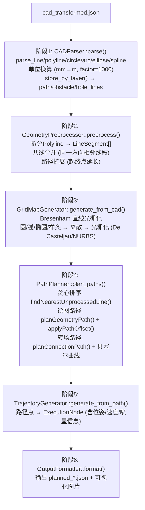
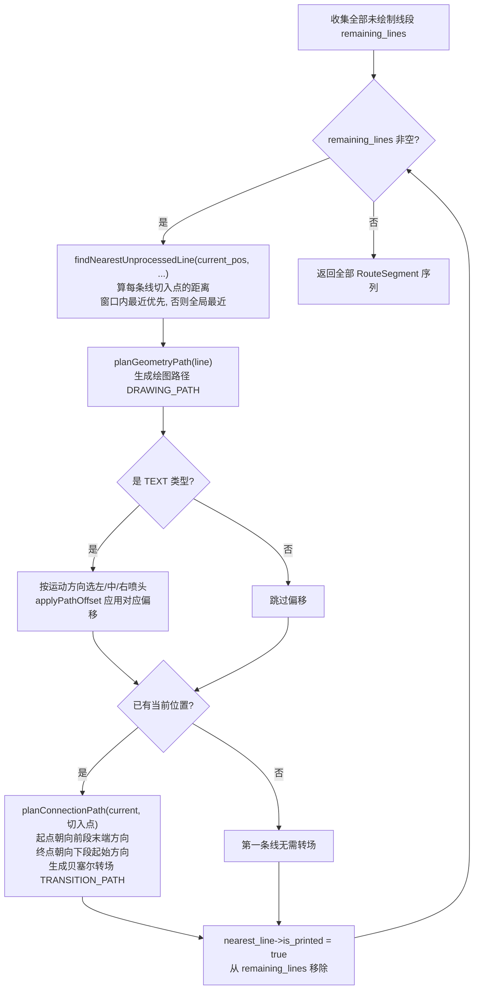

# 07-02 - xline_path_planner 路径规划器

> **位置**: `ros_pack/xline_path_planner/`
> **语言**: C++17
> **核心依赖**: Eigen3, OpenCV, nlohmann-json

---

## 1. 模块定位

路径规划器位于架构**第二层**，是数据的生产者。从CAD JSON生成机器人可执行的路径计划。

## 2. 文件清单

| 文件 | 功能 |
|------|------|
| `include/xline_path_planner/common_types.hpp` | ★★ 所有几何数据结构 (Point/Line/Circle/Arc/...) |
| `include/xline_path_planner/cad_parser.hpp` | CAD JSON解析器 |
| `include/xline_path_planner/geometry_preprocessor.hpp` | Polyline拆分/路径扩展 |
| `include/xline_path_planner/collinear_merger.hpp` | 共线线段合并 |
| `include/xline_path_planner/grid_map_generator.hpp` | 栅格地图生成 |
| `include/xline_path_planner/path_planner.hpp` | ★★ 路径规划主类 |
| `include/xline_path_planner/trajectory_generator.hpp` | 轨迹生成器 |
| `include/xline_path_planner/output_formatter.hpp` | JSON输出格式化 |
| `src/main.cpp` | 节点入口 (drawing_planner_node) |
| `config/planner.yaml` | 规划器总配置 |
| `test/` | 8个测试文件 |

## 3. 核心速查

| 类/函数 | 文件 | 功能 |
|----------|------|------|
| `CADParser::parse()` | cad_parser.cpp | 解析cad_transformed.json → CADData |
| `GeometryPreprocessor::preprocess()` | geometry_preprocessor.cpp | 拆分Polyline/扩展路径 |
| `GridMapGenerator::generate_from_cad()` | grid_map_generator.cpp | Bresenham光栅化 |
| `PathPlanner::plan_paths()` | path_planner.cpp | ★ 主规划入口 |
| `PathPlanner::planConnectionPath()` | path_planner.cpp | 贝塞尔转场 |
| `PathPlanner::findNearestUnprocessedLine()` | path_planner.cpp | 贪心搜索 |

## 4. 6阶段流水线

```
[cad_transformed.json]
    ↓ 阶段1: CADParser::parse()
    ├── parse_line / parse_polyline / parse_circle / parse_arc / parse_ellipse / parse_spline
    ├── 单位换算 (mm→m, factor=1000)
    └── store_by_layer() → path_lines / obstacle_lines / hole_lines
    ↓ 阶段2: GeometryPreprocessor::preprocess()
    ├── 拆分Polyline → LineSegment[]
    ├── 共线合并 (同一方向的相邻线段)
    └── 路径扩展 (起终点延长)
    ↓ 阶段3: GridMapGenerator::generate_from_cad()
    ├── Bresenham直线光栅化
    └── 圆/弧/椭圆/样条→离散→光栅化 (De Casteljau / NURBS)
    ↓ 阶段4: PathPlanner::plan_paths() ★★
    ├── 贪心排序: findNearestUnprocessedLine()
    ├── 绘图路径: planGeometryPath() + applyPathOffset()
    └── 转场路径: planConnectionPath() + 贝塞尔曲线
    ↓ 阶段5: TrajectoryGenerator::generate_from_path()
    └── 路径点→ExecutionNode (含位姿/速度/喷墨信息)
    ↓ 阶段6: OutputFormatter::format()
    └── 输出 planned_*.json + 可视化图片
```

**Mermaid 可视化版本：**



### 4.1 贪心排序详解：`findNearestUnprocessedLine()` 是如何排序的（源码核实 2026-10-07）

**一句话**：从机器人当前位置出发，**每次挑选"切入点最近"的一条未绘制线段**去画，画完标记已打印并从候选池移除，循环直到全部画完（贪心最近邻，O(N²)）。

**关键：距离衡量的不是"到线段本身"，而是"到这条线被绘制时的切入点"**

`findNearestUnprocessedLine()` 遍历每条未绘制线段时，先调用 `estimate_next_start(line)` 估算"机器人真正要到达这条线时的入口点"（考虑延长 + 喷码偏移），再计算 `current_pos` 到该切入点的欧氏距离。不同几何类型的切入点估算：

| 几何类型     | 切入点估算方式（`estimate_next_start`）                                        |
| -------- | --------------------------------------------------------------------- |
| LINE     | 起点沿线段方向**反向延长** `path_extension_start_length`，再按 `center_offset` 侧向偏移 |
| TEXT     | 起点反向延长 + 按喷码机类型偏移（左/中/右喷头分别用 left/center/right_offset）                |
| POLYLINE | 取前两个顶点方向做中心偏移                                                         |
| SPLINE   | 起点沿**切线反向**延长 `spline_extension_length` 再偏移；闭合样条不延长                   |
| CIRCLE   | 圆心 + (radius + center_offset) 的 **0° 角位置**（圆周入口点）                     |
| ARC      | 起点角度反向延长 `arc_extension_length`（上限 `arc_extension_max_angle`）再偏移      |
| ELLIPSE  | 参数方程在起始角 t0 处**反向延长**后再旋到世界坐标系                                        |
| CURVE    | 前两个控制点方向做中心偏移                                                         |

**关键：双候选 + 转场长度优先窗口（避免"每画一条就挪一小步"）**

| 候选 | 含义 | 选中条件 |
|------|------|------|
| `nearest_any` | 全局最近的一条 | 兜底，窗口内找不到时用 |
| `nearest_in_range` | 距离落在 **[transition_length_min, transition_length_max]** 窗口内的最近一条 | **优先选中**，即"不近不远、转场长度合理"的线 |

选择规则：`if (nearest_in_range) 用窗口内的；else 用全局最近的`。这样既保持贪心（就近），又避免频繁的超短转场（每次只挪几厘米）。

**主循环（processGeometryGroup）完整流程**：



**起点朝向/终点朝向规则（转场衔接）**：
- 转场**起点朝向** = 前一条路径末端的运动方向（`previous_path_end_heading`）；没有前一条时，用"当前点指向切入点"的方向
- 转场**终点朝向** = 下一条绘图路径首段的运动方向（`heading_from_first_motion`）

**输出结构**：每个绘图段 `DRAWING_PATH`（含 `execute_backward=false`、printer_type、ink_mode），每两个绘图段之间插入一条 `TRANSITION_PATH`（贝塞尔），`plan_paths()` 最后统一把非转场段的 `execute_backward` 置 false。

## 5. 贝塞尔转场参数

| 参数 | 默认值 | 说明 |
|------|--------|------|
| `enabled` | true | 启用贝塞尔转场 |
| `use_quintic` | false | 五次贝塞尔 (曲率连续) |
| `control_point_ratio` | 0.3 | 控制点距离比例 |
| `min_turning_radius` | 0.5m | 最小转弯半径 |
| `large_angle_threshold` | 90° | 大角度判定阈值 |
| `ratio_boost` | 1.5 | 大角度控制点放大 |
| `endpoint_tangent_mode` | ALIGN_PATH | 终点切线对齐方式 |

## 6. 对外接口

- **输入**: `cad_transformed.json` (通过PlanPath Service请求传入)
- **输出**: `planned_results/planned_*.json` + 可视化PNG图片
- **ROS接口**: `/plan_path` Service (xline_path_planner/PlanPath)
