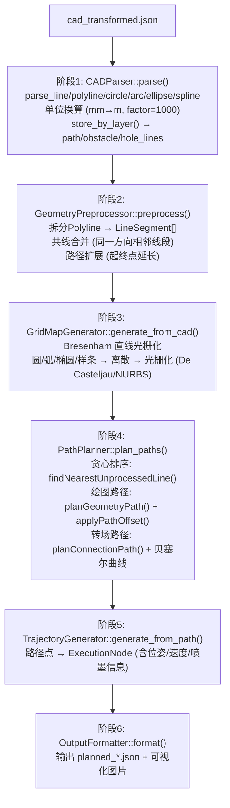

# 07-02 - xline_path_planner 路径规划器

> **位置**: `ros_pack/xline_path_planner/`  
> **语言**: C++17  
> **核心依赖**: Eigen3, OpenCV, nlohmann-json

---

## 1. 模块定位

路径规划器位于架构**第二层**，是数据的生产者。从CAD JSON生成机器人可执行的路径计划。

## 2. 文件清单

| 文件 | 功能 |
|------|------|
| `include/xline_path_planner/common_types.hpp` | ★★ 所有几何数据结构 (Point/Line/Circle/Arc/...) |
| `include/xline_path_planner/cad_parser.hpp` | CAD JSON解析器 |
| `include/xline_path_planner/geometry_preprocessor.hpp` | Polyline拆分/路径扩展 |
| `include/xline_path_planner/collinear_merger.hpp` | 共线线段合并 |
| `include/xline_path_planner/grid_map_generator.hpp` | 栅格地图生成 |
| `include/xline_path_planner/path_planner.hpp` | ★★ 路径规划主类 |
| `include/xline_path_planner/trajectory_generator.hpp` | 轨迹生成器 |
| `include/xline_path_planner/output_formatter.hpp` | JSON输出格式化 |
| `src/main.cpp` | 节点入口 (drawing_planner_node) |
| `config/planner.yaml` | 规划器总配置 |
| `test/` | 8个测试文件 |

## 3. 核心速查

| 类/函数 | 文件 | 功能 |
|----------|------|------|
| `CADParser::parse()` | cad_parser.cpp | 解析cad_transformed.json → CADData |
| `GeometryPreprocessor::preprocess()` | geometry_preprocessor.cpp | 拆分Polyline/扩展路径 |
| `GridMapGenerator::generate_from_cad()` | grid_map_generator.cpp | Bresenham光栅化 |
| `PathPlanner::plan_paths()` | path_planner.cpp | ★ 主规划入口 |
| `PathPlanner::planConnectionPath()` | path_planner.cpp | 贝塞尔转场 |
| `PathPlanner::findNearestUnprocessedLine()` | path_planner.cpp | 贪心搜索 |

## 4. 6阶段流水线

## 5. 贝塞尔转场参数

| 参数 | 默认值 | 说明 |
|------|--------|------|
| `enabled` | true | 启用贝塞尔转场 |
| `use_quintic` | false | 五次贝塞尔 (曲率连续) |
| `control_point_ratio` | 0.3 | 控制点距离比例 |
| `min_turning_radius` | 0.5m | 最小转弯半径 |
| `large_angle_threshold` | 90° | 大角度判定阈值 |
| `ratio_boost` | 1.5 | 大角度控制点放大 |
| `endpoint_tangent_mode` | ALIGN_PATH | 终点切线对齐方式 |

## 6. 对外接口

- **输入**: `cad_transformed.json` (通过PlanPath Service请求传入)
- **输出**: `planned_results/planned_*.json` + 可视化PNG图片
- **ROS接口**: `/plan_path` Service (xline_path_planner/PlanPath)
