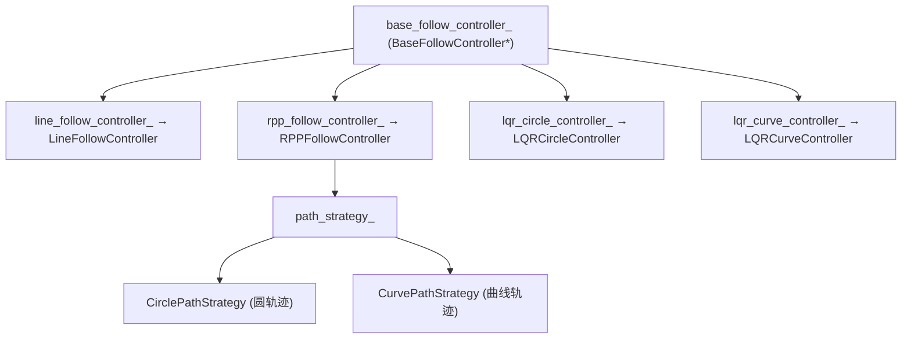
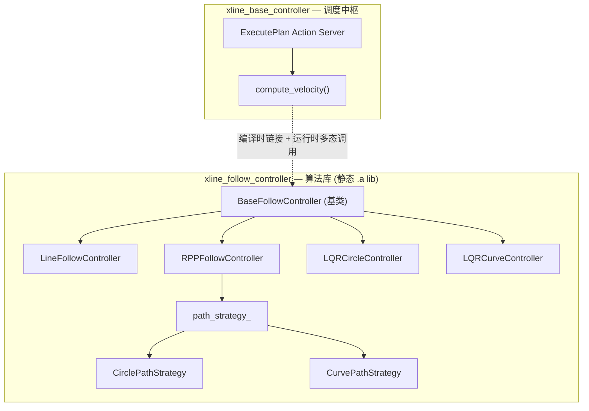
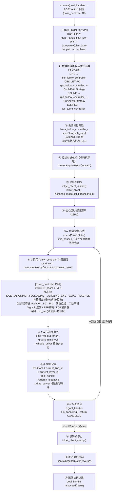

# 07-03 - xline_base_controller 运动控制中心

> **位置**: `ros_pack/xline_base_controller/`  
> **语言**: C++17  
> **核心依赖**: xline_follow_controller, xline_msgs, jsoncpp, rclcpp_action

---

## 1. 模块定位

运动控制中心位于架构**第三层**，是系统的调度中枢。它作为 ExecutePlan Action Server，接收执行计划，调度4种跟随控制器，协调整体执行。

## 2. 文件清单

| 文件 | 功能 |
|------|------|
| `include/xline_base_controller/motion_control_center.hpp` | ★★ 核心调度器头文件 |
| `include/xline_base_controller/inkjet_client.hpp` | 喷码机ROS Service客户端 |
| `src/base_controller_node.cpp` | 节点入口 (MultiThreadedExecutor) |
| `src/motion_control_center.cpp` | ★★ Action Server实现 / JSON解析 / 控制器调度 |
| `src/inkjet_client.cpp` | 喷码机控制实现 |

## 3. execute() 主循环

```
execute(goal_handle):
  plan_json = goal_handle.plan_json
  plan = json.parse(plan_json)
  
  for (auto& path : plan.lines):
    1. 解析路径类型
       extractLineData / CircleData / ArcData / SplineData / EllipseData
    
    2. 选择控制器 (多态)
       if (直线)    → line_follow_controller_
       elif (圆弧)  → rpp_follow_controller_  (CirclePathStrategy)
       elif (样条)  → rpp_follow_controller_  (CurvePathStrategy)
       elif (圆)    → lqr_circle_controller_
       elif (曲线)  → lqr_curve_controller_
    
    3. 设置路径
       base_follow_controller_->setPlan(path_data)
    
    4. 控制步进电机 (喷码机升降)
       controlStepperMotor(forward/reverse)
    
    5. 喷码机同步
       inkjet_client_->start()
       inkjet_client_->change_mode(solid/dashed/text)
    
    6. 运动控制循环
       while (!isGoalReached()):
           checkPauseState()     // 暂停检查
           cmd_vel = compute_velocity()
           publish(cmd_vel)
           publish_feedback(current_id)
    
    7. 喷码机停止
       inkjet_client_->stop()
    
    8. 检查是否取消
       if (cancel_requested): return CANCELED
  
  return SUCCEEDED
```

## 4. JSON解析支持的五种路径

| 类型 | JSON字段 | 解析方法 |
|------|----------|----------|
| 直线 | `start_xy`, `end_xy` | extractLineData() |
| 圆 | `center_xy`, `radius`, `start_xy` | extractCircleData() |
| 圆弧 | `center_xy`, `radius`, `start_angle`, `end_angle` | extractArcData() |
| 样条 | `vertices[]`, `degree` | extractSplineData() |
| 椭圆 | `center`, `major_axis`, `ratio`, `start_angle`, `end_angle`, `rotation` | extractEllipseData() |

## 5. 控制器多态调度



运行时通过 `base_follow_controller_->computeVelocityCommands()` 多态调用。

## 6. 执行状态

| 状态变量 | 说明 |
|----------|------|
| `is_executing_` | 是否正在执行 |
| `is_paused_` | 是否已暂停 |
| `current_layer_id` | 当前路径ID |
| `current_ink_mode_` | 喷墨模式: solid/dashed/text |
| `is_transition_path_` | 是否转场路径 (不喷码) |
| `use_stepper_for_current_path_` | 是否需要步进电机 |

## 7. 对外接口

- **Action Server**: `/execute_plan` (xline_msgs/ExecutePlan)
- **Service Server**: `/execution/pause`, `/execution/resume` (std_srvs/Trigger)
- **Service Server**: `/motion_control/execute_calibration` (std_srvs/Trigger)
- **Service Client**: `/printer_command`, `/motor_command`, `~/calibrate_pose`
- **Topic Publisher**: `/cmd_vel` (geometry_msgs/Twist)
- **Topic Subscriber**: `/estimated_pose` (geometry_msgs/PoseStamped)

---

## 8. xline_base_controller 与 xline_follow_controller 详细协作机制

这两个包是运动控制层的**双核心**，一个负责调度，一个负责算法，通过编译时链接 + 运行时多态调用紧密协作。

### 8.1 角色分工



| 维度 | base_controller | follow_controller |
|------|----------------|-------------------|
| **运行模式** | 独立 ROS2 节点 | 静态库，不启动节点 |
| **核心线程** | MultiThreadedExecutor | 无（被调用执行） |
| **对外通信** | Action/Service/Topic | 无（纯函数调用） |
| **职责** | JSON 解析、路径分发、状态管理、喷码同步 | 误差计算、控制算法、滤波平滑 |
| **关键文件** | `motion_control_center.cpp` | `rpp_follow_controller.cpp` 等 |

### 8.2 完整协作流程



### 8.3 暂停/恢复机制

```mermaid
flowchart TD
    subgraph PAUSE["pause 流程"]
        P1["移动端 → WebSocket pause → xline_server"] --> P2["ROS2 Service: /execution/pause"]
        P2 --> P3["base_controller::handle_pause()"]
        P3 --> P4["is_paused_ = true"]
        P4 --> P5["控制循环 checkPauseState() 检测到暂停"]
        P5 --> P6["条件变量 wait() 阻塞主循环"]
        P6 --> P7["向 follow_controller 发零速度（保证停车）"]
    end
    subgraph RESUME["resume 流程"]
        R1["移动端 → WebSocket resume → xline_server"] --> R2["ROS2 Service: /execution/resume"]
        R2 --> R3["base_controller::handle_resume()"]
        R3 --> R4["is_paused_ = false"]
        R4 --> R5["条件变量 notify_all() 唤醒控制循环"]
        R5 --> R6["follow_controller 恢复速度计算"]
        R6 --> R7["从当前中断点继续执行"]
    end
```



### 8.4 喷码同步机制

```
base_controller 控制喷码时机，follow_controller 不关心喷码逻辑：

┌───────────────────────────────────────────────────────────────┐
│                                                               │
│  base_controller:                                             │
│    if (is_transition_path_) {                                 │
│        // 转场路径：只移动，不喷码                             │
│        inkjet_client_->stop()                                 │
│    } else {                                                   │
│        // 喷码路径：移动 + 喷码同步                            │
│        inkjet_client_->start()                                │
│        inkjet_client_->change_mode(solid/dashed/text)         │
│    }                                                          │
│                                                               │
│  follow_controller:                                           │
│    // 只管运动，不管喷码                                       │
│    computeVelocityCommands() → 返回 (v, ω)                    │
│                                                               │
│  ★ 关键：follow_controller 的 isGoalReached() 返回 true 时，   │
│    base_controller 才会调用 inkjet_client_->stop()             │
│    确保喷码机不会在当前路径段结束前提前停止                     │
│                                                               │
└───────────────────────────────────────────────────────────────┘
```

### 8.5 四种控制器激活条件

| 路径类型 | 选择的控制器 | 调用的策略 | 何时选择 |
|----------|-------------|-----------|---------|
| `line` | `line_follow_controller_` | (无) | JSON 中 type = "line" |
| `circle` | `rpp_follow_controller_` | `CirclePathStrategy` | JSON 中 type = "circle" |
| `arc` | `rpp_follow_controller_` | `CirclePathStrategy` | JSON 中 type = "arc" |
| `spline` | `rpp_follow_controller_` | `CurvePathStrategy` | JSON 中 type = "spline" |
| `ellipse` | `lqr_curve_controller_` | (LQR 内建) | JSON 中 type = "ellipse" |

所有控制器通过基类指针 `base_follow_controller_->computeVelocityCommands()` 实现**运行时多态**，base_controller 不需要知道具体是哪种控制器在工作。

### 8.6 数据流总结

```
                    ┌─────────────────────────┐
                    │  xline_follow_controller │
                    │  (算法库，静态链接)       │
                    │                         │
                    │  setPlan(path)          │ ← ① base_controller 设置路径
                    │  computeVelocityCommands│ ← ② base_controller 18Hz 调用
                    │       ↓                 │
                    │  返回 cmd_vel (v, ω)    │ → ③ 返回给 base_controller
                    │  isGoalReached()        │ ← ④ base_controller 检查完成
                    └─────────────────────────┘
                              ↑ ③
                              │
┌─────────────────────────────────────────────────────────┐
│  xline_base_controller (调度中枢)                        │
│                                                         │
│  输入：                                                  │
│    /estimated_pose  ← xline_localization                │
│    /execute_plan    ← xline_server (Action Goal)        │
│                                                         │
│  输出：                                                  │
│    /cmd_vel         → wheels_driver                     │
│    /printer_command → xline_inkjet_printer              │
│    /motor_command   → stepper_motor_driver              │
│    Action Feedback  → xline_server                      │
└─────────────────────────────────────────────────────────┘
```
