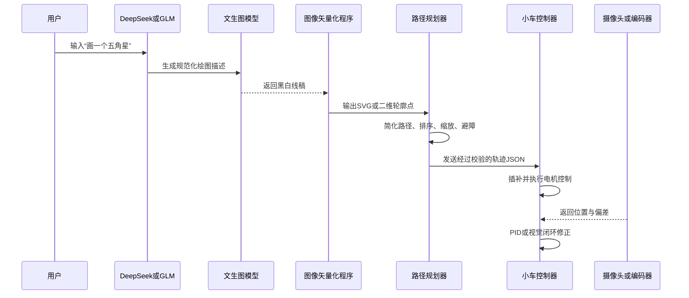

为什么要部署数据库，用自己的模型部署？
1. 能学习特定指令格式，划线的json格式
2. 有固定行业术语，例如道路标线、足球场线、停车位线；
3. 坐标可能不准确
4. 调用VLA模型，可以融合摄像头、语言和动作，==理解自然语言指向的现实物体==
5. 图像矢量化与路径规划还有路径点的规范化生成


什么时候需要微调
满足以下情况后，再考虑 LoRA 或监督微调：
- 已积累至少数千条“用户指令—正确设计JSON”数据；
- 提示词和JSON Schema仍不能稳定解决问题；
- 有固定行业术语，例如道路标线、足球场线、停车位线；
- 经常需要把同类施工图转换成统一轨迹；
- 已经建立自动化评测集，可以判断微调是否真的提升。
如果只是让模型稳定输出规定JSON，通常先使用：
系统提示词＋JSON Schema＋少量示例＋程序校验＋失败重试

这比马上微调便宜、快速，也更容易修改。

建议把模型微调目标限定为：

> 输入自然语言施工要求，输出标准化的“划线设计JSON”。

大模型不要直接输出电机PWM、脉冲数或者实时转速。后续由确定性程序完成：

![[2d2d10650ab4e7cdf4696eed2f49344d.png]]


### 微调方案的理解

| 路线 | 实现方法 | 难度 | 推荐场景 |
|---|---|---:|---|
| GLM平台LoRA微调 | 上传JSONL数据，在智谱平台创建微调任务 | 低 | 快速验证产品 |
| DeepSeek开源模型LoRA | 下载开源权重，使用LLaMA-Factory或Swift训练 | 中高 | 私有化部署、离线使用 |
| DeepSeek API蒸馏 | 用DeepSeek API生成高质量样本，训练较小开源模型 | 中 | 控制部署成本 |
| 不微调，直接结构化输出 | 提示词＋JSON Schema＋函数调用 | 最低 | 第一版基线系统 |
提示词＋JSON Schema


#### 三种文生图方案对比

| 方案 | 适合程度 | 优点 | 主要问题 | 建议 |
|---|---:|---|---|---|
| DeepSeek/GLM直接输出轨迹JSON | 较适合 | 开发快、成本低 | 坐标可能不准确，不能直接信任 | 用于生成设计参数，不直接控制电机 |
| 微调DeepSeek/GLM | 暂时不适合 | 能学习特定指令格式 | 需要准备数据，不能解决底盘误差 | 积累数据后再考虑 |
| 直接调用VLA | 不适合第一版 | 可以融合摄像头、语言和动作 | 数据、算力、实时性和安全验证成本高 | 后期研究闭环智能控制时使用 |
| 传统路径规划＋视觉校正 | 最适合 | 可解释、稳定、轨迹可验证 | 需要编写运动控制和标定程序 | 作为产品主架构 |



### 生成的格式
图像矢量化，就是把由像素组成的图片，转换成由线段、曲线和坐标点组成的几何路径。
边缘平滑的矢量图，才好划线，将复杂图形变成一块块的色块

[Ai生成矢量图SVG格式图，可直接编辑图\_哔哩哔哩\_bilibili](https://www.bilibili.com/video/BV1fm5r6HEEJ/?share_source=copy_web&vd_source=ac598847856f571a2cc05827e3382826)


先让图片变成描边线稿
[Ai里将图片转为可编辑的描边线稿\_哔哩哔哩\_bilibili](https://www.bilibili.com/video/BV1QZqRYGE1p?spm_id_from=333.788.recommend_more_video.2&trackid=web_related_0.router-related-2479604-t4rlm.1788155614552.29&vd_source=ac598847856f571a2cc05827e3382826)
更好的“文成图”方式
如果最终目标只是让小车画线，建议优先生成以下内容：

| 输出形式      | 推荐程度 | 原因              |
| --------- | ---: | --------------- |
| SVG矢量图    |   最高 | 天然包含线段、曲线和路径    |
| 结构化几何JSON |   很高 | 可直接转换成小车轨迹      |
| 黑白线稿PNG   |   中等 | 还需要二值化、骨架化和矢量化  |
| 彩色写实图片    |   很低 | 轮廓复杂，难以确定应该画哪些线 |

因此可以设计成两种入口：
1. 简单图形：由大模型输出几何描述，例如圆、矩形、文字和五角星。
2. 复杂图案：调用文生图模型生成黑白线稿，再通过 OpenCV、Potrace 等工具矢量化。
建议的JSON分层
不要把“图形数据”和“底盘指令”混成一种JSON。建议分成三层：
层级	示例内容	生成者
设计层	五角星、宽500毫米、居中	DeepSeek或GLM
轨迹层	坐标点、贝塞尔曲线、抬笔落笔	路径规划程序
控制层	左右轮速度、运行时间、转向角度	小车控制器


### 建议的JSON分层、输出格式

不要把“图形数据”和“底盘指令”混成一种JSON。建议分成三层：

| 层级 | 示例内容 | 生成者 |
|---|---|---|
| 设计层 | 五角星、宽500毫米、居中 | DeepSeek或GLM |
| 轨迹层 | 坐标点、贝塞尔曲线、抬笔落笔 | 路径规划程序 |
| 控制层 | 左右轮速度、运行时间、转向角度 | 小车控制器 |

| 字段       | 说明              | 示例            |
| -------- | --------------- | ------------- |
| `任务类型`   | 图形、文字、道路标线、场地图案 | `几何图形`        |
| `画布`     | 实际施工区域          | `3000×2000毫米` |
| `图元`     | 直线、圆、圆弧、多边形、文字  | `圆`           |
| `位置`     | 图元在画布中的坐标       | `(1500,1000)` |
| `尺寸`     | 长度、半径、宽度        | `半径500毫米`     |
| `线宽`     | 实际划线宽度          | `50毫米`        |
| `颜色`     | 涂料颜色            | `白色`          |
| `约束`     | 居中、等距、保持比例      | `水平居中`        |
| `不确定项`   | 用户没有说清楚的参数      | `线宽`          |
| `是否需要确认` | 防止模型擅自补充关键参数    | `true`        |

轨迹层示例：

```json
{
  "版本": "1.0",
  "单位": "毫米",
  "画布": {
    "宽度": 1000,
    "高度": 1000
  },
  "路径": [
    {
      "编号": 1,
      "是否闭合": true,
      "速度": 100,
      "动作": [
        {"类型": "移动", "横坐标": 500, "纵坐标": 100, "落笔": false},
        {"类型": "直线", "横坐标": 620, "纵坐标": 450, "落笔": true},
        {"类型": "直线", "横坐标": 250, "纵坐标": 230, "落笔": true}
      ]
    }
  ]
}
```

第一步：确定模型输出范围
模型只输出以下字段：

| 字段 | 说明 | 示例 |
|---|---|---|
| `任务类型` | 图形、文字、道路标线、场地图案 | `几何图形` |
| `画布` | 实际施工区域 | `3000×2000毫米` |
| `图元` | 直线、圆、圆弧、多边形、文字 | `圆` |
| `位置` | 图元在画布中的坐标 | `(1500,1000)` |
| `尺寸` | 长度、半径、宽度 | `半径500毫米` |
| `线宽` | 实际划线宽度 | `50毫米` |
| `颜色` | 涂料颜色 | `白色` |
| `约束` | 居中、等距、保持比例 | `水平居中` |
| `不确定项` | 用户没有说清楚的参数 | `线宽` |
| `是否需要确认` | 防止模型擅自补充关键参数 | `true` |

第二步：制定统一的设计JSON
建议先固定一个版本，后续不要频繁修改字段。

```json
{
  "协议版本": "1.0",
  "任务编号": "任务-0001",
  "任务类型": "几何图形",
  "单位": "毫米",
  "画布": {
	"宽度": 3000,
	"高度": 2000,
	"原点": "左下角"
  },
  "图元": [
	{
	  "编号": "图元-001",
	  "类型": "圆",
	  "中心": {
		"横坐标": 1500,
		"纵坐标": 1000
	  },
	  "半径": 500,
	  "线宽": 50,
	  "颜色": "白色",
	  "是否闭合": true
	}
  ],
  "施工参数": {
	"推荐速度": 100,
	"允许倒车": false,
	"优先连续划线": true
  },
  "不确定项": [],
  "是否需要确认": false
}
```
这里的推荐速度仍然只是设计参数。真正发送给底盘前，还要通过速度规划器限制。
第三步：准备微调数据
建议第一版准备1000～3000条人工审核数据。
数据类型	建议比例	示例
基础几何图形	25%	直线、矩形、圆、五角星
组合图形	20%	圆内接正方形、两个平行矩形
道路标线	20%	停车位、斑马线、箭头
运动场地	10%	篮球场、羽毛球场
文字与数字	10%	车位编号、方向文字
参数缺失	5%	没有尺寸、没有线宽
参数冲突	5%	图形超过画布
非法或危险要求	5%	超速、越界、关闭急停


训练集、验证集和测试集应按照下面比例划分：
数据集	比例	用途
训练集	80%	LoRA训练
验证集	10%	选择参数、防止过拟合
测试集	10%	最终验收，训练时不能使用


不要简单随机拆分近似样本。例如，同一个模板生成的100个不同尺寸矩形，应放在同一个数据分区，否则测试结果会虚高。

即使 DeepSeek或GLM返回了这个JSON，也必须经过以下校验才能发送给小车：

- JSON Schema格式校验；
- 画布坐标越界校验；
- 最大速度与最大加速度限制；
- 路径连续性校验；
- 最小转弯半径校验；
- 小车尺寸和笔尖偏移补偿；
- 超时、急停和通信中断保护。
