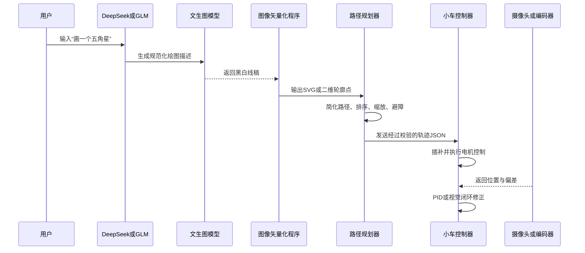

为什么要部署数据库，用自己的模型部署？
1. 能学习特定指令格式，划线的json格式
2. 有固定行业术语，例如道路标线、足球场线、停车位线；
3. 坐标可能不准确
4. 调用VLA模型，可以融合摄像头、语言和动作，==理解自然语言指向的现实物体==
5. 图像矢量化与路径规划还有路径点的规范化生成


什么时候需要微调
满足以下情况后，再考虑 LoRA 或监督微调：
- 已积累至少数千条“用户指令—正确设计JSON”数据；
- 提示词和JSON Schema仍不能稳定解决问题；
- 有固定行业术语，例如道路标线、足球场线、停车位线；
- 经常需要把同类施工图转换成统一轨迹；
- 已经建立自动化评测集，可以判断微调是否真的提升。
如果只是让模型稳定输出规定JSON，通常先使用：
系统提示词＋JSON Schema＋少量示例＋程序校验＋失败重试

这比马上微调便宜、快速，也更容易修改。


### 三种文生图方案对比

| 方案 | 适合程度 | 优点 | 主要问题 | 建议 |
|---|---:|---|---|---|
| DeepSeek/GLM直接输出轨迹JSON | 较适合 | 开发快、成本低 | 坐标可能不准确，不能直接信任 | 用于生成设计参数，不直接控制电机 |
| 微调DeepSeek/GLM | 暂时不适合 | 能学习特定指令格式 | 需要准备数据，不能解决底盘误差 | 积累数据后再考虑 |
| 直接调用VLA | 不适合第一版 | 可以融合摄像头、语言和动作 | 数据、算力、实时性和安全验证成本高 | 后期研究闭环智能控制时使用 |
| 传统路径规划＋视觉校正 | 最适合 | 可解释、稳定、轨迹可验证 | 需要编写运动控制和标定程序 | 作为产品主架构 |



### 生成的格式

边缘平滑的矢量图，才好划线，将复杂图形变成一块块的色块

[Ai生成矢量图SVG格式图，可直接编辑图\_哔哩哔哩\_bilibili](https://www.bilibili.com/video/BV1fm5r6HEEJ/?share_source=copy_web&vd_source=ac598847856f571a2cc05827e3382826)

更好的“文成图”方式
如果最终目标只是让小车画线，建议优先生成以下内容：

| 输出形式      | 推荐程度 | 原因              |
| --------- | ---: | --------------- |
| SVG矢量图    |   最高 | 天然包含线段、曲线和路径    |
| 结构化几何JSON |   很高 | 可直接转换成小车轨迹      |
| 黑白线稿PNG   |   中等 | 还需要二值化、骨架化和矢量化  |
| 彩色写实图片    |   很低 | 轮廓复杂，难以确定应该画哪些线 |

因此可以设计成两种入口：
1. 简单图形：由大模型输出几何描述，例如圆、矩形、文字和五角星。
2. 复杂图案：调用文生图模型生成黑白线稿，再通过 OpenCV、Potrace 等工具矢量化。
建议的JSON分层
不要把“图形数据”和“底盘指令”混成一种JSON。建议分成三层：
层级	示例内容	生成者
设计层	五角星、宽500毫米、居中	DeepSeek或GLM
轨迹层	坐标点、贝塞尔曲线、抬笔落笔	路径规划程序
控制层	左右轮速度、运行时间、转向角度	小车控制器


### 建议的JSON分层

不要把“图形数据”和“底盘指令”混成一种JSON。建议分成三层：

| 层级 | 示例内容 | 生成者 |
|---|---|---|
| 设计层 | 五角星、宽500毫米、居中 | DeepSeek或GLM |
| 轨迹层 | 坐标点、贝塞尔曲线、抬笔落笔 | 路径规划程序 |
| 控制层 | 左右轮速度、运行时间、转向角度 | 小车控制器 |

轨迹层示例：

```json
{
  "版本": "1.0",
  "单位": "毫米",
  "画布": {
    "宽度": 1000,
    "高度": 1000
  },
  "路径": [
    {
      "编号": 1,
      "是否闭合": true,
      "速度": 100,
      "动作": [
        {"类型": "移动", "横坐标": 500, "纵坐标": 100, "落笔": false},
        {"类型": "直线", "横坐标": 620, "纵坐标": 450, "落笔": true},
        {"类型": "直线", "横坐标": 250, "纵坐标": 230, "落笔": true}
      ]
    }
  ]
}
```

即使 DeepSeek或GLM返回了这个JSON，也必须经过以下校验才能发送给小车：

- JSON Schema格式校验；
- 画布坐标越界校验；
- 最大速度与最大加速度限制；
- 路径连续性校验；
- 最小转弯半径校验；
- 小车尺寸和笔尖偏移补偿；
- 超时、急停和通信中断保护。
