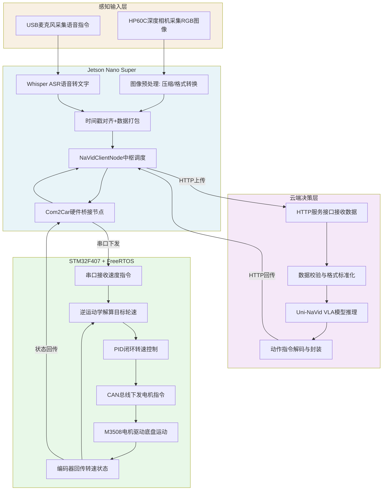
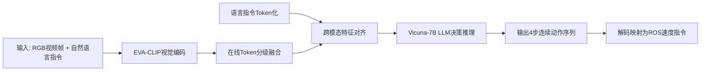
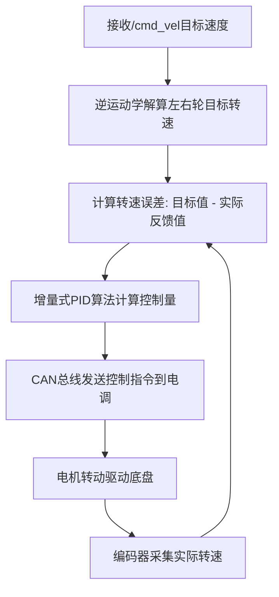
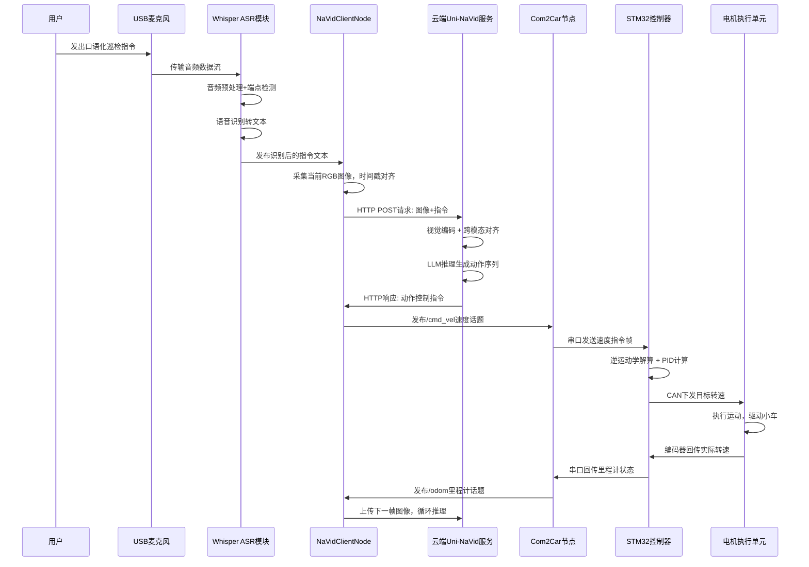
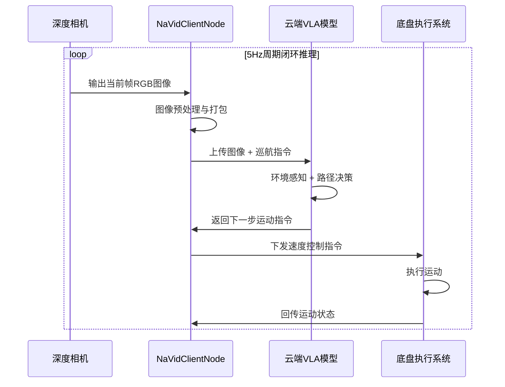
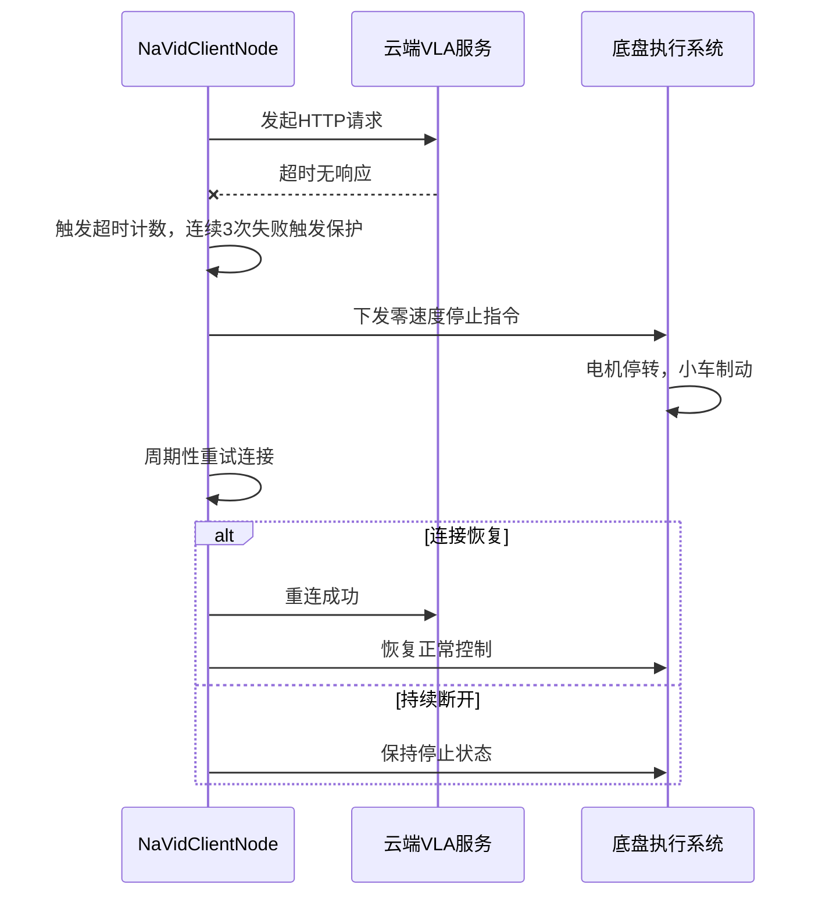

## 笔记摘抄

涵盖四种导航任务的数据样本，包括视觉语言导航，VLN，目标物体导航，Ob jNav,具生问答EQA和人体跟随follow，

激光雷达、光谱仪、热成像仪

海外的果园巡检机器人发展起始时间较早，智能化和集成化水平较高，技术体系更为完备，以==多功能监测、自主作业、云端管理==作为主要特性，已建立起成熟的技术体系｡ 西班牙研制的 Vinbot 葡萄管理机器人[3]基于视觉与传感技术自主监控葡萄的生长情形；法国  Wall‑Ye  机器人配置==多摄像头和 GPS 导航==，能够完成葡萄修剪、环境监测等工作；德国 BoniRob机器人[4]运用光谱成像实现作物精确识别与位置标注，可全程记录植株生长形势｡ 从整体情况而言，国外的巡检机器人在适应复杂地形、多任务协同以及长期自主作业等方面具备明显优势，目前已朝着==多机协作==和智慧农场管理的方向不断发展｡
中国果园自主移动机器人起始于1990年，相关研究较为滞后[5]，不过在==导航技术、视觉感知、底盘适配==等领域进展快速，主要针对非结构化果园以及复杂地形开展实用化研究｡ 张振乾等人所设计的==双目视觉香蕉园巡检机器人==[6]，其导航路径横向平均偏差为 14.3 厘米，航向偏差平均值是 4.8度，能够满足垄间巡检的需求；高鹏等人提出的履带式果园机器人[7]，将激光雷达与多传感器定位相融合，在 0.5 米每秒的行进速度下导航偏差小于等于 10 厘米，地形适应能力较强；TP500 型农业巡检机器人[8]集成==激光雷达、光谱仪、热成像仪==等装置，可对作物长势与病虫害进行实时监测，依靠 ==RTK+SLAM 实现自主定位与避障==，还能基于云端数据来指导生产｡

缺少语义理解的能力，泛化能力不够｡ 所以研究 VLA 模型驱动的端到端智能巡检策略的可行性成为主要研究方向｡ 
果园巡检机器人泛化能力弱、语义理解不足、决策死板

2023 年 7 月，谷歌 DeepMind 所发布的 RT-2[10]模型率先确立 VLA 的技术模式，它突破大模型和物理世界的模态障碍，把机器人的离散动作编成可由语言模型处理的特殊标识，实现 视觉感知、自然语言指令 到 机器人动作序列 的端到端直接映照｡

一是于经典方案里强化上下文推理能力，二是整合扩散模型提高连续动作生成精准度，三是运用视频生成主干强化时空动态认知｡ 

### 基于VLA的智能果园巡检小车技术笔记
#### 1. 方案总览与核心技术定位
##### 1.1 研究背景与行业痛点

- **传统巡检机器人的技术瓶颈**：主流方案采用「感知-规划-控制」分离的模块化架构，依赖预标注数据集训练的视觉模型仅能识别预设场景，决策逻辑完全基于人工编写的固定规则，遇到断枝、倒伏、临时障碍物等非预设场景时直接失效，泛化能力与场景适应性极差，无法适配果园非结构化、动态多变的作业环境。

##### 1.2 VLA技术演进与核心优势
视觉-语言-动作（Vision-Language-Action, VLA）模型是具身智能领域的核心技术，实现了从视觉感知、自然语言理解到机器人动作输出的端到端映射，技术演进脉络如下：
1.  **技术奠基**：2023年谷歌DeepMind发布RT-2，首次将机器人离散动作编码为语言模型可处理的token，确立了VLA「视觉+语言→动作」的端到端技术范式。
2.  **开源普及**：2024年斯坦福大学开源OpenVLA，大幅降低了VLA的部署门槛，后续衍生出TinyVLA、MiniVLA等轻量化版本，推动VLA从实验室走向真实机器人场景。
3.  **导航专项优化**：Uni-NaVid作为视频驱动的VLA模型，针对机器人导航场景做了专项优化，无需预建地图、无需深度图输入，仅依靠第一视角RGB视频与自然语言指令即可输出连续动作，更适配移动机器人巡检场景。

与传统模块化机器人方案相比，VLA模型的核心优势：
- **强泛化性**：基于大规模多模态数据预训练，可识别未见过的物体、应对未预设的场景，无需针对每个新场景重新训练模型。
- **端到端一体化**：绕开传统方案中感知、规划、控制的复杂解耦流程，直接将视觉与语言输入映射为动作指令，减少模块间的误差累积。
- **自然语言交互**：支持口语化指令直接控制机器人，无需专业编程操作，大幅降低农业场景的使用门槛。

##### 1.3 研究目标与核心价值
- **核心目标**：设计并实现一套云边端协同的VLA果园巡检小车，验证视觉-语言-动作模型在果园巡检场景落地的工程可行性，为智慧农业与具身智能的结合提供实践参考。
- **理论价值**：探索VLA模型在非结构化农业场景的适配方案，补充农业机器人领域端到端智能决策的技术路径。
- **工程价值**：构建「语音交互-视觉感知-云端决策-底盘执行」的完整闭环，形成可复用的云边端三级机器人架构，降低同类农业机器人的开发与部署成本。

##### 1.4 整体技术栈与三级架构
采用**云端-边缘端-底层终端**三级分布式架构，设计原则为「云端强智能决策、边缘强实时处理、底层强稳定执行」，各层级技术选型如下：

| 架构层级  | 核心硬件/平台            | 核心软件/算法                                           | 核心职能                              |
| ----- | ------------------ | ------------------------------------------------- | --------------------------------- |
| 云端决策层 | GPU云服务器            | Uni-NaVid VLA模型、HTTP服务、EVA-CLIP、Vicuna-7B         | 多模态语义理解、端到端动作决策、长时序规划             |
| 边缘计算层 | Jetson Nano Super  | Ubuntu 22.04、ROS2 Humble、Whisper-base ASR、图像预处理算法 | 感知数据采集与预处理、ASR语音转文字、云边数据交互、本地设备调度 |
| 底层执行层 | STM32F407单片机       | FreeRTOS实时操作系统、PID控制算法、差速运动学、CAN驱动                | 硬实时电机控制、运动学解算、里程计采集、底盘状态监测        |
| 感知交互层 | HP60C深度相机、USB降噪麦克风 | 视觉驱动、音频降噪算法                                       | 环境视觉采集、语音指令输入                     |
| 执行机构层 | DJI M3508电机、C620电调 | 无刷电机FOC驱动                                         | 四轮差速底盘运动输出                        |

#### 2. 硬件系统详细设计
##### 2.1 整机机械与底盘设计
- **底盘形式**：四轮差速驱动底盘，采用铝合金型材搭建主体框架，亚克力板作为上层设备安装底板，兼顾结构强度与轻量化。
- **核心参数**：车轮直径200mm，采用橡胶防滑轮胎适配果园松软土壤与颠簸路面；四轮独立驱动，通过左右轮速差实现转向，无转向舵机结构，机械复杂度更低、可靠性更高。
- **布局设计**：电池后置平衡重心，控制器与计算单元居中布置，深度相机前置安装于车体中上部，确保第一视角无遮挡，覆盖果园行间道路与两侧植株。

##### 2.2 分级隔离供电系统
采用**单电源输入、分路独立供电**的设计，通过隔离DC-DC模块切断功率回路与信号回路的干扰，保障控制系统稳定运行。
1.  **主电源单元**
    - 选型：TB48 24V/20Ah磷酸铁锂电池组，自带BMS电池管理系统。
    - 保护功能：过充、过放、过流、短路四重保护，实时监测电压、电流、温度参数，异常状态自动切断回路。
    - 续航能力：满电状态下可支持小车连续巡检4-6小时，覆盖百亩级果园单次巡检需求。
2.  **分路供电设计**
    - 动力回路：24V直流电经航空插头一分四，直接给4路C620电调+M3508电机供电，减少中间转换的功率损耗。
    - 边缘计算回路：24V转19V/10A隔离DC-DC模块，为Jetson Nano Super供电，满足满负载峰值功耗。
    - 底层控制回路：24V转5V/3A隔离DC-DC模块，为STM32F407控制器与外围传感器供电。
    - 外设回路：深度相机、USB麦克风通过Jetson的USB3.0接口供电，实现供电与数据传输一体化。
3.  **设计优势**：动力回路的大电流波动不会干扰控制回路的信号稳定性，有效抑制电机启停带来的电源纹波干扰。

##### 2.3 多级异构通信链路
系统包含四级通信链路，根据不同层级的传输需求匹配最优通信协议，兼顾实时性、可靠性与带宽。

| 通信链路 | 通信协议 | 核心参数 | 传输内容 | 选型理由 |
|---------|---------|---------|---------|---------|
| 云端 ↔ 边缘端 | HTTP + JSON | WiFi无线网络，TCP/IP协议栈 | 上传RGB图像、语音指令文本；下发动作控制指令 | 部署简单、跨平台兼容性强，适合非实时性的大数据量传输 |
| 边缘端 ↔ 底层控制器 | UART串口 | 波特率115200bps，8位数据位、1位停止位、无校验（8N1），CRC16校验 | 下发/cmd_vel速度指令；回传里程计、电机状态数据 | 板间通信布线简单、稳定可靠，满足控制指令的低延迟传输需求 |
| 控制器 ↔ 电机电调 | CAN总线 | 波特率1Mbps，双绞线传输，终端120Ω匹配电阻 | 下发目标转速指令；回传电机转速、温度、电流数据 | 抗干扰能力强、支持多节点挂载、实时性高，是工业电机控制的标准总线 |
| 相机 ↔ 边缘端 | USB3.0 | 640×480分辨率，30fps帧率 | RGB图像+深度点云数据 | 高带宽、即插即用，满足视频流实时传输需求 |

##### 2.4 多模态感知模块选型与参数
1.  **视觉感知：奥比中光HP60C深度相机**
    - 输出能力：同步输出RGB彩色图像与深度点云数据，RGB分辨率最高1920×1080，系统适配采用640×480分辨率平衡精度与传输带宽。
    - 适用场景：支持户外强光环境，深度测量范围0.3m-5m，适配果园行间狭窄空间的障碍物检测与环境感知。
    - 接口：USB3.0接口，即插即用，ROS生态有成熟驱动包。
2.  **运动感知：电机内置编码器**
    - 选型：M3508电机内置12位高精度磁编码器，通过CAN总线直接读取脉冲数据。
    - 功能：实时采集电机转速、转角，经轮径换算与差速解算得到小车线速度、角速度与累计里程，为运动闭环控制与轨迹记录提供数据。
    - 优势：无需额外安装里程计外设，结构精简、数据延迟低，减少外部传感器的故障点。
3.  **语音交互：USB高信噪比降噪麦克风**
    - 硬件特性：全向拾音，内置前端降噪算法，有效抑制果园风声、枝叶摩擦声等背景噪音。
    - 接口：免驱USB接口，直接接入Jetson Nano，无需额外电路改造。

##### 2.5 执行驱动单元
1.  **驱动电机：DJI M3508直流无刷电机**
    - 核心参数：额定电压24V，最大输出功率190W，自带减速箱，输出扭矩大，适配果园复杂地形的负载需求。
    - 配套电调：C620无刷电调，支持FOC矢量控制，转速控制精度高，支持CAN总线通信。
    - 地址分配：4台电机分配独立CAN ID（0x201~0x204），依次对应左前、左后、右前、右后电机，避免指令串扰。
2.  **驱动优势**：工业级成熟方案，可靠性高、ROS生态适配完善，差速控制算法成熟，转向灵活，可实现原地自旋。

##### 2.6 硬件抗干扰与环境适配设计
- **电磁兼容设计**：CAN总线采用屏蔽双绞线，终端接入120Ω匹配电阻；动力线与信号线分开布线，避免交叉干扰；控制器加装金属屏蔽罩，抑制电机电磁辐射。
- **环境防护设计**：核心电路板做防潮涂覆处理，接口处加装防水护套，适配果园高湿、多尘的作业环境。
- **机械减震设计**：相机、Jetson等精密设备加装减震垫片，削弱路面颠簸带来的振动，提升视觉采集稳定性。

#### 3. 软件系统技术架构详解
##### 3.1 边缘端ROS2软件体系
###### 3.1.1 ROS2工作空间与节点拓扑
基于ROS2 Humble版本构建分布式软件系统，采用节点化设计，各模块解耦，便于后续功能扩展。核心工作空间包含三个功能包：
- `navid_bringup`：启动配置包，包含launch文件，一键启动所有节点与驱动。
- `navid_client`：核心业务包，包含NaVidClientNode中枢节点。
- `car_hardware_driver`：硬件驱动包，包含Com2Car桥接节点与底层硬件驱动。

系统核心话题通信关系：
- `/image_raw`：相机节点发布，NaVidClientNode订阅，传输原始RGB图像。
- `/voice_cmd`：ASR节点发布，NaVidClientNode订阅，传输识别后的文本指令。
- `/cmd_vel`：NaVidClientNode发布，Com2Car节点订阅，传输标准Twist速度控制指令。
- `/odom`：Com2Car节点发布，传输里程计位姿与速度数据。

###### 3.1.2 NaVidClientNode中枢节点
作为边缘端的核心调度节点，承担云边交互与指令分发职能，核心工作流程：
1.  周期订阅相机原始图像与ASR文本指令，对图像做分辨率压缩、格式转换等预处理，将图像与指令按时间戳对齐打包。
2.  按照固定频率（5Hz，与云端VLA推理帧率匹配）向云端服务器发起HTTP POST请求，上传感知数据包。
3.  接收云端返回的动作指令，解析后转换为ROS标准的`geometry_msgs/Twist`消息格式，发布到`/cmd_vel`话题。
4.  异常处理：云端通信超时或返回异常时，触发本地兜底策略，发布停止指令，保障小车安全。

###### 3.1.3 Com2Car硬件桥接节点
实现ROS系统与底层STM32的硬件抽象，屏蔽底层硬件细节，为上层提供标准化接口：
1.  订阅`/cmd_vel`话题，将ROS标准速度指令转换为自定义串口协议帧，通过UART串口发送给STM32。
2.  持续监听串口数据，接收STM32回传的里程计、电机状态数据，解析后封装为标准`nav_msgs/Odometry`消息，发布到`/odom`话题。
3.  提供硬件状态监测服务，可查询电池电压、电机温度、通信状态等信息。

##### 3.2 底层嵌入式实时控制系统
基于STM32F407单片机+FreeRTOS实时操作系统构建，核心目标是实现硬实时的电机控制，保证运动精度与稳定性。

###### 3.2.1 FreeRTOS任务调度机制
将底层功能拆分为三个独立任务，通过消息队列实现任务间数据交互，避免资源冲突：
1.  **运动控制任务（最高优先级，1kHz周期）**
    - 优先级设置为最高，确保电机控制循环严格按1ms周期执行，保证PID控制的稳定性。
    - 核心工作：接收目标速度指令，执行差速逆运动学解算，运行PID转速闭环算法，通过CAN总线向电调下发控制指令。
2.  **通信处理任务（中等优先级，100Hz周期）**
    - 负责串口数据的接收与解析，提取上层下发的目标速度，通过消息队列发送给运动控制任务。
    - 打包里程计、电机状态数据，通过串口回传给边缘端。
3.  **底盘状态监测任务（低优先级，10Hz周期）**
    - 周期性读取电机温度、电压、电流等参数，监测异常状态。
    - 出现过温、过压、通信中断等故障时，触发紧急停止保护，切断电机输出。

###### 3.2.2 差速运动学正逆解算法
四轮差速底盘等效为两轮差速模型（左右两侧车轮分别同轴），运动学解算是速度控制的核心基础。
- **符号定义**：车体几何中心为两轮连线中点，全局坐标系下位姿为 $(x,y,\theta)$；左轮线速度 $v_L$，右轮线速度 $v_R$；车体线速度 $v$，角速度 $\omega$；轮距 $L$，车轮半径 $r$。
- **正向运动学（轮速→车体状态）**：通过左右轮实际转速，计算小车整体运动状态，用于里程计解算。
  $$
  v = \frac{v_L + v_R}{2}, \quad \omega = \frac{v_R - v_L}{L}
  $$
- **逆向运动学（目标速度→轮速）**：根据上层下发的目标线速度与角速度，反解出左右轮的目标转速，是速度控制的核心。
  $$
  v_L = v - \frac{\omega L}{2}, \quad v_R = v + \frac{\omega L}{2}
  $$
- 补充转换：线速度与电机角速度的转换关系为 $v_{wheel} = \omega_{motor} \cdot r$，实现电机转速与车体速度的映射。

###### 3.2.3 电机PID闭环控制算法
采用增量式PID算法实现电机转速闭环，每个电机独立控制：
- 输入：目标转速（运动学解算得到）与实际转速（编码器反馈）的差值。
- 输出：电机控制量，转换为CAN总线指令发送给C620电调。
- 参数整定：先整定比例项P保证响应速度，再积分项I消除静差，最后微分项D抑制振荡，适配果园路面负载波动的场景。

###### 3.2.4 CAN总线通信协议
遵循大疆C620电调标准通信协议：
- 控制指令发送：通过ID为0x200的标准帧，一次性下发4台电机的控制电流/转速，每台电机占2字节数据。
- 状态数据回传：每台电机主动回传自身ID的状态帧，包含实际转速、电流、温度等参数。

###### 3.2.5 串口通信协议与CRC校验
自定义串口数据帧格式，保证数据传输可靠性：
`帧头(0xAA 0x55) + 功能码 + 数据长度 + 有效数据 + CRC16校验位 + 帧尾(0x0D 0x0A)`
- 功能码区分指令类型：速度控制指令、状态查询指令、参数配置指令。
- CRC16校验：接收端先校验数据完整性，校验失败则丢弃该帧，避免错误指令导致异常运动。

##### 3.3 边缘端ASR语音交互系统
###### 3.3.1 Whisper-base模型轻量化部署
- 选型理由：OpenAI开源的Whisper-base模型体积小、推理速度快，支持多语种识别，在Jetson Nano上可实现接近实时的语音转文字，兼顾准确率与边缘端算力限制。
- 部署优化：采用FP16量化加速，结合Jetson的GPU推理，降低CPU占用，保证识别延迟小于500ms。
- 离线运行：完全在边缘端本地推理，无需联网，保障果园弱网环境下的可用性。

###### 3.3.2 前端语音预处理与降噪
1.  硬件端：麦克风自带前端降噪算法，抑制稳态背景噪声。
2.  软件端：加入语音端点检测（VAD），只在检测到人声时启动识别，减少无效推理与误识别；对音频做归一化、滤波处理，提升识别准确率。

###### 3.3.3 指令意图解析与纠错机制
- 指令集：预设果园巡检常用指令集，包含前进、后退、左转、右转、停止、开始巡检、寻找果树、避障等核心指令。
- 模糊匹配：对ASR识别结果做文本模糊匹配与纠错，修正同音字、口误导致的识别错误，提升指令识别成功率。
- 结果输出：解析后的标准指令文本发布到ROS话题，接入VLA决策链路。

##### 3.4 云端Uni-NaVid VLA模型原理
Uni-NaVid是专门针对具身导航任务优化的视频驱动VLA模型，也是本系统的智能决策核心，无需预建地图、无需深度图，仅靠RGB视频与自然语言指令即可输出连续动作。

###### 3.4.1 模型整体架构与输入输出定义
- **输入**：第一视角RGB视频序列 + 自然语言指令文本。
- **输出**：未来4步的连续动作序列，包含线速度与角速度，映射为ROS的Twist控制指令。
- **核心创新**：在线token融合机制，在保证推理精度的前提下将推理帧率稳定在5Hz，满足移动机器人实时导航的需求。

###### 3.4.2 EVA-CLIP视觉编码
采用EVA-CLIP视觉编码器对每一帧RGB图像进行特征提取：
- 将图像转换为高维的视觉token序列，保留图像中的物体、空间、纹理等语义信息。
- 视觉token与语言token处于同一特征空间的前置对齐基础，为后续跨模态融合做准备。

###### 3.4.3 在线Token融合加速算法
为解决长视频推理计算量大、延迟高的问题，采用分级token融合策略：
1.  **当前帧**：保留完整的视觉token，保证当前场景感知的精度。
2.  **短期记忆**：对近几帧的token做网格池化压缩，保留近期环境信息。
3.  **长期记忆**：对更早的帧做相似度筛选与融合，保留全局环境的关键特征。
通过该机制，大幅减少每轮推理的token数量，将推理速度提升至5Hz，同时兼顾长时序的环境记忆能力。

###### 3.4.4 跨模态特征对齐
通过两层MLP投影层，将视觉token与语言指令token映射到同一个统一特征空间，实现视觉语义与语言语义的精准对齐，让模型理解“指令对应画面中的什么内容”。

###### 3.4.5 LLM动作序列生成
对齐后的多模态特征输入Vicuna-7B大语言模型，由LLM进行推理决策，一次性预测未来4步的连续动作：
- 多步预测的优势：兼顾短时序的动作平滑性与长时序的规划性，避免每步决策的短视问题。
- 动作空间：离散化的线速度与角速度组合，输出结果直接对应机器人可执行的运动指令。

###### 3.4.6 动作空间到ROS指令的映射
模型输出的动作token经过解码后，转换为线速度v与角速度ω的具体数值，封装为ROS标准Twist消息，通过HTTP接口下发到边缘端，完成从决策到执行的映射。

#### 4. 核心技术流程图
##### 4.1 系统全链路工作总流程图

##### 4.2 VLA模型内部推理流程图

##### 4.3 底层运动控制闭环流程图

#### 5. 核心业务时序图
##### 5.1 语音指令巡检全流程时序图

##### 5.2 自主巡航闭环推理时序图

##### 5.3 通信异常应急停止时序图

#### 6. 系统部署与联调方案
##### 6.1 硬件装配与布线规范
###### 6.1.1 机械装配步骤
1.  搭建铝合金底盘框架，固定4台电机与车轮，确保左右轮同轴、轮距对称。
2.  安装电池支架与上层亚克力底板，固定电调、STM32、Jetson等核心部件，动力部件与信号部件分区布置。
3.  前置安装深度相机支架，调整角度确保水平视角覆盖行间道路，无车体遮挡。
4.  固定USB麦克风，拾音面朝上，远离电机与风扇等噪声源。

###### 6.1.2 电气布线规范
1.  CAN总线：采用屏蔽双绞线，串联所有电调，首尾两端接入120Ω终端电阻；屏蔽层单端接地，避免共模干扰。
2.  串口线：采用双绞线，长度控制在30cm以内，远离动力线。
3.  动力线：采用大截面积硅胶线，线径满足最大电流要求，接线处做绝缘与防松处理。
4.  整体布线：强弱电分离，走线规整，用扎带固定，避免颠簸导致线路松动。

##### 6.2 软件环境分步部署
###### 6.2.1 边缘端Jetson环境部署
1.  系统烧录：刷入适配Jetson Nano Super的Ubuntu 22.04系统，配置静态IP、SSH远程登录、开机自启脚本。
2.  ROS2安装：安装ROS2 Humble版本，配置环境变量，创建工作空间。
3.  依赖安装：安装深度相机ROS驱动、USB音频驱动、Whisper模型依赖、Python HTTP相关库。
4.  代码编译：将功能包拷贝至工作空间，执行`colcon build`编译，设置环境变量生效。

###### 6.2.2 底层STM32固件烧录与配置
1.  开发环境：搭建Keil MDK开发环境，安装STM32F407器件包，引入FreeRTOS、CAN驱动、串口驱动库。
2.  参数配置：配置系统主频168MHz，配置CAN外设波特率1Mbps，配置串口波特率115200，配置定时器中断实现1kHz控制周期。
3.  程序烧录：通过ST-Link下载器将编译好的固件烧录到STM32，通过串口助手测试通信是否正常。
4.  参数整定：空载状态下整定电机PID参数，确保转速响应快、无振荡、无静差。

###### 6.2.3 云端VLA模型服务部署
1.  环境搭建：GPU服务器安装Ubuntu系统，配置CUDA、Conda环境，创建Python 3.10虚拟环境。
2.  依赖安装：安装PyTorch、Transformers、flash-attn等深度学习依赖，安装FastAPI作为HTTP服务框架。
3.  模型准备：下载EVA-CLIP编码器、Vicuna-7B基座、Uni-NaVid微调权重，按官方目录结构存放。
4.  服务封装：基于FastAPI编写推理接口，接收JSON格式的图像与指令数据，推理后返回动作指令；加入超时控制、并发限制、数据校验机制。
5.  服务启动：后台启动API服务，配置端口映射与外网访问，测试接口连通性。

##### 6.3 分级联调测试流程
采用**从下到上、从单机到系统**的分级联调策略，每一级验证通过后再进入下一级，降低排障难度。
1.  **底层单机调试**
    - 测试CAN总线通信，验证电机转速控制与状态回传正常。
    - 测试串口通信，验证指令接收与状态回传正常。
    - 测试运动学解算，验证差速转向、直行等动作正确。
2.  **边底联调测试**
    - 启动ROS2与Com2Car节点，手动发布`/cmd_vel`指令，观察小车运动是否符合预期。
    - 查看`/odom`话题，验证里程计数据回传正常、数值准确。
3.  **边云联调测试**
    - 启动NaVidClientNode，测试HTTP通信，验证图像上传、指令下发链路通畅。
    - 测试推理延迟，验证云端返回的动作指令可正常驱动小车。
4.  **全系统联调测试**
    - 一键启动所有节点，测试语音指令控制全流程。
    - 测试长时间运行稳定性，排查内存泄漏、通信中断、运动抖动等问题。

#### 7. 实验验证与结果分析
##### 7.1 实验环境与评价指标
###### 7.1.1 实验环境
- **仿真环境**：基于ROS2 + Gazebo搭建虚拟果园场景，包含果树、土壤路面、随机障碍物，还原果园行间巡检环境；小车模型与实机参数一致。
- **实机环境**：实验室搭建模拟果园场景，放置仿真树模拟植株布局，平坦硬质地面，环境光照稳定。

###### 7.1.2 评价指标
| 测试项目 | 评价指标 | 指标定义 |
|---------|---------|---------|
| 通信稳定性 | 交互成功率 | 成功交互次数 / 总交互次数 |
| 基础动作 | 动作成功率 | 成功执行指令次数 / 总指令次数 |
| 语音识别 | 识别准确率 | 正确识别字数 / 总输入字数 |
| 目标巡检 | 任务成功率 | 成功找到目标次数 / 总测试次数；平均完成时长 |

##### 7.2 仿真实验详细结果
###### 7.2.1 车云通信稳定性测试
- 测试方法：连续传输图像与指令，统计总交互次数、异常次数，重复3轮。
- 实验数据：
  | 轮数 | 总交互次数 | 异常交互次数 | 交互成功率 |
  |------|-----------|-------------|-----------|
  | 1 | 126 | 10 | 92.06% |
  | 2 | 98 | 8 | 91.84% |
  | 3 | 102 | 8 | 92.16% |
  | 总计 | 326 | 26 | 92.02% |
- 结果分析：平均交互成功率92.02%，异常主要由网络波动导致，系统自带的超时重连机制可快速恢复，未出现持续性断连，满足巡检作业基本需求。

###### 7.2.2 基础巡检动作测试
- 测试方法：对前进、左转、右转、停止四个基础动作各测试15次，统计成功率。
- 实验数据：
  | 动作类型 | 指令文本 | 测试次数 | 成功次数 | 成功率 |
  |---------|---------|---------|---------|--------|
  | 前进 | Go forward | 15 | 15 | 100% |
  | 左转 | Turn left | 15 | 15 | 100% |
  | 右转 | Turn right | 15 | 15 | 100% |
  | 停止 | Stop | 15 | 15 | 100% |
- 结果分析：基础动作成功率100%，说明VLA模型输出的动作指令与底盘运动学适配良好，基础运动控制可靠。

###### 7.2.3 目标寻找能力测试
- 测试方法：场景中随机放置桌子模型，下达“寻找桌子”指令，限时5分钟，统计成功率与用时。
- 实验数据：3次测试中2次成功，失败原因为室内复杂场景下模型出现方向误判；果园开阔场景下均能成功完成任务。
- 结果分析：验证了VLA模型无需预标注即可识别目标、自主规划路径的泛化能力，开阔果园场景下表现更优。

##### 7.3 实机验证详细结果
###### 7.3.1 语音识别准确率测试
- 测试方法：输入口语化巡检指令，统计总字数与识别错误字数，重复4轮。
- 实验数据：
  | 轮数 | 总字数 | 错误字数 | 准确率 |
  |------|-------|---------|--------|
  | 1 | 65 | 4 | 93.85% |
  | 2 | 74 | 5 | 93.24% |
  | 3 | 84 | 7 | 91.67% |
  | 4 | 93 | 4 | 93.55% |
  | 总计 | 318 | 20 | 93.71% |
- 结果分析：边缘端离线Whisper-base平均准确率93.71%，配合指令模糊匹配机制，可满足果园语音交互需求。

###### 7.3.2 基础动作验证
- 测试方法：同仿真测试，对四个基础动作各测试15次。
- 实验结果：四个动作成功率均为100%，与仿真结果一致，实机底盘运动控制稳定，指令执行准确。

###### 7.3.3 目标果树巡检测试
- 测试方法：场景中放置仿真果树，下达“寻找果树”指令，统计成功率与用时。
- 实验数据：3次测试全部成功，平均用时1分40秒，表现优于仿真环境。
- 结果分析：实机真实视觉信息比仿真场景更丰富，VLA模型的视觉理解更准确，进一步验证了模型的真实场景泛化能力。

##### 7.4 实验结果综合分析
1.  **可行性验证**：仿真与实机测试共同验证了VLA模型驱动果园巡检小车的技术可行性，三级架构运行稳定，全流程闭环通畅。
2.  **性能结论**：基础运动控制可靠，语音交互准确率达标，目标巡检任务可完成，系统整体满足果园基础巡检的功能需求。
3.  **优势体现**：VLA模型无需预训练、无需建图即可适配新场景，泛化能力显著优于传统规则化巡检机器人。
4.  **现存不足**：车云通信成功率有待提升，复杂遮挡场景下的目标寻找能力仍有优化空间。

#### 8. 关键技术难点与优化方案
##### 8.1 云边通信延迟与稳定性问题
- **问题表现**：果园WiFi信号覆盖有限，网络波动会导致指令延迟、丢包，影响巡检流畅性。
- **优化方案**：
  1.  数据压缩：对上传的图像做JPEG压缩，降低带宽占用。
  2.  本地兜底：边缘端加入简单的避障兜底算法，云端断连时本地执行紧急避障与停止。
  3.  轻量化部署：后续将VLA模型量化压缩，部署到边缘端，实现离线全自主运行，摆脱对云端网络的依赖。

##### 8.2 果园复杂环境下视觉感知鲁棒性
- **问题表现**：果园光照变化大、枝叶遮挡、背景复杂，会影响VLA模型的视觉理解精度。
- **优化方案**：
  1.  图像预处理：加入自动曝光、白平衡校正，提升不同光照下的图像质量。
  2.  场景微调：采集果园真实场景数据，对VLA模型做小样本微调，提升场景适配性。
  3.  多传感器融合：加入激光雷达辅助避障，弥补纯视觉在深度感知上的不足。

##### 8.3 VLA模型推理实时性优化
- **问题表现**：大模型推理存在延迟，高速运动下会出现决策滞后。
- **优化方案**：
  1.  模型量化：采用INT4/INT8量化，提升推理速度。
  2.  推理加速：使用TensorRT对模型做推理优化，适配Jetson边缘算力。
  3.  动作插值：云端输出4步动作，边缘端做插值平滑，降低推理帧率要求。

##### 8.4 底盘运动控制精度优化
- **问题表现**：果园路面松软、颠簸，里程计误差累积，运动控制精度下降。
- **优化方案**：
  1.  PID自适应：加入负载自适应PID，根据路面阻力动态调整参数。
  2.  里程计校正：融合视觉里程计，校正轮式里程计的累积误差。
  3.  机械优化：更换防滑纹理更深的轮胎，提升抓地力，减少打滑。

#### 9. 系统创新点与未来展望
##### 9.1 核心创新点
1.  **架构创新**：提出「云端VLA决策+边缘ROS调度+底层实时控制」的三级分布式架构，兼顾了大模型的智能性与底层控制的实时性，为农业机器人引入大模型提供了可复用的架构方案。
2.  **技术路径创新**：首次将视频驱动的Uni-NaVid VLA模型应用于果园巡检场景，验证了端到端具身智能模型在非结构化农业场景的落地可行性，摆脱了传统机器人对预建地图、预标注数据的依赖。
3.  **交互创新**：集成离线ASR语音交互，支持果农口语化指令控制，降低了智能农机的使用门槛，更适配农业生产场景。

##### 9.2 现存局限
1.  依赖云端网络，弱网环境下性能受限，边缘端自主智能能力不足。
2.  目前仅实现基础巡检与目标寻找功能，病虫害识别、长势评估等专业巡检功能尚未集成。
3.  实机测试仅在模拟环境开展，真实果园的复杂地形、极端环境下的可靠性有待验证。

##### 9.3 未来优化方向
1.  **边缘轻量化**：研发轻量化VLA模型，实现边缘端全离线推理，彻底摆脱网络依赖。
2.  **功能扩展**：集成病虫害检测、果实识别、长势评估等农业专用功能，从“巡检行走”升级为“智能巡检作业”。
3.  **多机协同**：扩展多机器人协同巡检方案，实现万亩级果园的全覆盖、高效率巡检。
4.  **真实场景落地**：在真实果园开展长期测试，优化地形适配、环境抗干扰能力，推动工程化落地。

