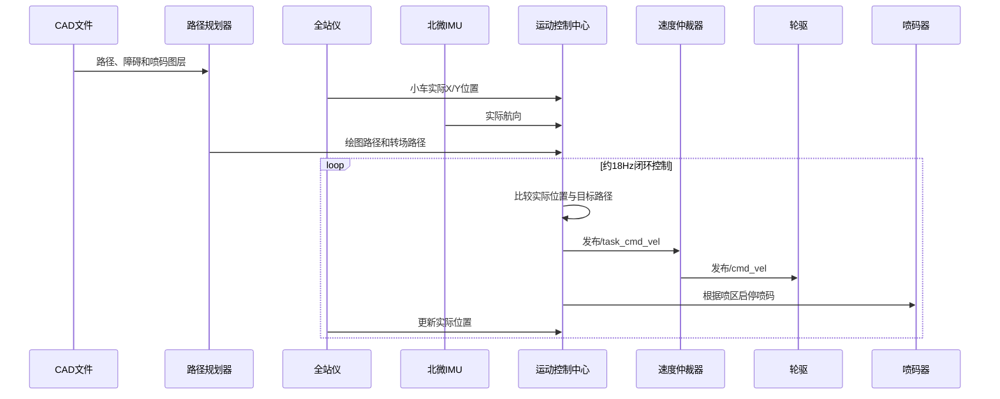

#### 原来有全站仪时，小车如何实现划线

全站仪本身不负责生成路径，也不直接控制轮子。它的核心作用是持续提供小车在施工坐标系中的真实位置。

完整控制链路是：

```mermaid
flowchart LR
    A[CAD划线文件] --> B[路径规划器]
    T[全站仪坐标] --> L[定位融合节点]
    I[北微IMU航向] --> L
    L --> P[/robot_pose]
    B --> J[规划结果JSON]
    J --> C[运动控制中心]
    P --> C
    C -->|/task_cmd_vel| M[速度仲裁器]
    M -->|/cmd_vel| W[轮子驱动]
    W --> CAN[can0]
    CAN --> E[M1505电机]
    C --> K[喷码器]
```

#### 1. 全站仪负责测量小车真实位置

小车上安装反射棱镜或反射球，全站仪测量反射目标的三维坐标：

```text
reflector_position:
    x
    y
    z
```

但全站仪测量的是反射棱镜位置，不一定是小车底盘中心。因此定位节点会根据小车航向和“棱镜到底盘中心的安装偏移”进行换算：

```text
底盘中心X = 棱镜X + cos(航向)×前后偏移 - sin(航向)×左右偏移
底盘中心Y = 棱镜Y + sin(航向)×前后偏移 + cos(航向)×左右偏移
```

定位代码：[localization_node.cpp](/home/qingz/xline_ws3/src/xline_path_planner/xline_localization/src/localization_node.cpp:274)

#### 2. IMU负责提供车头朝向

单台全站仪主要提供棱镜位置，不能仅凭一个测量点可靠确定车头朝向。

系统使用北微IMU提供航向角：

```text
全站仪 → 小车X、Y坐标
北微IMU → 小车yaw航向
安装偏移 → 棱镜坐标换算到底盘中心
```

最终融合成：

```text
/robot_pose
├── position.x
├── position.y
└── orientation（小车航向）
```

同时发布：

```text
/localization/valid
```

只有全站仪和IMU数据都正常、新鲜并完成标定时，定位才有效。

#### 3. CAD文件如何变成可执行路径

路径规划器首先读取CAD转换后的JSON文件，并按照图层区分：

| CAD内容 | 规划器用途 |
|---|---|
| 路径图层 | 需要喷墨绘制的线、圆、圆弧、椭圆或样条 |
| 障碍图层 | 生成静态障碍区域 |
| 空洞图层 | 生成禁止进入区域 |
| 文字内容 | 生成对应文字喷码任务 |

规划器配置：[planner.yaml](/home/qingz/xline_ws3/src/xline_path_planner/xline_path_planner/config/planner.yaml)

CAD坐标原来以毫米记录，规划时转换为米：

```text
CAD毫米坐标 ÷ 1000 = ROS米坐标
```

#### 4. 路径几何预处理

解析CAD后会进行几何整理：

| 处理 | 作用 |
|---|---|
| 拆分多段线 | 把Polyline拆成可执行的小线段 |
| 合并共线线段 | 减少不必要的停车和转向 |
| 删除过短线段 | 避免执行无意义的小段 |
| 圆弧和椭圆离散 | 转换为控制器能够跟踪的连续路径点 |
| 喷头偏移补偿 | 根据左、中、右喷头相对底盘的位置移动轨迹 |
| 起终点延长 | 给喷码启动、稳定出墨和结束留出距离 |

当前配置中：

| 参数 | 数值 |
|---|---:|
| 栅格分辨率 | `0.005 m`，即5毫米 |
| 地图边缘扩展 | `0.10 m` |
| 机器人碰撞半径 | `0.20 m` |
| 障碍安全余量 | `0.05 m` |
| 直线起点延长 | `0.20 m` |
| 直线终点延长 | `0.05 m` |
| 圆弧起点延长 | `0.40 m` |

#### 5. 如何决定先画哪一条线

规划器会取得全站仪提供的当前 `/robot_pose`，把小车真实位置作为规划起点。

然后从尚未绘制的图形中选择较合适的最近线段：

```text
小车当前位置
  → 查找尚未执行的最近绘图线段
  → 决定从线段哪一端进入
  → 生成当前位置到绘图起点的转场路径
  → 执行绘图路径
  → 再选择下一条线
```

相关代码：[path_planner.cpp](/home/qingz/xline_ws3/src/xline_path_planner/xline_path_planner/src/path_planner.cpp:1978)

当前贝塞尔转场功能配置为：

```yaml
bezier_transition:
  enabled: false
```

因此目前转场主要使用直线路径，而不是贝塞尔曲线。

#### 6. 绘图路径和转场路径不同

| 路径类型 | 小车是否运动 | 是否喷墨 |
|---|---:|---:|
| 绘图路径 | 是 | 在规定喷区内喷墨 |
| 转场路径 | 是 | 不喷墨 |
| 起点对准 | 可能原地旋转 | 不喷墨 |
| 定位校准 | 可能短距离移动 | 不喷墨 |

规划器会给每条绘图路径记录：

```text
ink_start_distance
ink_end_distance
ink_start
ink_end
```

这些数值确定从路径的哪个位置开始喷墨、哪个位置结束喷墨。

转场路径明确设置：

```text
ink.enabled = false
```

对应代码：[output_formatter.cpp](/home/qingz/xline_ws3/src/xline_path_planner/xline_path_planner/src/output_formatter.cpp:524)

#### 7. 静态障碍物如何参与路径规划

CAD障碍物会转换成分辨率为 `5 mm` 的栅格地图。

规划器检查最终绘图路径和转场路径时，会按照：

```text
机器人半径0.20m + 安全余量0.05m
```

检查路径周围是否与障碍栅格重叠。

如果重叠，规划直接失败：

```text
路径与障碍物安全区碰撞
```

相关代码：[path_planner.cpp](/home/qingz/xline_ws3/src/xline_path_planner/xline_path_planner/src/path_planner.cpp:425)

这里处理的是CAD中预先存在的静态障碍物，不是现场突然出现的动态障碍物。

#### 8. 路径如何控制小车运动

运动控制中心以约 `18 Hz`重复执行闭环控制：

```text
读取全站仪融合位姿
  → 找到当前路径上的目标点
  → 计算横向偏差
  → 计算航向误差
  → 生成线速度和角速度
  → 发布/task_cmd_vel
  → 等待下一帧全站仪位置
  → 再次修正
```

运动控制入口：[motion_control_center.cpp](/home/qingz/xline_ws3/src/xline_base_controller/xline_base_controller/src/motion_control_center.cpp:1028)

这是闭环控制。小车发生偏差时，不是继续盲目发送固定速度，而是根据下一帧真实位置重新计算方向。

例如：

```text
计划路径：小车应该在路径左侧
全站仪测量：小车实际偏到了路径右侧
控制器计算：产生向左的角速度修正
小车回到路径附近
```

#### 9. 速度如何发送到轮子

运动控制中心输出：

```text
/task_cmd_vel
```

速度仲裁器将任务速度转发为：

```text
/cmd_vel
```

轮驱再将整车速度换算成左右轮RPM：

```text
左轮速度 = v - 轮距/2 × w
右轮速度 = v + 轮距/2 × w
```

最后通过：

```text
SocketCAN can0 → M1505左右轮电机
```

#### 10. 喷码如何与位置同步

运动控制中心根据路径已经行驶的距离判断是否进入喷区：

```text
尚未到达 ink_start_distance
  → 不喷墨

进入 ink_start_distance
  → 启动喷码

位于喷码区间
  → 保持运动和喷码

超过 ink_end_distance
  → 停止喷码
```

因此原来的划线不是简单地“小车一启动就一直喷”，而是根据全站仪反馈的位置和路径累计进度控制喷码区间。

#### 11. 全站仪定位丢失时

运动控制中心每个控制周期都检查：

```text
/robot_pose是否新鲜
/localization/valid是否为true
```

连续发现定位无效时会：

1. 发布零速度；
2. 停止喷码；
3. 终止或暂停当前任务；
4. 防止失去定位后继续盲走。

安全停车代码：[motion_control_center.cpp](/home/qingz/xline_ws3/src/xline_base_controller/xline_base_controller/src/motion_control_center.cpp:1056)

#### 原系统的核心原理



一句话总结：路径规划器负责决定“应该走哪里”，全站仪和IMU负责告诉系统“小车实际在哪里”，运动控制器负责不断纠正误差，速度仲裁器负责转发速度，轮驱负责执行，喷码器根据路径进度开始和停止出墨。