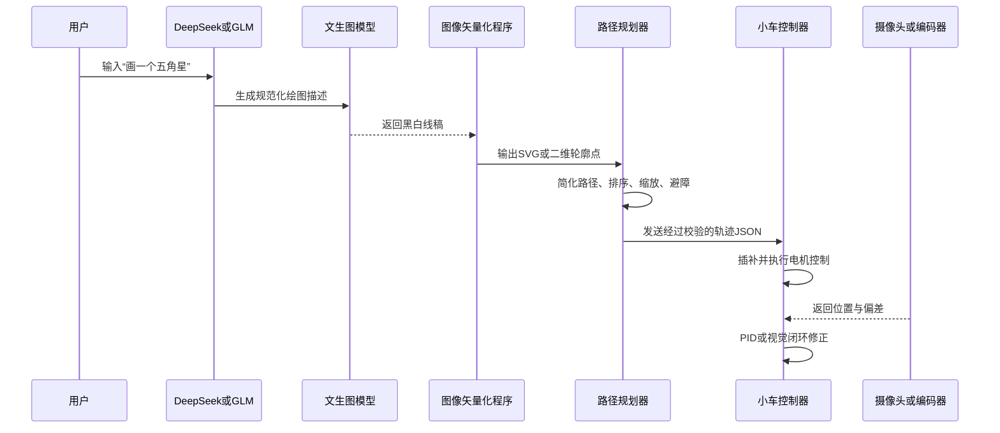

### 结论

现阶段建议采用：

> **DeepSeek/GLM API负责理解文字 → 成熟文生图模型生成图案 → 图像矢量化与路径规划 → 确定性控制程序生成JSON → 小车执行**

暂时不要微调 DeepSeek/GLM，也不建议一开始直接使用 VLA。

你的划线小车属于“二维确定性轨迹执行”问题，而 VLA 更适合机械臂抓取、物体操作、复杂视觉反馈等任务。OpenVLA 本身也是面向机器人操作训练的，需要机器人示范数据、动作空间适配和较高算力，不是划线小车的最短落地路线。[OpenVLA官方项目](https://github.com/openvla/openvla)、[OpenVLA论文](https://arxiv.org/abs/2406.09246)

### 三种方案对比

| 方案 | 适合程度 | 优点 | 主要问题 | 建议 |
|---|---:|---|---|---|
| DeepSeek/GLM直接输出轨迹JSON | 较适合 | 开发快、成本低 | 坐标可能不准确，不能直接信任 | 用于生成设计参数，不直接控制电机 |
| 微调DeepSeek/GLM | 暂时不适合 | 能学习特定指令格式 | 需要准备数据，不能解决底盘误差 | 积累数据后再考虑 |
| 直接调用VLA | 不适合第一版 | 可以融合摄像头、语言和动作 | 数据、算力、实时性和安全验证成本高 | 后期研究闭环智能控制时使用 |
| 传统路径规划＋视觉校正 | 最适合 | 可解释、稳定、轨迹可验证 | 需要编写运动控制和标定程序 | 作为产品主架构 |

### 推荐系统架构



其中，大模型不应该直接输出左右轮PWM。它最多生成“画什么、尺寸多大、放在哪里”等高级参数。坐标变换、速度限制、曲线插补和急停必须由确定性程序完成。

### 更好的“文成图”方式

如果最终目标只是让小车画线，建议优先生成以下内容：

| 输出形式 | 推荐程度 | 原因 |
|---|---:|---|
| SVG矢量图 | 最高 | 天然包含线段、曲线和路径 |
| 结构化几何JSON | 很高 | 可直接转换成小车轨迹 |
| 黑白线稿PNG | 中等 | 还需要二值化、骨架化和矢量化 |
| 彩色写实图片 | 很低 | 轮廓复杂，难以确定应该画哪些线 |

因此可以设计成两种入口：

1. 简单图形：由大模型输出几何描述，例如圆、矩形、文字和五角星。
2. 复杂图案：调用文生图模型生成黑白线稿，再通过 OpenCV、Potrace 等工具矢量化。

### 建议的JSON分层

不要把“图形数据”和“底盘指令”混成一种JSON。建议分成三层：

| 层级 | 示例内容 | 生成者 |
|---|---|---|
| 设计层 | 五角星、宽500毫米、居中 | DeepSeek或GLM |
| 轨迹层 | 坐标点、贝塞尔曲线、抬笔落笔 | 路径规划程序 |
| 控制层 | 左右轮速度、运行时间、转向角度 | 小车控制器 |

轨迹层示例：

```json
{
  "版本": "1.0",
  "单位": "毫米",
  "画布": {
    "宽度": 1000,
    "高度": 1000
  },
  "路径": [
    {
      "编号": 1,
      "是否闭合": true,
      "速度": 100,
      "动作": [
        {"类型": "移动", "横坐标": 500, "纵坐标": 100, "落笔": false},
        {"类型": "直线", "横坐标": 620, "纵坐标": 450, "落笔": true},
        {"类型": "直线", "横坐标": 250, "纵坐标": 230, "落笔": true}
      ]
    }
  ]
}
```

即使 DeepSeek或GLM返回了这个JSON，也必须经过以下校验才能发送给小车：

- JSON Schema格式校验；
- 画布坐标越界校验；
- 最大速度与最大加速度限制；
- 路径连续性校验；
- 最小转弯半径校验；
- 小车尺寸和笔尖偏移补偿；
- 超时、急停和通信中断保护。

DeepSeek和GLM现在都提供结构化JSON或函数调用能力，适合承担意图解析和设计参数生成。[DeepSeek JSON输出文档](https://api-docs.deepseek.com/guides/json_mode/)、[智谱结构化输出文档](https://docs.bigmodel.cn/cn/guide/capabilities/struct-output)

### DeepSeek还是GLM

两者都可以先直接通过API测试，不必马上微调。

| 选择因素 | DeepSeek | GLM |
|---|---|---|
| 中文指令理解 | 足够 | 足够 |
| 结构化JSON | 支持 | 支持 |
| 函数调用 | 支持 | 支持 |
| 第一版选择原则 | 看价格、延迟和稳定性 | 看价格、延迟和稳定性 |
| 是否决定最终精度 | 否 | 否 |

最终划线精度主要由这些因素决定：

1. 轮径和轮距标定；
2. 编码器精度；
3. 地面打滑；
4. IMU航向误差；
5. 相机或定位系统；
6. 路径插补算法；
7. 笔尖相对小车中心的位置。

所以模型选 DeepSeek 还是GLM，不会决定小车能不能把线画准。

### 什么时候需要微调

满足以下情况后，再考虑 LoRA 或监督微调：

- 已积累至少数千条“用户指令—正确设计JSON”数据；
- 提示词和JSON Schema仍不能稳定解决问题；
- 有固定行业术语，例如道路标线、足球场线、停车位线；
- 经常需要把同类施工图转换成统一轨迹；
- 已经建立自动化评测集，可以判断微调是否真的提升。

如果只是让模型稳定输出规定JSON，通常先使用：

> 系统提示词＋JSON Schema＋少量示例＋程序校验＋失败重试

这比马上微调便宜、快速，也更容易修改。

### VLA适合什么时候加入

后期如果小车需要完成以下任务，才值得研究 VLA：

- 摄像头发现施工区域并自行定位；
- 根据现场障碍实时修改路线；
- 识别已经画过和没有画过的区域；
- 理解自然语言指向的现实物体；
- 在未知环境中自主决策。

但即便采用 VLA，也建议保留传统安全控制层：

```text
VLA输出高级动作
        ↓
安全约束与轨迹规划
        ↓
底盘闭环控制
        ↓
电机驱动
```

### 推荐开发顺序

| 阶段 | 目标 | 是否需要大模型 |
|---|---|---:|
| 第一阶段 | JSON轨迹驱动仿真小车 | 不需要 |
| 第二阶段 | SVG转换为轨迹JSON | 不需要 |
| 第三阶段 | 实车编码器、IMU和PID闭环 | 不需要 |
| 第四阶段 | 文本生成几何设计或SVG | 调用DeepSeek或GLM |
| 第五阶段 | 复杂线稿生成与矢量化 | 调用文生图模型 |
| 第六阶段 | 摄像头定位与轨迹纠偏 | 传统视觉优先 |
| 第七阶段 | 复杂未知环境自主执行 | 再评估VLA |

最终建议是：**第一版选择GLM或DeepSeek直接调用，不微调；让模型只负责理解和设计，让SVG、OpenCV、路径规划器与底盘控制算法负责真正划线。VLA留到具有摄像头闭环和大量实车数据之后再评估。**